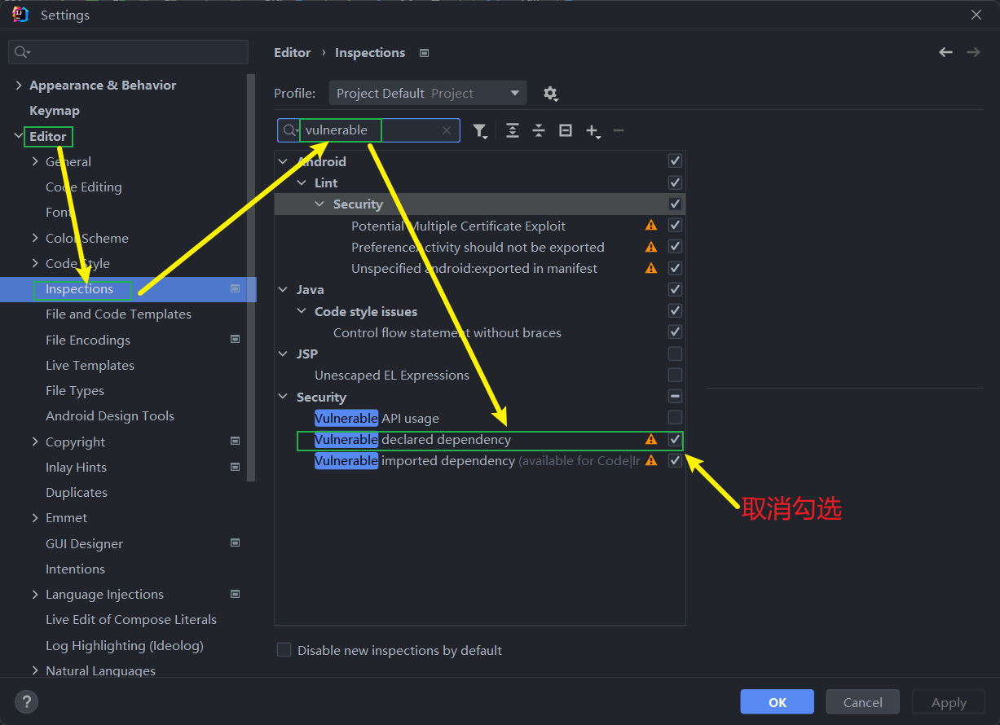
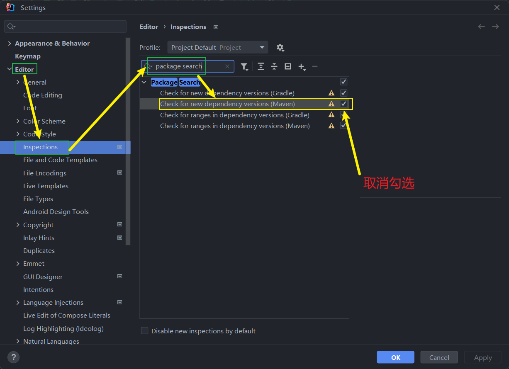
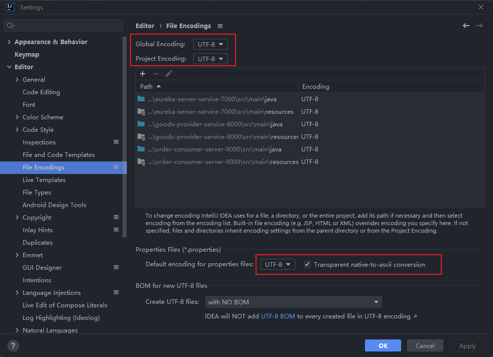
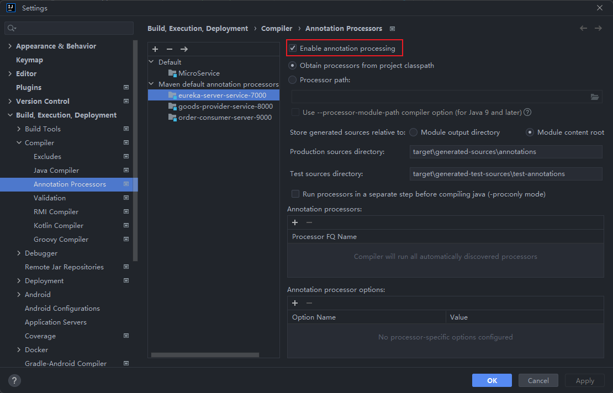
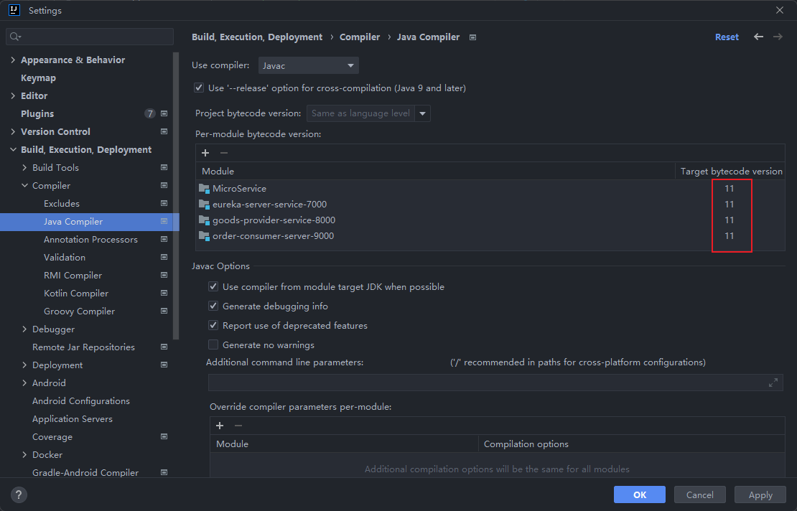
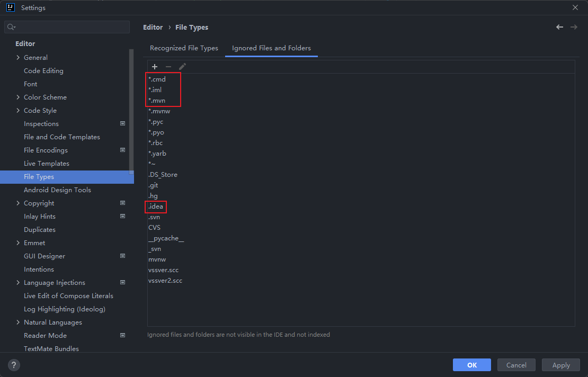

## 开发工具

### JDK

### Maven

#### IDEA设置

###### 除去pom文件依赖漏洞检查警告线

###### 取消依赖版本检查和提示

### Git

### IDEA

#### 设置

###### 字符集设置为UTF-8

###### 注解生效激活

###### JDK版本选择

###### 文件过滤

#### 插件

#### 快捷键

#### 模版

