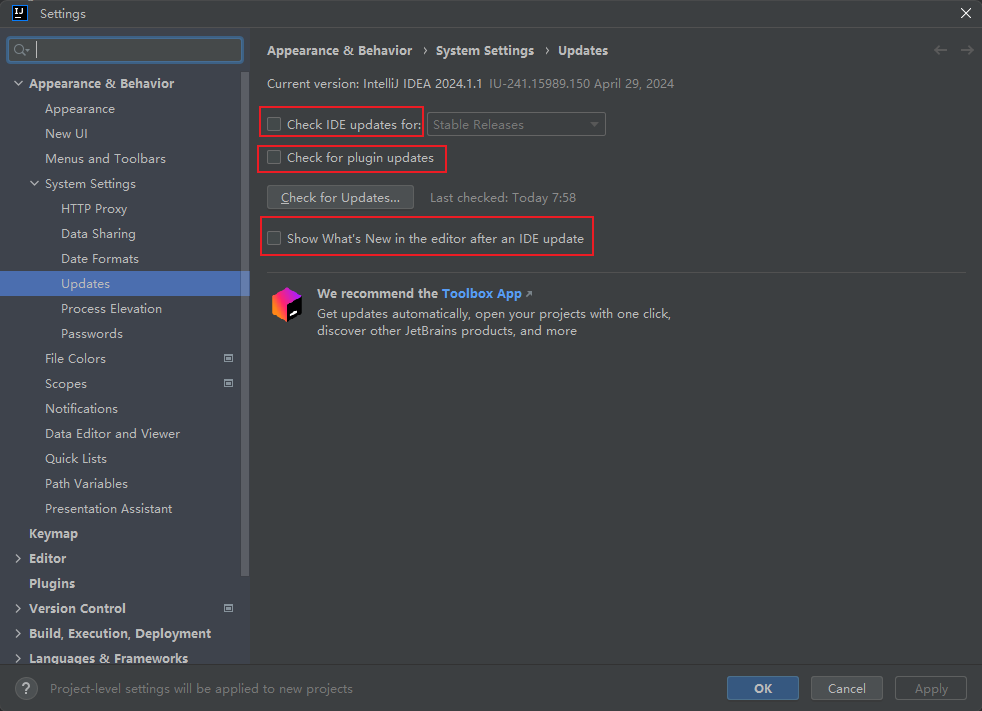
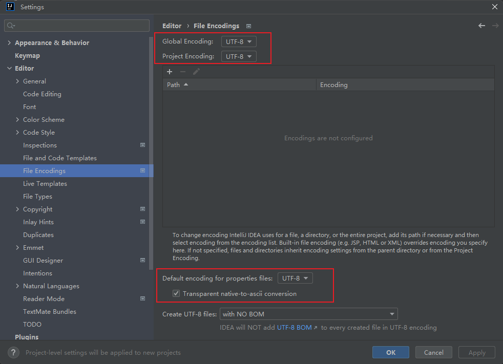
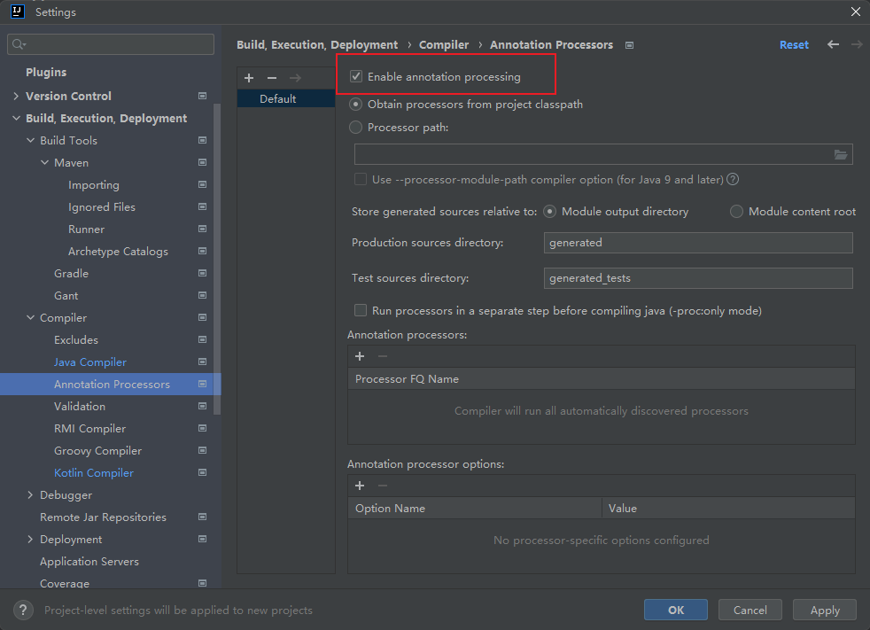

# 必备设置


## 一 Appearance & Behavior

### 1.1 设置主题


### 1.2 设置显示内存指示器


### 1.3 关闭idea自动更新



### 1.4 启动IDEA默认打开项目列表


## 二 Keymap

### 2.1 自定义快捷键


## 三 Editor

### 3.1 设置鼠标滚轮修改字体大小


### 3.2 设置自动导包功能


### 3.3 设置显示行号和方法间的分隔符


### 3.4 忽略大小写提示


### 3.5 设置取消单行显示tabs的操作


### 3.6 设置默认的字体、字体大小、字体行间距


### 3.7 修改当前主题的字体、字体大小、字体行间距


### 3.8 修改当前主题的控制台输出的字体及字体大小


### 3.9 修改代码中注释的字体颜色


### 3.10 设置超过指定 import 个数，改为*


### 3.11 注释设置行首缩进


### 3.12 Xml文件注释设置


### 3.13 自动生成serialVersionUID


> 当某个类实现Serializable接口后，选中类，Alt+Enter

### 3.14 设置字符编码



### 3.15 自定义代码模板

* 异常处理

```java
try {
      $action$
  } catch (Exception e) {
      log.error("", e);
      $END$
  }
```

* bean注入

```java
@Autowired
private
```

* 文件头

```java
/**
  *@Author: xuming
  *@Date: ${DATE} ${TIME}
  *@Version: 1.0.0
  *@Description: TODO
 **/
```

### 3.16 控制台设置字符集


### 3.17 自动导包


3.18 方法参数提示


3.18 将项目的build和run权限交给maven


## 四 Version Controll

### 4.1 配置Git


### 4.2 关闭自动fetch


## 五 Build,Execution,Deployment

### 配置Maven


### 设置自动编译





## 界面

### 设置包展开


### 设置IDEA内存大小


### 查看历史代码


# 常用插件

## Rainbow Brackets

将括号用彩色显示

## MyBatisX

MyBatis 必装插件

## Maven Helper

Maven 依赖可视化

## Grep Console

控制台样式设置


## Alibaba Java Coding Guidelines

阿里巴巴编码规范检查插件

## Tabnine

代码补全工具

## RestfulToolkit

根据url查找controller,使用ctrl+\查询接口

## Json Parser

json格式化工具

## Mybatis Log Plugin

Mybatis日志

## CheckStyle-IDEA

代码规范

## Eclipse Code Formatter

配置阿里格式化

## EasyCode

代码生成


## .ignore

git提交忽略文件

## POJO to JSON

pojo对象转json对象

## SequenceDiagram

时序图

## GsonFormatPlus

json对象转pojo

## Convert YAML and Properties File

yaml转properties

## Properties to YAML Converter

properties转yaml

## PlantUML integration

UML图

## CamelCase

多种命名格式之间切换

## String Manipulation

字符串处理


# 快捷键


## Ctrl

Ctrl + F 在当前文件进行文本查找 （必备）
Ctrl + R 在当前文件进行文本替换 （必备）
Ctrl + Z 撤销 （必备）
Ctrl + Y 删除光标所在行 或 删除选中的行 （必备）
Ctrl + X 剪切光标所在行 或 剪切选择内容
Ctrl + C 复制光标所在行 或 复制选择内容
Ctrl + D 复制光标所在行 或 复制选择内容，并把复制内容插入光标位置下面 （必备）
Ctrl + W 递进式选择代码块。可选中光标所在的单词或段落，连续按会在原有选中的基础上再扩展选中范围 （必备）
Ctrl + E 显示最近打开的文件记录列表
Ctrl + N 根据输入的 类名 查找类文件
Ctrl + G 在当前文件跳转到指定行处
Ctrl + J 插入自定义动态代码模板
Ctrl + P 方法参数提示显示
Ctrl + Q 光标所在的变量 / 类名 / 方法名等上面（也可以在提示补充的时候按），显示文档内容
Ctrl + U 前往当前光标所在的方法的父类的方法 / 接口定义
Ctrl + B 进入光标所在的方法/变量的接口或是定义处，等效于 Ctrl + 左键单击
Ctrl + K 版本控制提交项目，需要此项目有加入到版本控制才可用
Ctrl + T 版本控制更新项目，需要此项目有加入到版本控制才可用
Ctrl + H 显示当前类的层次结构
Ctrl + O 选择可重写的方法
Ctrl + I 选择可继承的方法
Ctrl + + 展开代码
Ctrl + - 折叠代码
Ctrl + / 注释光标所在行代码，会根据当前不同文件类型使用不同的注释符号 （必备）
Ctrl + [ 移动光标到当前所在代码的花括号开始位置
Ctrl + ] 移动光标到当前所在代码的花括号结束位置
Ctrl + F1 在光标所在的错误代码处显示错误信息
Ctrl + F3 调转到所选中的词的下一个引用位置
Ctrl + F4 关闭当前编辑文件
Ctrl + F8 在 Debug 模式下，设置光标当前行为断点，如果当前已经是断点则去掉断点
Ctrl + F9 执行 Make Project 操作
Ctrl + F11 选中文件 / 文件夹，使用助记符设定 / 取消书签
Ctrl + F12 弹出当前文件结构层，可以在弹出的层上直接输入，进行筛选
Ctrl + Tab 编辑窗口切换，如果在切换的过程又加按上delete，则是关闭对应选中的窗口
Ctrl + Enter 智能分隔行
Ctrl + End 跳到文件尾
Ctrl + Home 跳到文件头
Ctrl + Space 基础代码补全，默认在 Windows 系统上被输入法占用，需要进行修改，建议修改为 ALT+/（必备）
Ctrl + Delete 删除光标后面的单词或是中文句
Ctrl + BackSpace 删除光标前面的单词或是中文句
Ctrl + 1,2,3…9 定位到对应数值的书签位置
Ctrl + 左键单击 在打开的文件标题上，弹出该文件路径
Ctrl + 光标定位 按 Ctrl 不要松开，会显示光标所在的类信息摘要
Ctrl + 左方向键 光标跳转到当前单词 / 中文句的左侧开头位置
Ctrl + 右方向键 光标跳转到当前单词 / 中文句的右侧开头位置
Ctrl + 前方向键 等效于鼠标滚轮向前效果
Ctrl + 后方向键 等效于鼠标滚轮向后效果

Ctrl+J:代码模板生成菜单


## Alt

Alt + ` 显示版本控制常用操作菜单弹出层
Alt + Q 弹出一个提示，显示当前类的声明 / 上下文信息
Alt + F1 显示当前文件选择目标弹出层，弹出层中有很多目标可以进行选择
Alt + F2 对于前面页面，显示各类浏览器打开目标选择弹出层
Alt + F3 选中文本，逐个往下查找相同文本，并高亮显示
Alt + F7 查找光标所在的方法 / 变量 / 类被调用的地方
Alt + F8 在 Debug 的状态下，选中对象，弹出可输入计算表达式调试框，查看该输入内容的调试结果
Alt + Home 定位 / 显示到当前文件的 Navigation Bar
Alt + Enter IntelliJ IDEA 根据光标所在问题，提供快速修复选择，光标放在的位置不同提示的结果也不同 （必备）
Alt + Insert 代码自动生成，如生成对象的 set / get 方法，构造函数，toString() 等（必备）
Alt + 左方向键 按左方向切换当前已打开的文件视图
Alt + 右方向键 按右方向切换当前已打开的文件视图
Alt + 前方向键 当前光标跳转到当前文件的前一个方法名位置
Alt + 后方向键 当前光标跳转到当前文件的后一个方法名位置
Alt + 1,2,3…9 显示对应数值的选项卡，其中 1 是 Project 用得最多


## Shift

Shift + F1 如果有外部文档可以连接外部文档
Shift + F2 跳转到上一个高亮错误 或 警告位置
Shift + F3 在查找模式下，查找匹配上一个
Shift + F4 对当前打开的文件，使用新Windows窗口打开，旧窗口保留
Shift + F6 对文件 / 文件夹 重命名
Shift + F7 在 Debug 模式下，智能步入。断点所在行上有多个方法调用，会弹出进入哪个方法
Shift + F8 在 Debug 模式下，跳出，表现出来的效果跟 F9 一样
Shift + F9 等效于点击工具栏的 Debug 按钮
Shift + F10 等效于点击工具栏的 Run 按钮
Shift + F11 弹出书签显示层
Shift + Tab 取消缩进
Shift + ESC 隐藏当前 或 最后一个激活的工具窗口
Shift + End 选中光标到当前行尾位置
Shift + Home 选中光标到当前行头位置
Shift + Enter 开始新一行。光标所在行下空出一行，光标定位到新行位置
Shift + 左键单击 在打开的文件名上按此快捷键，可以关闭当前打开文件
Shift + 滚轮前后滚动 当前文件的横向滚动轴滚动


## Ctrl+Alt

Ctrl + Alt + L 格式化代码，可以对当前文件和整个包目录使用 （必备）
Ctrl + Alt + O 优化导入的类，可以对当前文件和整个包目录使用 （必备）
Ctrl + Alt + I 光标所在行 或 选中部分进行自动代码缩进，有点类似格式化
Ctrl + Alt + T 对选中的代码弹出环绕选项弹出层
Ctrl + Alt + J 弹出模板选择窗口，将选定的代码加入动态模板中
Ctrl + Alt + H 调用层次
Ctrl + Alt + B 在某个调用的方法名上使用会跳到具体的实现处，可以跳过接口 （Ctrl + Alt + U 查看关系图）
Ctrl + Alt + V 快速引进变量
Ctrl + Alt + Y 同步、刷新
Ctrl + Alt + S 打开 IntelliJ IDEA 系统设置
Ctrl + Alt + F7 显示使用的地方。寻找被该类或是变量被调用的地方，用弹出框的方式找出来
Ctrl + Alt + F11 切换全屏模式
Ctrl + Alt + Enter 光标所在行上空出一行，光标定位到新行
Ctrl + Alt + Home 弹出跟当前文件有关联的文件弹出层
Ctrl + Alt + Space 类名自动完成
Ctrl + Alt + 左方向键 退回到上一个操作的地方 （必备）
Ctrl + Alt + 右方向键 前进到上一个操作的地方 （必备）
Ctrl + Alt + 前方向键 在查找模式下，跳到上个查找的文件
Ctrl + Alt + 后方向键 在查找模式下，跳到下个查找的文件


## Ctrl+Shift

Ctrl + Shift + F 根据输入内容查找整个项目 或 指定目录内文件 （必备）
Ctrl + Shift + R 根据输入内容替换对应内容，范围为整个项目 或 指定目录内文件 （必备）
Ctrl + Shift + J 自动将下一行合并到当前行末尾 （必备）
Ctrl + Shift + Z 取消撤销 （必备）
Ctrl + Shift + W 递进式取消选择代码块。可选中光标所在的单词或段落，连续按会在原有选中的基础上再扩展取消选中范围 （必备）
Ctrl + Shift + N 通过文件名定位 / 打开文件 / 目录，打开目录需要在输入的内容后面多加一个正斜杠 （必备）
Ctrl + Shift + U 对选中的代码进行大 / 小写轮流转换 （必备）
Ctrl + Shift + T 对当前类生成单元测试类，如果已经存在的单元测试类则可以进行选择
Ctrl + Shift + C 复制当前文件磁盘路径到剪贴板
Ctrl + Shift + V 弹出缓存的最近拷贝的内容管理器弹出层
Ctrl + Shift + E 显示最近修改的文件列表的弹出层
Ctrl + Shift + H 显示方法层次结构
Ctrl + Shift + B 跳转到类型声明处
Ctrl + Shift + I 快速查看光标所在的方法 或 类的定义
Ctrl + Shift + A 查找动作 / 设置
Ctrl + Shift + / 代码块注释 （必备）
Ctrl + Shift + [ 选中从光标所在位置到它的顶部中括号位置
Ctrl + Shift + ] 选中从光标所在位置到它的底部中括号位置
Ctrl + Shift + + 展开所有代码
Ctrl + Shift + - 折叠所有代码
Ctrl + Shift + F7 高亮显示所有该选中文本，按Esc高亮消失
Ctrl + Shift + F8 在 Debug 模式下，指定断点进入条件
Ctrl + Shift + F9 编译选中的文件 / 包 / Module
Ctrl + Shift + F12 编辑器最大化
Ctrl + Shift + Space 智能代码提示
Ctrl + Shift + Enter 自动结束代码，行末自动添加分号 （必备）
Ctrl + Shift + Backspace 退回到上次修改的地方
Ctrl + Shift + 1,2,3…9 快速添加指定数值的书签
Ctrl + Shift + 左键单击 把光标放在某个类变量上，按此快捷键可以直接定位到该类中 （必备）
Ctrl + Shift + 左方向键 在代码文件上，光标跳转到当前单词 / 中文句的左侧开头位置，同时选中该单词 / 中文句
Ctrl + Shift + 右方向键 在代码文件上，光标跳转到当前单词 / 中文句的右侧开头位置，同时选中该单词 / 中文句
Ctrl + Shift + 左方向键 在光标焦点是在工具选项卡上，缩小选项卡区域
Ctrl + Shift + 右方向键 在光标焦点是在工具选项卡上，扩大选项卡区域
Ctrl + Shift + 前方向键 光标放在方法名上，将方法移动到上一个方法前面，调整方法排序
Ctrl + Shift + 后方向键 光标放在方法名上，将方法移动到下一个方法前面，调整方法排序


## Alt+Shift

Alt + Shift + N 选择 / 添加 task
Alt + Shift + F 显示添加到收藏夹弹出层 / 添加到收藏夹
Alt + Shift + C 查看最近操作项目的变化情况列表
Alt + Shift + I 查看项目当前文件
Alt + Shift + F7 在 Debug 模式下，下一步，进入当前方法体内，如果方法体还有方法，则会进入该内嵌的方法中，依此循环进入
Alt + Shift + F9 弹出 Debug 的可选择菜单
Alt + Shift + F10 弹出 Run 的可选择菜单
Alt + Shift + 左键双击 选择被双击的单词 / 中文句，按住不放，可以同时选择其他单词 / 中文句
Alt + Shift + 前方向键 移动光标所在行向上移动
Alt + Shift + 后方向键 移动光标所在行向下移动


## 其他

F2 跳转到下一个高亮错误 或 警告位置 （必备）
F3 在查找模式下，定位到下一个匹配处
F4 编辑源
F7 在 Debug 模式下，进入下一步，如果当前行断点是一个方法，则进入当前方法体内，如果该方法体还有方法，则不会进入该内嵌的方法中
F8 在 Debug 模式下，进入下一步，如果当前行断点是一个方法，则不进入当前方法体内
F9 在 Debug 模式下，恢复程序运行，但是如果该断点下面代码还有断点则停在下一个断点上
F11 添加书签
F12 回到前一个工具窗口
Tab 缩进
ESC 从工具窗口进入代码文件窗口

Ctrl + Shift + Alt + V 无格式黏贴
Ctrl + Shift + Alt + N 前往指定的变量 / 方法
Ctrl + Shift + Alt + S 打开当前项目设置
Ctrl + Shift + Alt + C 复制参考信息

## 汇总

Ctrl + F12 弹出当前文件结构层(类的方法属性等)，可以在弹出的层上直接输入，进行筛选
Ctrl + 左键单击 在打开的文件标题上，弹出该文件路径
Ctrl + N 根据输入的 类名 查找类文件
Ctrl + D 复制光标所在行 或 复制选择内容，并把复制内容插入光标位置下面
Ctrl + P 方法参数提示显示
Ctrl + Alt + O 优化导入的类，可以对当前文件和整个包目录使用
Alt + Insert 代码自动生成，如生成对象的 set / get 方法，构造函数，toString() 等
Shift + F6 对文件 / 文件夹 重命名
Ctrl + Shift + Enter 自动结束代码，行末自动添加分号
Ctrl + B 找变量、方法、类等的来源或者使用过的地方
Ctrl + Alt + B 在某个调用的方法名上使用会跳到具体的实现处，可以跳过接口
Ctrl + Q 光标所在的变量 / 类名 / 方法名等上面（也可以在提示补充的时候按），显示文档内容
Ctrl + Alt + T 对选中的代码弹出环绕选项弹出层(try，if等语句包裹)
Ctrl + Alt + L 格式化代码，可以对当前文件和整个包目录使用
Ctrl + Alt + 左方向键 退回到上一个操作的地方
Ctrl + Alt + 右方向键 前进到上一个操作的地方
Ctrl + Shift + J 自动将下一行合并到当前行末尾
Alt + F8 在 Debug 的状态下，选中对象，弹出可输入计算表达式调试框，查看该输入内容的调试结果
连按两次Shift 弹出 Search Everywhere 弹出层

Alt + F7 查找光标所在的方法 / 变量 / 类被调用的地方
Ctrl + Alt + F7 显示使用的地方。寻找被该类或是变量被调用的地方，用弹出框的方式找出来

Ctrl + F 在当前文件进行文本查找
Ctrl + Shift + F 根据输入内容查找整个项目 或 指定目录内文件

Ctrl + R 在当前文件进行文本替换
Ctrl + Shift + R 根据输入内容替换对应内容，范围为整个项目 或 指定目录内文件

Ctrl + H 显示当前类的层次结构
Ctrl + Alt + H 调用层次
Ctrl + Shift + H 显示方法层次结构

Ctrl + W 递进式选择代码块。可选中光标所在的单词或段落，连续按会在原有选中的基础上再扩展选中范围
Ctrl + Shift + W 递进式取消选择代码块。可选中光标所在的单词或段落，连续按会在原有选中的基础上再扩展取消选中范围

Ctrl + [ 移动光标到当前所在代码的花括号开始位置
Ctrl + ] 移动光标到当前所在代码的花括号结束位置
Ctrl + Shift + [ 选中从光标所在位置到它的顶部中括号位置
Ctrl + Shift + ] 选中从光标所在位置到它的底部中括号位置

Ctrl + O 选择可重写的方法
Ctrl + I 选择可实现的方法
Ctrl + Y 删除光标所在行 或 删除选中的行
Ctrl + X 剪切光标所在行 或 剪切选择内容
Ctrl + G 在当前文件跳转到指定行处
Ctrl + Q 光标所在的变量 / 类名 / 方法名等上面（也可以在提示补充的时候按），显示文档内容
Ctrl + U 前往当前光标所在的方法的父类的方法 / 接口定义
Ctrl + End 跳到文件尾
Ctrl + Home 跳到文件头

Alt + ` 显示版本控制常用操作菜单弹出层
Alt + Enter 根据光标所在问题，提供快速修复选择，光标放在的位置不同提示的结果也不同

Shift + ESC 隐藏当前 或 最后一个激活的工具窗口
Shift + End 选中光标到当前行尾位置
Shift + Home 选中光标到当前行头位置
Shift + Enter 开始新一行。光标所在行下空出一行，光标定位到新行位置
Shift + 左键单击 在打开的文件名上按此快捷键，可以关闭当前打开文件

Ctrl + Alt + I 光标所在行 或 选中部分进行自动代码缩进，有点类似格式化
Ctrl + Alt + Space 类名自动完成

Ctrl + Shift + N 通过文件名定位 / 打开文件 / 目录，打开目录需要在输入的内容后面多加一个正斜杠
Ctrl + Shift + U 对选中的代码进行大 / 小写轮流转换
Ctrl + Shift + / 代码块注释
Ctrl + Shift + Backspace 退回到上次修改的地方
Ctrl + Shift + F12 编辑器最大化
Ctrl + Shift + 左键单击 把光标放在某个类变量上，按此快捷键可以直接定位到该类中


基本操作

- Ctrl + Alt + S：打开设置窗口
- Ctrl + Shift + A：查找动作
- Ctrl + N：查找类文件
- Ctrl + Shift + N：查找文件
- Ctrl + F12：显示当前文件的结构（支持搜索和跳转）
- Ctrl + E：显示最近打开的文件列表
- Ctrl + Shift + E：显示最近更改的文件列表
- Ctrl + G：跳转到行
- Ctrl + W：递增选择代码块
- Ctrl + Shift + W：递减选择代码块
- Ctrl + X：剪切当前行或选定内容
- Ctrl + C：复制当前行或选定内容
- Ctrl + V：粘贴剪贴板中内容
- Ctrl + D：复制当前行或选定内容并将其粘贴在下一行
- Ctrl + Y：删除当前行或选定内容
- Ctrl + Z：撤销上一个操作
- Ctrl + Shift + Z：重做上一个操作
- Ctrl + Shift + U：在大小写之间切换
- Ctrl + Shift + J：合并选定行（可用于消除空格）
- Ctrl + Alt + L：格式化代码
- Tab：缩进选定的代码行或选定的代码块
- Shift + Tab：取消缩进选定的代码行或选定的代码块

编辑器

- Ctrl + Space：自动完成代码
- Ctrl + Shift + Space：根据类型自动完成代码
- Ctrl + Alt + Space：完成代码单元
- Alt + Enter：显示可用的操作列表
- Ctrl + P：显示方法参数信息
- Ctrl + Q：显示代码文档
- Ctrl + J：插入文件模板
- Ctrl + Slash（/）：插入或取消注释行
- Ctrl + Shift + Slash（/）：插入或取消注释块
- Ctrl + Alt + T：用代码环绕选定的代码行或代码块
- Ctrl + Shift + U：将选定的文本转换为大写或小写
- Ctrl + F：查找
- Ctrl + Shift + F：查找和替换
- Ctrl + Shift + V：从最近的缓冲区粘贴内容并选择其中一个
- F2：跳转到下一个高亮错误或警告标志
- Shift + F2：跳转到上一个高亮错误或警告标志


重构

- Ctrl + Alt + Shift + T：重构该文件、整理import等
- Ctrl + Alt + N：内联变量
- Ctrl + Alt + M：提取方法
- Ctrl + Alt + F：提取字段
- Ctrl + Alt + V：提取变量
- Ctrl + Alt + C：提取常量
- Ctrl + Alt + P：提取参数
- Ctrl + Alt + Shift + J：合并多个行为一个逻辑行


版本控制

- Ctrl + K：提交代码
- Ctrl + T：更新代码
- Alt + Shift + C：查看最近的更改
- Alt + Shift + V：查看项目版本
- Alt + `：显示版本控制器日志


调试和运行

- Ctrl + Shift + R：运行应用程序
- Ctrl + Shift + D：调试应用程序
- Alt + Shift + F10：选择或配置运行配置选项
- Alt + Shift + F9：选择或配置调试配置选项


