# 必备设置

## 一 Appearance & Behavior

###### 1.1 多窗口

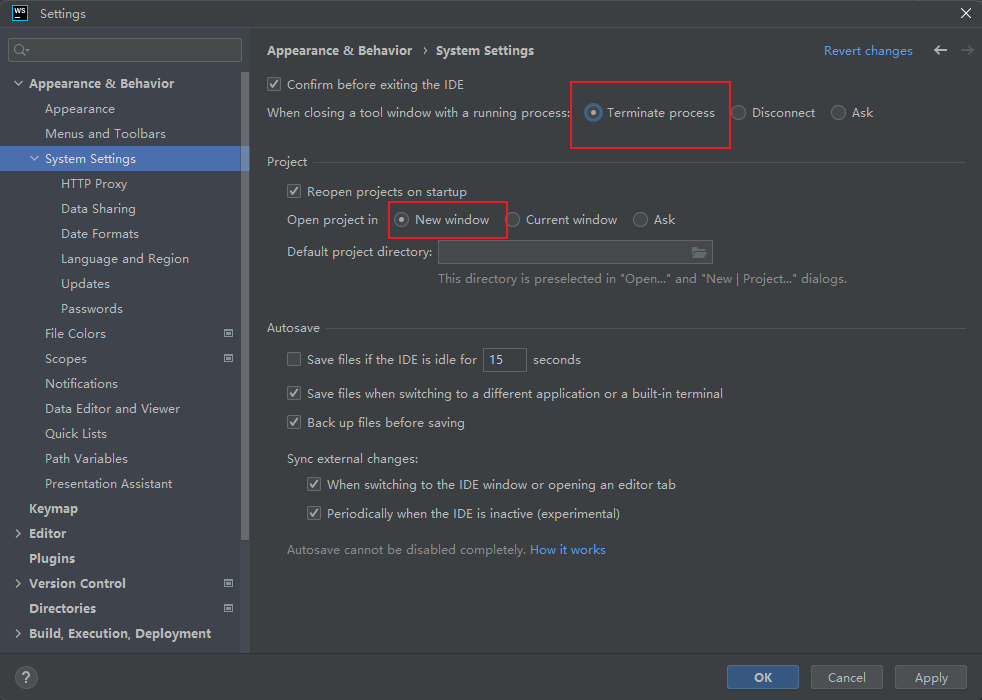

## 二 Keymap


## 三 Editor

###### 3.1 是否区分大小写

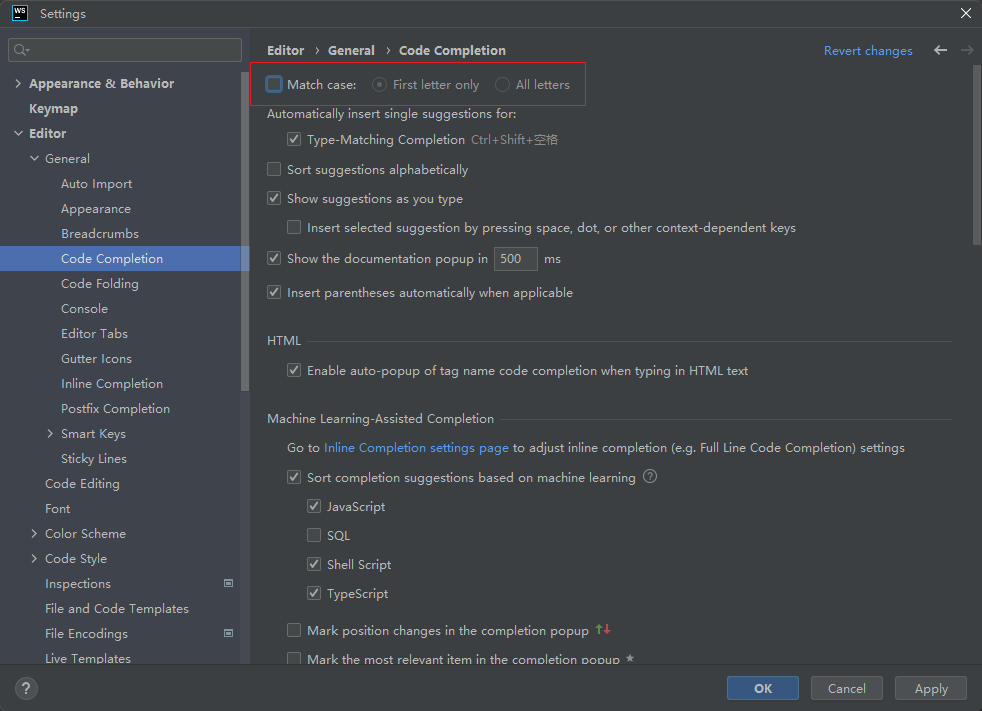

###### 3.2 代码折叠

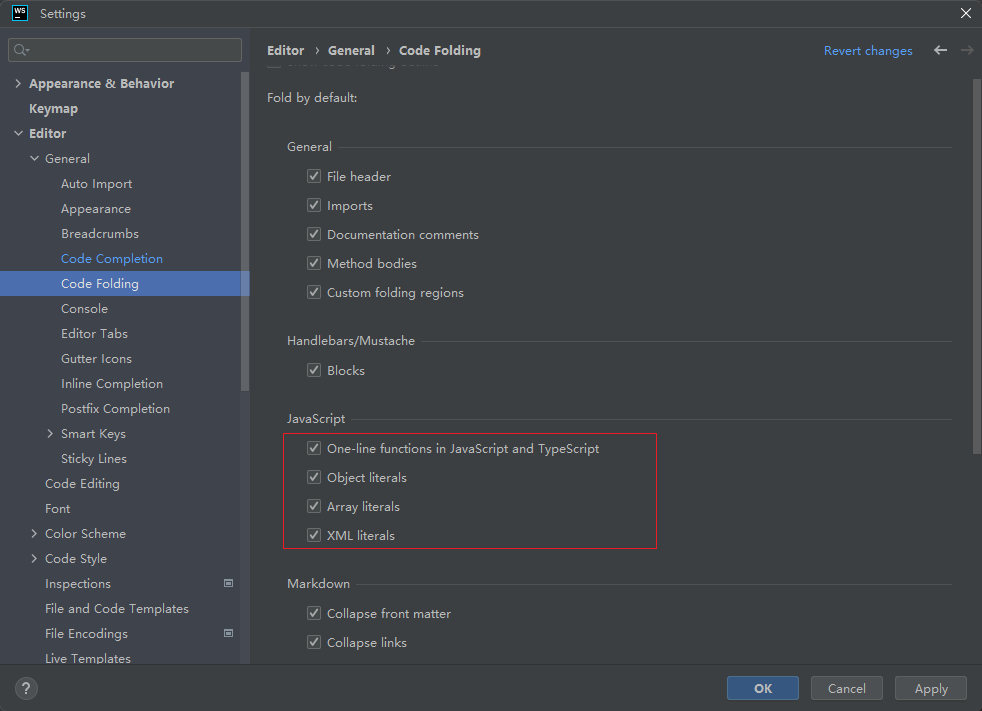

###### 3.3 tab多行显示

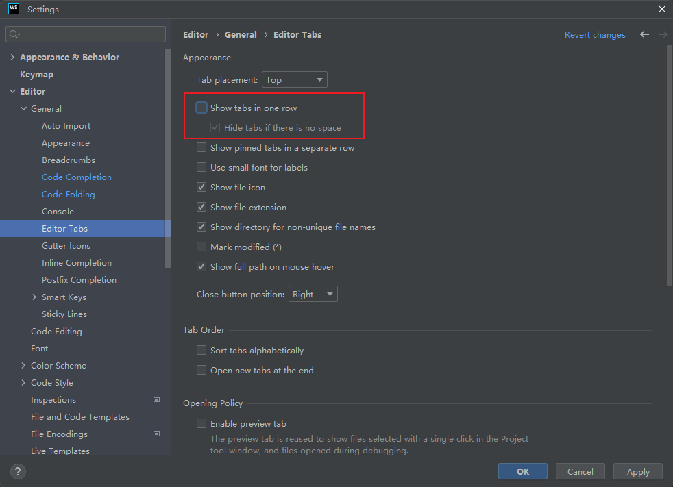

###### 3.4 Ctrl+滚轮 缩放文件

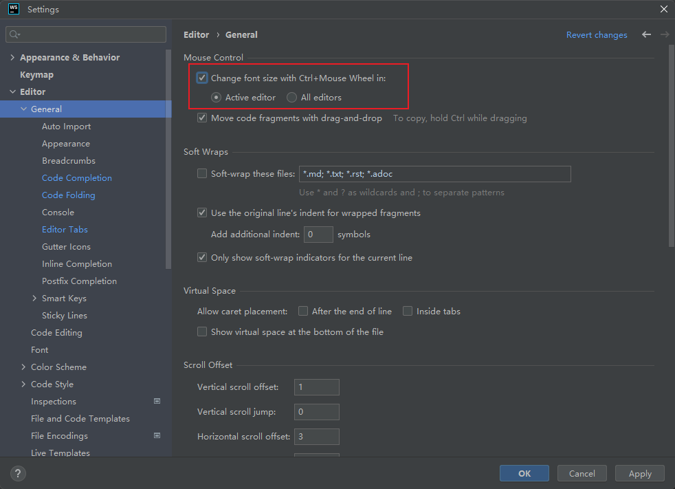

###### 3.5 显示行数和方法线

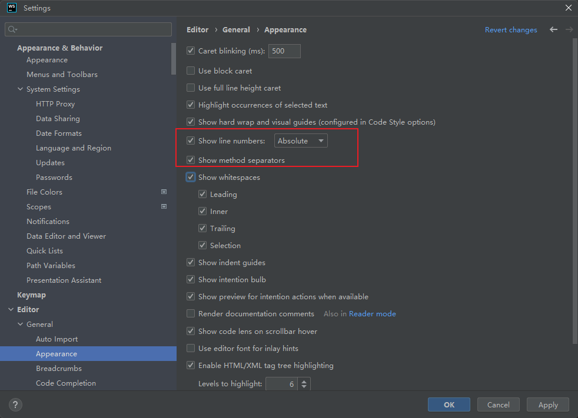

###### 3.6 代码过长自动换行

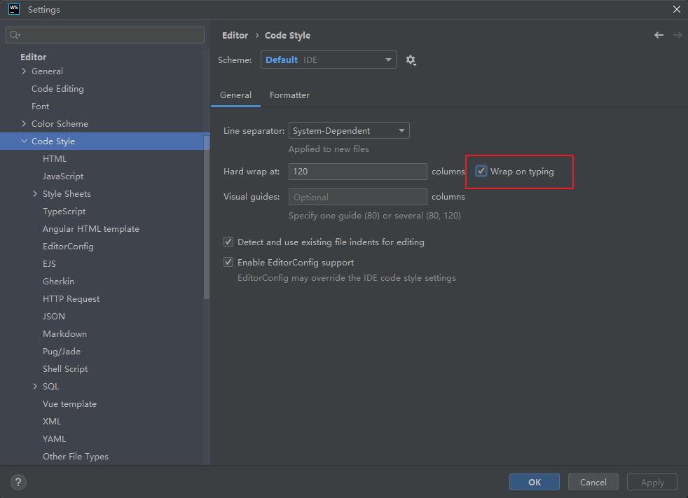

###### 3.7 文件编码

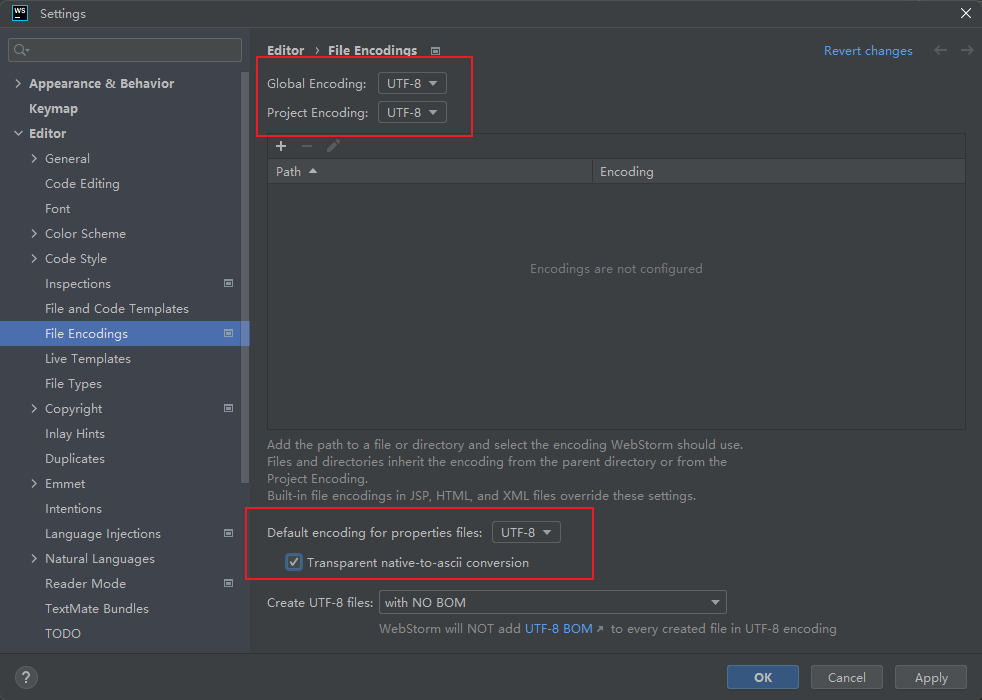

###### 3.8 隐藏文件和目录

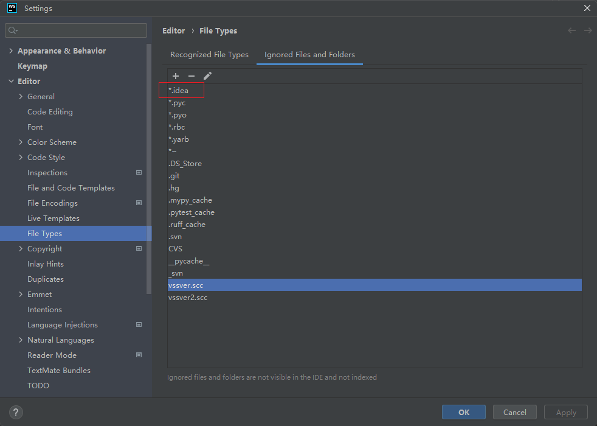

###### 3.9 高亮未使用的代码

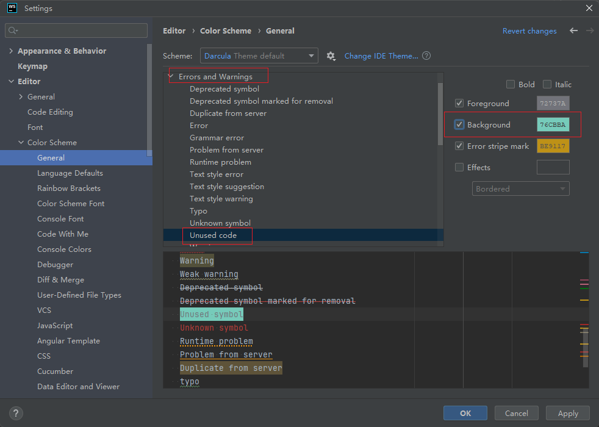

###### 3.10 头部注解

```JavaScript
/*
* @Description: ${NAME}
* @Verson: v1.0
* @Author: ${USER}
* @Date: ${YEAR}-${MONTH}-${DAY} ${HOUR}:${MINUTE}
*/ 
```

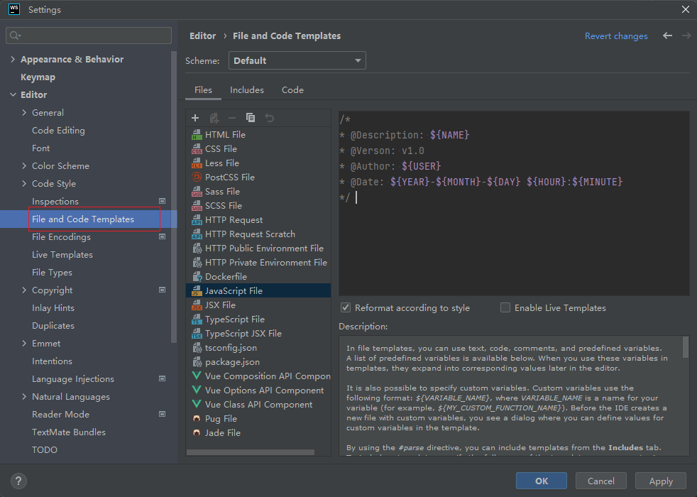


## 四 Plugins

###### 4.1 Classic UI

###### 4.2 Rainbow Brackets

###### 4.3 Atom Material Icons

###### 4.4 Tabnine

###### 4.5 .ignore

###### 4.6 String Manipulatio

> Alt + M:弹出工具功能列表

###### 4.7 GitToolBox

###### 4.8 .env files support

###### 4.9 HighlightBracketPair


## 五 Version Control

###### 5.1 高亮有变更的目录

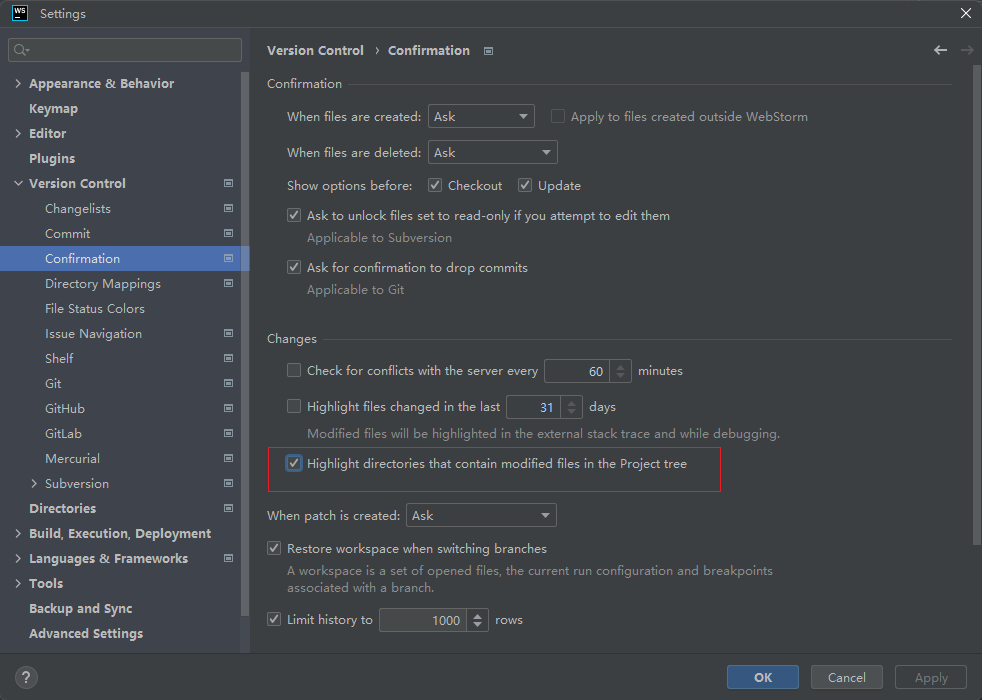

## 六 Build,Execution,Deployment


## 七 Languages & Frameworks

###### 7.1 Node配置

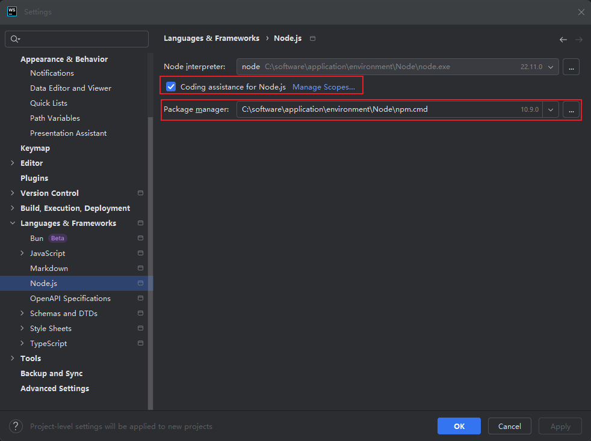

7.2 格式化代码

```JavaScript
npm install --global prettier
```

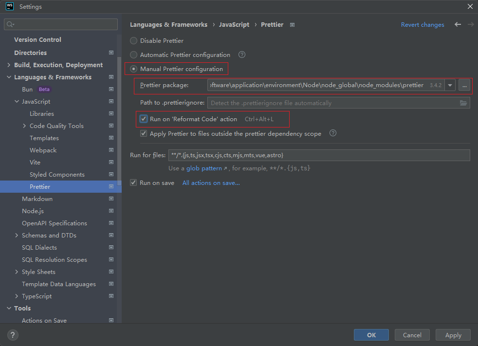

## 八 Tools

## 九 Backup and Sync

## 十 Advanced Settings

