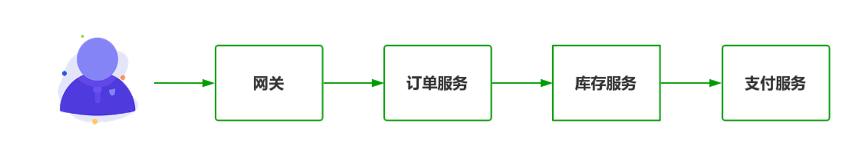
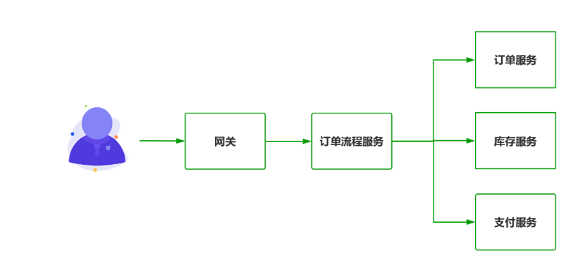

## SpringCloud

### 基础篇

#### SpringCloud概述

##### 开发知识

###### 分布式开发规范

`约定 > 配置 > 编码`

###### 分布式开发步骤

* 改POM
* 写yaml
* 主启动
* 业务类

###### 常用依赖

```xml
   <dependencyManagement>
        <dependencies>
            <!--SpringBoot依赖-->
            <dependency>
                <groupId>org.springframework.boot</groupId>
                <artifactId>spring-boot-dependencies</artifactId>
                <version>2.6.15</version>
                <scope>import</scope>
                <type>pom</type>
            </dependency>
            <!--SpringCloud依赖-->
            <dependency>
                <groupId>org.springframework.cloud</groupId>
                <artifactId>spring-cloud-dependencies</artifactId>
                <version>2021.0.8</version>
                <type>pom</type>
                <scope>import</scope>
            </dependency>
            <!--SpringCloud alibaba依赖-->
            <dependency>
                    <groupId>com.alibaba.cloud</groupId>
                    <artifactId>spring-cloud-alibaba-dependencies</artifactId>
                    <version>2021.0.5.0</version>
                    <type>pom</type>
                    <scope>import</scope>
                </dependency>
            <!-- mysql -->
            <dependency>
                <groupId>mysql</groupId>
                <artifactId>mysql-connector-java</artifactId>
                <version>8.0.30</version>
            </dependency>
            <!--mybatis-plus-->
            <dependency>
                <groupId>com.baomidou</groupId>
                <artifactId>mybatis-plus-boot-starter</artifactId>
                <version>3.5.2</version>
            </dependency>
            <!--druid连接池-->
            <dependency>
                <groupId>com.alibaba</groupId>
                <artifactId>druid-spring-boot-starter</artifactId>
                <version>1.2.16</version>
            </dependency>
            <!--hutool工具包-->
            <dependency>
                <groupId>cn.hutool</groupId>
                <artifactId>hutool-all</artifactId>
                <version>5.8.18</version>
            </dependency>
            <!--logback日志-->
            <dependency>
                <groupId>org.slf4j</groupId>
                <artifactId>slf4j-api</artifactId>
                <version>1.7.36</version>
            </dependency>
            <dependency>
                <groupId>ch.qos.logback</groupId>
                <artifactId>logback-classic</artifactId>
                <version>1.2.3</version>
            </dependency>
            <dependency>
                <groupId>ch.qos.logback</groupId>
                <artifactId>logback-core</artifactId>
                <version>1.2.3</version>
            </dependency>
        </dependencies>
    </dependencyManagement>
```

###### 分布式架构的作用

​	架构圈有句名言“任何脱离场景的架构设计都是耍流氓”。在分布式架构演进的几十年过程中出现了几十种架构模式，但目标只有一个，解决上一代架构遗留的各种问题

###### 为什么要学习SpringCloud Alibaba

​	在这几年以Netfilix Eureka为代表的SpringCloud核心中间件纷纷停止更新，再加上许多组件设计老旧，在性能上已无法满足互联网大厂的要求

###### 是什么微服务架构

​	所谓微服务架构风格是一种将单机应用程序开发为一组小型服务的方法，每个小服务运行在自己的进程中，并以轻量级的机制来进行通信。这些服务围绕着业务能力所建立，并且由完全自动化的部署机构独立部署，这些服务的集中管理只有最低限度，可以用不同的编程语言编写并使用不同的数据库存储技术。

###### 微服务特点

* 基于业务、可重用的、职责明确的小型服务
* 统一的通信标准，轻量级的通信协议
* 可独立运行，独立存储由独立团队进行维护

###### 微服务架构的新挑战

1. 跨进程通信带来的新问题。 以往单体应用是在单机中进行进程内通信，通信稳定性相当好。但是打散为分布式系统后，变为进程间通信，往往这个过程还伴随着跨设备的网络访问，架构师在设计时必须考虑上下游系统因为网络因素无法通信的情况，要假设网络是不可靠的，并设计微服务在网络异常时也能进行符合预期的异常处理。

2. 较高的响应延迟。 相比传统单体架构进程内通信，跨进程、跨网络的微服务通信在网络传输与消息序列化带来的延迟是不可被忽略的，尤其是在五个以上微服务间消息调用时，网络延迟对于实时系统的影响是很大的。

3. 运维成本会直线上升。 早期单体应用因为结构简单，规模也较小，发版时通常面对几台服务器部署几个Jar/War文件就可以了。同时，应用的交付周期也是以周甚至月为单位，此时硬件设备成本与运维人员技术要求都比较低，采用手动部署即可满足要求。而对于微服务架构而言，每一个服务都是可独立运行、独立部署、独立维护的业务单元，再加上互联网时代用户需求的不断变化以及市场的不稳定因素，运维人员每天面对成百上千台服务器发布几十次已是家常便饭，传统手动部署显然已经无法满足互联网的快速变化
4. 组织架构层面的调整。 微服务不但是一种架构风格，同样也是一种软件组织模型，以往软件公司会以职能划分研发、测试、运维部门进行独立管理考核，而在微服务的实施过程中，是以业务模块进行团队划分，每一个团队是内聚的，要求可以独立完成从调研到发版的全流程，尽量减少对外界的依赖。如何将传统的职能团队调整为按业务划分的研发团队，同样是对管理者的巨大挑战，要知道人的思想比架构更难改变。
5. 服务间的集成测试变得举步维艰。 传统单体架构集成测试是将不同的模块按业务流程进行组合，在进程内验证每一种可能性下其模块间协作是否符合预期即可。但对于微服务而言，系统被拆解为很多独立运行的单元，服务间采用接口进行网络通信。要获取准确的测试结果，必须搭建完整的微服务环境，光这一项就需要花费大量的人力物力。同时，因为微服务是跨网络通信，网络延迟、超时、带宽、数据量等因素都将影响最终结果，测试结果易产生偏差。

###### 微服务最佳实践

1. 微服务的划分原则

   1. 单一职责原则

   每一个微服务只做好一件事，体现出“高内聚、低耦合”，尽量减少对外界环境的依赖

   1. 服务依赖原则

   避免服务间的循环引用，在设计时就要对服务进行分级，区分核心服务与非核心服务

   1. Two Pizza Team原则

   就是说让团队保持在两个比萨能让队员吃饱的小规模的概念。团队要小到让每个成员都能做出显著的贡献，并且相互依赖，有共同目标，以及统一的成功标准。一个微服务团队应涵盖从设计到发布运维的完整生命周期，使团队内部便可以解决大部分任务，从人数上4~6人是比较理想的规模。

2. 为每一个微服务模块明确使命

> 模板
> XX 微服务用来
> 在出现痛点场景的情况下
> 解决现有的 XX 问题
> 从而达到了 XXX 的效果
> 体现了微服务的价值
> 示例
> 商品检索微服务用来
> 在商品数据全量多维度组合查询的情况下
> 解决了 MySQL 数据库全表扫描查询慢的问题
> 从而让查询响应降低到 50ms 以下
> 有效提升了用户体验

3. 微服务确保独立的数据存储
4. 服务间通信优先采用聚合器模式。在微服务间通信时存在两种消息传递模式：链式模式与聚合器模式

* 链式模式



* 聚合器模式



5. 不要强行“微服务”化

##### 配置中心

###### 什么是服务治理

​	服务治理是一种在`分布式系统中管理和维护各种服务的方法和实践`，旨在确保服务之间的协调、可用性、性能、安全性和可维护性。

###### 什么是服务注册

​	将不同服务实例（例如，微服务、容器、虚拟机等）的信息注册到`一个中心化的服务注册表或服务发现系统`中，以便其他组件或服务可以发现和访问这些服务实例。

###### 注册中心示例图

###### 常见的注册中心

* Eureka
* Nacos
* Zookeeper
* Consul

###### 注册中心对比

| 组件名 | 开发语言 | CAP  | 调用协议 |
| ------ | -------- | ---- | -------- |
|        |          |      |          |
|        |          |      |          |
|        |          |      |          |
|        |          |      |          |

###### 微服务RPC远程服务调用最核心的是什么

​	==高可用==

* 原因: 如果注册中心只有一个，一旦出故障就会导致整个为服务环境不可用
* 解决方案: `搭建集群,实现负载均衡+故障容错`


###### 开发配置

1. `添加依赖`

```xml
<!--web-->
<dependency>
    <groupId>org.springframework.boot</groupId>
    <artifactId>spring-boot-starter-web</artifactId>
</dependency>
<!--eureka服务端-->
<dependency>
    <groupId>org.springframework.cloud</groupId>
    <artifactId>spring-cloud-starter-netflix-eureka-server</artifactId>
</dependency>
```

2. `yaml配置文件`

* 单节点

```yaml
server:
  port: 7000

spring:
  application:
    name: eureka-server-service

eureka:
  instance:
    hostname: eureka-server
  client:
    # 是否将自己注入到注册中心
    registerWithEureka: false
    # 是否从注册中心获取注册列表
    fetchRegistry: false
    # 指定eureka服务端的地址
    serviceUrl:
      defaultZone: http://${eureka.instance.hostname}:${server.port}/eureka/
```

* 集群版

> 伪集群需要修改hosts ---> 127.0.0.1 eureka-server-7001.com

```yaml
server:
  port: 7001

spring:
  application:
    name: eureka-server-service

eureka:
  instance:
    hostname: eureka-server-7001.com
    prefer-ip-address: true
    instance-id: eureka-server-7001
  client:
    # 是否将自己注入到注册中心
    registerWithEureka: true
    # 是否从注册中心获取注册列表
    fetchRegistry: true
    # eureka实例之间互相注册，即把自己注册到另外两个服务注册中心实例中，以便于客户端的数据同步
    serviceUrl:
      defaultZone: http://eureka-server-7001.com:7001/eureka/,http://eureka-server-7002.com:7002/eureka/
```

3. `启动类`

```java
@SpringBootApplication
@EnableEurekaServer
public class EurekaApplication {

    public static void main(String[] args) {
        SpringApplication.run(EurekaApplication.class);
    }
}
```

4. `客户端`

```xml
<!--web-->
<dependency>
    <groupId>org.springframework.boot</groupId>
    <artifactId>spring-boot-starter-web</artifactId>
</dependency>
<!--eureka服务端-->
<dependency>
    <groupId>org.springframework.cloud</groupId>
    <artifactId>spring-cloud-starter-netflix-eureka-client</artifactId>
</dependency>
```

```yaml
server:
  port: 8000
  
spring:
  application:
    name: eureka-client

eureka:
  client:
  	# 是否将自己注入到注册中心
    registerWithEureka: true
    # 是否从注册中心获取注册列表,集群必须设置为true
    fetchRegistry: true
    # 集群中各个服务注册中心的地址
    service-url:
      # eureka注册中心地址,多个用逗号分隔
      defaultZone: http://localhost:7000/eureka/
```

```java
@SpringBootApplication
@EnableEurekaClient
public class EurekaClientApplication {

    public static void main(String[] args) {
        SpringApplication.run(EurekaClientApplication.class);
    }
}
```

```java
// 集群需要配置负载均衡
@Configuration
public class ApplicationContextConfig {

    @Bean
    @LoadBalanced
    public RestTemplate restTemplate() {
        return new RestTemplate();
    }
}

```


###### Eureka组件

* **Eureka Server**:提供服务注册服务,各个微服务节点通过配置启动后，会在Eureka Server中进行注册，这样Eureka Server中的服务注册表中将会存储所有可用服务节点的信息，服务节点的信息可以在界面中直观看到

* **Eureka Client**:通过注册中心进行访问,是一个Java客户端，用于简化Eureka Server的交互，客户端同时也具备一个内置的、使用轮询(round-robin)负载算法的负载均衡器。在应用启动后，将会向Eureka Server发送心跳(默认周期为30秒)。如果Eureka Server在多个心跳周期内没有接收到某个节点的心跳，EurekaServer将会从服务注册表中把这个服务节点移除（默认90秒）

###### Eureka功能

* **服务注册**：Eureka Client 负责将服务实例的信息注册到 Eureka Server 中。这些信息包括服务的名称、IP 地址、端口号、健康状态等。当服务启动时，Eureka Client会定期向 Eureka Server 发送心跳，以通知其可用性。
* **服务发现**：Eureka Client 允许应用程序查询 Eureka Server 以获取其他服务的可用实例列表。这使得应用程序能够发现需要与之通信的服务实例的位置信息。
* **健康检查**：Eureka Client 会定期向 Eureka Server 发送健康状态信息，以便 Eureka Server 可以监控服务实例的状态。如果服务实例长时间未发送心跳或健康状态不佳，它可能会被 Eureka Server 标记为不可用。
* **自我保护机制**：Eureka Client 遵循 Eureka Server 的自我保护机制。这意味着如果应用程序无法连接到 Eureka Server，Eureka Client 将保持对已知健康实例的本地缓存，以防止误报正常实例为不可用。
* **负载均衡**：Eureka Client 可以与负载均衡器结合使用，以确保负载均衡和高可用性。通过查询 Eureka Server 获取服务实例列表，负载均衡器可以选择一个可用的服务实例来处理请求。

###### 自我保护机制

​	默认情况下，如果EurekaServer在一定时间内没有接收到某个微服务实例的心跳，EurekaServer将会注销该实例（默认90秒）。但是当网络分区故障发生(延时、卡顿、拥挤)时，微服务与EurekaServer之间无法正常通信，以上行为可能变得非常危险了——因为微服务本身其实是健康的，此时本不应该注销这个微服务。Eureka通过“自我保护模式”来解决这个问题——当EurekaServer节点在短时间内丢失过多客户端时（可能发生了网络分区故障），那么这个节点就会进入自我保护模式。

​	在面临网络通信故障或高负载时，`Eureka服务器会继续维护已知的健康服务实例的信息，并提供它们的注册信息，而不会立刻将它们标记为不可用`。这样可以防止在网络通信故障或负载高峰期间，大量正常的服务实例被误报为不可用，从而降低了系统的可用性。

在自我保护模式中，Eureka Server会保护服务注册表中的信息，不再注销任何服务实例。

它的设计哲学就是宁可保留错误的服务注册信息，也不盲目注销任何可能健康的服务实例。一句话讲解：好死不如赖活着

综上，自我保护模式是一种应对网络异常的安全保护措施。它的架构哲学是宁可同时保留所有微服务（健康的微服务和不健康的微服务都会保留）也不盲目注销任何健康的微服务。使用自我保护模式，可以让Eureka集群更加的健壮、稳定。

某时刻某一个微服务不可用了，Eureka不会立刻清理，依旧会对该微服务的信息进行保存

###### 自我保护机制的特点

* **租约续约**：每个服务实例注册到Eureka服务器时都会建立一个租约，该租约需要定期续约。如果Eureka服务器在一段时间内没有收到来自服务实例的续约，它会将该服务实例标记为不可用。
* **自我保护阈值**：Eureka服务器会设置一个自我保护阈值，用于确定服务实例的续约是否足够频繁。如果Eureka服务器在一段时间内收到的续约数量低于阈值，它将进入自我保护模式。
* **自我保护模式**：在自我保护模式下，Eureka服务器会继续维护已知的健康服务实例的信息，即使它们没有发送续约。这防止了正常的服务实例被错误标记为不可用。
* **自我保护退出**：一旦网络通信故障或高负载情况得到改善，Eureka 服务器将退出自我保护模式，重新开始严格检查服务实例的续约状态。

6.如何禁用自我保护模式

```yaml
eureka:
  server:
    enable-self-preservation: false
```


##### 服务调用


###### Feign是什么

​	Feign是一个声明式WebService客户端。使用Feign能让编写Web Service客户端更加简单。它的使用方法是定义一个服务接口然后在上面添加注解。Feign也支持可拔插式的编码器和解码器。Spring Cloud对Feign进行了封装，使其支持了Spring MVC标准注解和HttpMessageConverters。Feign可以与Eureka和Ribbon组合使用以支持负载均衡

Feign是一个声明式的Web服务客户端，让编写Web服务客户端变得非常容易，只需创建一个接口并在接口上添加注解即可


Feign能干什么
Feign旨在使编写Java Http客户端变得更容易。
前面在使用Ribbon+RestTemplate时，利用RestTemplate对http请求的封装处理，形成了一套模版化的调用方法。但是在实际开发中，由于对服务依赖的调用可能不止一处，往往一个接口会被多处调用，所以通常都会针对每个微服务自行封装一些客户端类来包装这些依赖服务的调用。所以，Feign在此基础上做了进一步封装，由他来帮助我们定义和实现依赖服务接口的定义。在Feign的实现下，我们只需创建一个接口并使用注解的方式来配置它(以前是Dao接口上面标注Mapper注解,现在是一个微服务接口上面标注一个Feign注解即可)，即可完成对服务提供方的接口绑定，简化了使用Spring cloud Ribbon时，自动封装服务调用客户端的开发量。

Feign集成了Ribbon
利用Ribbon维护了Payment的服务列表信息，并且通过轮询实现了客户端的负载均衡。而与Ribbon不同的是，通过feign只需要定义服务绑定接口且以声明式的方法，优雅而简单的实现了服务调用


OpenFeign
OpenFeign是Spring Cloud 在Feign的基础上支持了SpringMVC的注解，如@RequesMapping等等。OpenFeign的@FeignClient可以解析SpringMVC的@RequestMapping注解下的接口，并通过动态代理的方式产生实现类，实现类中做负载均衡并调用其他服务。


Feign	
Feign是Spring Cloud组件中的一个轻量级RESTful的HTTP服务客户端
Feign内置了Ribbon，用来做客户端负载均衡，去调用服务注册中心的服务。Feign的使用方式是：使用Feign的注解定义接口，调用这个接口，就可以调用服务注册中心的服务	


OpenFeign默认等待1秒钟，超过后报错 

 默认Feign客户端只等待一秒钟，但是服务端处理需要超过1秒钟，导致Feign客户端不想等待了，直接返回报错。
为了避免这样的情况，有时候我们需要设置Feign客户端的超时控制。


设置feign客户端超时时间(OpenFeign默认支持ribbon)


Feign 提供了日志打印功能，我们可以通过配置来调整日志级别，从而了解 Feign 中 Http 请求的细节。
说白了就是对Feign接口的调用情况进行监控和输出

```java
@Configuration
public class FeignConfig
{
    @Bean
    Logger.Level feignLoggerLevel()
    {
        return Logger.Level.FULL;
    }
}
```


##### 负载均衡

###### Ribbon是什么

​	在微服务架构中为客户端应用程序提供负载均衡能力的工具

​	提供客户端的软件负载均衡算法和服务调用

Ribbon其实就是一个软负载均衡的客户端组件，
他可以和其他所需请求的客户端结合使用，和eureka结合只是其中的一个实例。

###### Ribbon的功能

* 负载均衡
* 负载均衡策略
* 服务列表的动态更新
* 故障转移和充实

###### LB负载均衡(Load Balance)是什么

​	将用户的请求平摊的分配到多个服务上，从而达到系统的HA（高可用）。常见的负载均衡有软件Nginx，LVS，硬件 F5等。

###### Ribbon本地负载均衡客户端 VS Nginx服务端负载均衡区别

 Nginx是服务器负载均衡，客户端所有请求都会交给nginx，然后由nginx实现转发请求。即负载均衡是由服务端实现的。

 Ribbon本地负载均衡，在调用微服务接口时候，会在注册中心上获取注册信息服务列表之后缓存到JVM本地，从而在本地实现RPC远程服务调用技术。

###### 集中式LB

即在服务的消费方和提供方之间使用独立的LB设施(可以是硬件，如F5, 也可以是软件，如nginx), 由该设施负责把访问请求通过某种策略转发至服务的提供方；

###### 进程内LB

将LB逻辑集成到消费方，消费方从服务注册中心获知有哪些地址可用，然后自己再从这些地址中选择出一个合适的服务器。

Ribbon就属于进程内LB，它只是一个类库，集成于消费方进程，消费方通过它来获取到服务提供方的地址。

###### 负载均衡策略

* 轮询(RoundRobinRule)
* 随机(RandomRule)
* 重试(RetryRule): 先按照RoundRobinRule的策略获取服务，如果获取服务失败则在指定时间内会进行重试，获取可用的服务
* 优先级(WeightedResponseTimeRule): 对RoundRobinRule的扩展，响应速度越快的实例选择权重越大，越容易被选择
* 最佳服务(BestAvailableRule): 会先过滤掉由于多次访问故障而处于断路器跳闸状态的服务，然后选择一个并发量最小的服务
* 可用过滤(AvailabilityFilteringRule): 先过滤掉故障实例，再选择并发较小的实例
* 复合判断(ZoneAvoidanceRule): 默认规则,复合判断server所在区域的性能和server的可用性选择服务器

> 官方文档明确给出了警告：
> 这个自定义配置类不能放在@ComponentScan所扫描的当前包下以及子包下，
> 否则我们自定义的这个配置类就会被所有的Ribbon客户端所共享，达不到特殊化定制的目的了。

```java
@Component
public class MyLB implements LoadBalancer
{
    private AtomicInteger atomicInteger = new AtomicInteger(0);

    public final int getAndIncrement()
    {
        int current;
        int next;
        do
        {
            current = this.atomicInteger.get();
            next = current >= 2147483647 ? 0 : current + 1;
        } while(!this.atomicInteger.compareAndSet(current, next));
        System.out.println("*****next: "+next);
        return next;
    }


    @Override
    public ServiceInstance instances(List<ServiceInstance> serviceInstances)
    {
        int index = getAndIncrement() % serviceInstances.size();
        return serviceInstances.get(index);
    }
}
```


传统的Web框架，比如说：struts2，springmvc等都是基于Servlet API与Servlet容器基础之上运行的。
但是
在Servlet3.1之后有了异步非阻塞的支持。而WebFlux是一个典型非阻塞异步的框架，它的核心是基于Reactor的相关API实现的。相对于传统的web框架来说，它可以运行在诸如Netty，Undertow及支持Servlet3.1的容器上。非阻塞式+函数式编程（Spring5必须让你使用java8）

Spring WebFlux 是 Spring 5.0 引入的新的响应式框架，区别于 Spring MVC，它不需要依赖Servlet API，它是完全异步非阻塞的，并且基于 Reactor 来实现响应式流规范。


路由

路由是构建网关的基本模块，它由ID，目标URI，一系列的断言和过滤器组成，如果断言为true则匹配该路由

web请求，通过一些匹配条件，定位到真正的服务节点。并在这个转发过程的前后，进行一些精细化控制。
predicate就是我们的匹配条件；
而filter，就可以理解为一个无所不能的拦截器。有了这两个元素，再加上目标uri，就可以实现一个具体的路由了


客户端向 Spring Cloud Gateway 发出请求。然后在 Gateway Handler Mapping 中找到与请求相匹配的路由，将其发送到 Gateway Web Handler。

Handler 再通过指定的过滤器链来将请求发送到我们实际的服务执行业务逻辑，然后返回。
过滤器之间用虚线分开是因为过滤器可能会在发送代理请求之前（“pre”）或之后（“post”）执行业务逻辑。

Filter在“pre”类型的过滤器可以做参数校验、权限校验、流量监控、日志输出、协议转换等，
在“post”类型的过滤器中可以做响应内容、响应头的修改，日志的输出，流量监控等有着非常重要的作用。


Gateway工作流程:==路由转发+执行过滤器链==


##### 熔断降级

**服务雪崩**：由于一个服务发生问题，进而导致整个系统不可用或瘫痪的问题

 解决雪崩问题的常见方式：

 1、超时处理：设定超时时间，请求超过一定的时间没有响应就返回错误信息，不会无休止等待。

 2、舱壁模式：限定每个业务能使用的线程数，避免耗尽整个tomcat资源，因此也叫线程隔离。

 3、[熔断降级](https://so.csdn.net/so/search?q=熔断降级&spm=1001.2101.3001.7020)：有断路器统计业务执行的异常比例，如果超出阈值则会熔断业务，拦截访问该业务的一切请求。

 4、流量控制：限制业务访问的QPS,避免服务因流量的突增而故障


 服务降级是指 当服务器压力剧增的情况下，根据实际业务情况及流量，对一些服务和页面有策略的不处理，或换种简单的方式处理，从而释放服务器资源以保证核心业务正常运作或高效运作。说白了，就是尽可能的把系统资源让给优先级高的服务。

 整个网站处于流量高峰期，服务器压力剧增，根据当前业务情况及流量，对一些服务和页面进行由策略的降级[停止服务，所有的调用直接返回降级数据]。以此缓解服务器资源的压力，以保证核心业务的正常运行，同时也保持了客户和大部分客户得到正确的对应。


当扇出链路的某个微服务不可用或者响应时间太长时，会进行服务的降级，进而熔断该节点微服务的调用，快速返回错误的响应信息。检测到该节点微服务调用响应正常后恢复调用链路。

 A服务调用 B服务的某个功能，由于网络不稳定问题，或者 B服务卡机，导致功能时间超长。如果这样的次数很多。我们就可以直接将 B服务段路了（A不再请求 B接口），凡是调用 B得直接返回降级数据，不必等待 B的超长执行。这样 B的故障问题，就不会级联影响到 A服务。

    4. **服务限流**

 对打入服务的请求流量进行控制，使服务能够承担不超过自己能力的流量压力


**熔断和降级异同：**

 相同点：

 为了保证集群大部分服务的可用性和可靠性，防止崩溃，牺牲小我

 用户最终都是体验到某个功能不可用

 不同点：

 熔断时被调用方故障，触发的系统主动规则

 降级是基于全局的考虑，通知一些正常服务，释放资源

Sentinel安装与使用


这里的 `spring.cloud.sentinel.transport.port` 端口配置会在应用对应的机器上启动一个 Http Server，该 Server 会与 Sentinel 控制台做交互。比如 Sentinel 控制台添加了一个限流规则，会把规则数据 push 给这个 Http Server 接收，Http Server 再将规则注册到 Sentinel 中。


qps是每秒查询数， tps是每秒内的事务数， pv 是指页面被浏览的次数。


分布式系统面临的问题
复杂分布式体系结构中的应用程序有数十个依赖关系，每个依赖关系在某些时候将不可避免地失败。


服务雪崩
多个微服务之间调用的时候，假设微服务A调用微服务B和微服务C，微服务B和微服务C又调用其它的微服务，这就是所谓的“扇出”。如果扇出的链路上某个微服务的调用响应时间过长或者不可用，对微服务A的调用就会占用越来越多的系统资源，进而引起系统崩溃，所谓的“雪崩效应”.

对于高流量的应用来说，单一的后端依赖可能会导致所有服务器上的所有资源都在几秒钟内饱和。比失败更糟糕的是，这些应用程序还可能导致服务之间的延迟增加，备份队列，线程和其他系统资源紧张，导致整个系统发生更多的级联故障。这些都表示需要对故障和延迟进行隔离和管理，以便单个依赖关系的失败，不能取消整个应用程序或系统。
所以，
通常当你发现一个模块下的某个实例失败后，这时候这个模块依然还会接收流量，然后这个有问题的模块还调用了其他的模块，这样就会发生级联故障，或者叫雪崩。


微服务的服务雪崩是指在一个微服务架构中，由于多个微服务之间的相互依赖，当一个微服务发生故障或变得不可用时，可能会导致其他微服务也受到影响，最终导致整个系统崩溃。

微服务的服务雪崩是指在一个微服务架构中，由于多个微服务之间的相互依赖，当一个微服务发生故障或变得不可用时，可能会导致其他微服务也受到影响，最终导致整个系统崩溃。


服务雪崩通常发生在以下情况下：

1. **服务依赖**：在微服务架构中，各个微服务通常会相互依赖。当一个微服务发生故障或变得不可用时，依赖它的其他微服务可能无法正常工作。
2. **超时和重试**：微服务通常会对外部依赖的服务发起请求，这些请求可能会在网络或服务端出现问题时超时。如果没有适当的超时和重试策略，这些问题可能会传播到其他微服务。
3. **负载不均衡**：如果某个微服务在一个时间段内收到大量请求，而其他微服务负载较轻，那么这个微服务可能会因过多的请求而变得不稳定，最终导致故障。

为防止微服务的服务雪崩，可以采取以下措施：

1. **故障隔离**：设计微服务架构时，要考虑故障隔离，确保一个微服务的故障不会传播到其他微服务。这可以通过采用断路器模式、限流和负载均衡来实现。
2. **超时和重试策略**：在微服务之间的通信中，要实施合理的超时和重试策略，以防止请求无限制地等待，同时避免大量重复请求。
3. **负载均衡**：使用负载均衡器将流量均匀分发到各个微服务实例上，以避免某个实例过载。
4. **缓存**：在需要的情况下，可以使用缓存来减轻对微服务的请求压力，减少对数据库或其他依赖服务的直接访问。
5. **监控和警报**：建立全面的监控系统，以实时监测微服务的性能和健康状态，一旦出现问题，能够及时发出警报并采取措施。

微服务的服务雪崩是一种严重的系统故障，可通过合理的架构设计和采用相应的解决方案来降低风险和最小化影响。

Hystrix是一个用于处理分布式系统的延迟和容错的开源库，在分布式系统里，许多依赖不可避免的会调用失败，比如超时、异常等，Hystrix能够保证在一个依赖出问题的情况下，不会导致整体服务失败，避免级联故障，以提高分布式系统的弹性。

“断路器”本身是一种开关装置，当某个服务单元发生故障之后，通过断路器的故障监控（类似熔断保险丝），向调用方返回一个符合预期的、可处理的备选响应（FallBack），而不是长时间的等待或者抛出调用方无法处理的异常，这样就保证了服务调用方的线程不会被长时间、不必要地占用，从而避免了故障在分布式系统中的蔓延，乃至雪崩。


哪些情况会出发降级

* 程序运行异常
* 超时
* 服务熔断触发服务降级
* 线程池/信号量打满也会导致服务降级


超时导致服务器变慢(转圈)-超时不再等待

出错(宕机或程序运行出错)-出错要有兜底


熔断机制概述
熔断机制是应对雪崩效应的一种微服务链路保护机制。当扇出链路的某个微服务出错不可用或者响应时间太长时，
会进行服务的降级，进而熔断该节点微服务的调用，快速返回错误的响应信息。
当检测到该节点微服务调用响应正常后，恢复调用链路。

在Spring Cloud框架里，熔断机制通过Hystrix实现。Hystrix会监控微服务间调用的状况，
当失败的调用到一定阈值，缺省是5秒内20次调用失败，就会启动熔断机制。熔断机制的注解是@HystrixCommand。


断路器-一句话就是家里的保险丝


涉及到断路器的三个重要参数：快照时间窗、请求总数阀值、错误百分比阀值。
1：快照时间窗：断路器确定是否打开需要统计一些请求和错误数据，而统计的时间范围就是快照时间窗，默认为最近的10秒。

2：请求总数阀值：在快照时间窗内，必须满足请求总数阀值才有资格熔断。默认为20，意味着在10秒内，如果该hystrix命令的调用次数不足20次，即使所有的请求都超时或其他原因失败，断路器都不会打开。

3：错误百分比阀值：当请求总数在快照时间窗内超过了阀值，比如发生了30次调用，如果在这30次调用中，有15次发生了超时异常，也就是超过50%的错误百分比，在默认设定50%阀值情况下，这时候就会将断路器打开


1：再有请求调用的时候，将不会调用主逻辑，而是直接调用降级fallback。通过断路器，实现了自动地发现错误并将降级逻辑切换为主逻辑，减少响应延迟的效果。

2：原来的主逻辑要如何恢复呢？
对于这一问题，hystrix也为我们实现了自动恢复功能。
当断路器打开，对主逻辑进行熔断之后，hystrix会启动一个休眠时间窗，在这个时间窗内，降级逻辑是临时的成为主逻辑，
当休眠时间窗到期，断路器将进入半开状态，释放一次请求到原来的主逻辑上，如果此次请求正常返回，那么断路器将继续闭合，
主逻辑恢复，如果这次请求依然有问题，断路器继续进入打开状态，休眠时间窗重新计时。


#### Nacos

Aopoll

#### Openfeign

#### Dubbo

#### Gateway

#### Sentinel

#### Seata

### 中级篇

链路追踪

日志监控与预警服务

认证授权

分布式锁

分布式事务

分布式任务

分布式日志

分布式文件


### 高级篇

一致性hash算法 

集群时钟同步问题

分布式ID

分布式调度

session共享

幂等