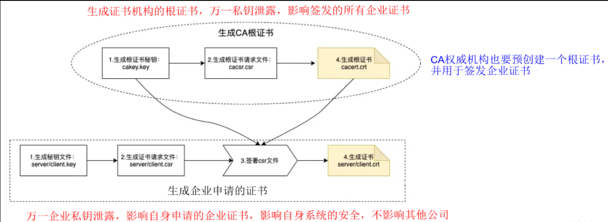

# 面试篇

## 一 概述

###### Linux什么

是一个基于POSIX和UNIX的多用户、多任务、支持多线程和多CPU的`操作系统`(直接管理系统硬件和资源的软件,操作系统位于应用与硬件之间,负责在所有软件与相关的物理资源之间建立连接)

###### 如何理解Linux一切皆文件(Everything is a file)

Linux系统中的一切东西全都可以通过文件的方式进行访问或者管理反过来说任何被挂在系统中的东西,即使它们的本质并不是文件,也会被OS以文件的眼光来呈现

> 1. Linux所有文件的后缀只是方便用户使用,对系统没有任何作用
> 2. 文件=内容+属性使用C函数接口对文件的操作只是对其内容进行增删改；而只有使用的chmod、chgrep命令才是对文件的属性操作

###### Linux目录结构

|    目录     |                             说明                             |
| :---------: | :----------------------------------------------------------: |
|   `/bin`    |                      存放经常使用的命令                      |
|    /sbin    |       s表示Super User,存放系统管理员使用的系统管理程序       |
|  ``/home``  |                       普通用户的主目录                       |
|   `/root`   |                      超级管理员的主目录                      |
|    /lib     | 系统开机所需要的最基本的动态连接共享库,类似Windows的DLL文件  |
| /lost+found |       一般情况下为空,当系统非法关机后,就会存放一些文件       |
|  ==/etc==   |            所有的系统管理所需要的配置文件和子目录            |
|  ==/usr==   |               用户的应用程序和文件默认存放位置               |
|    /boot    |                    Linux启动时的核心文件                     |
|    /proc    |    虚拟目录,是系统内存的映射,可以访问这个目录获取系统信息    |
|    /srv     |               存放一些服务启动后需要提取的数据               |
|    /sys     | 系统使用的目录,虚拟文件系统和/proc/相似,该目录中的数据都保存在内存中 |
|    /tmp     |                       存放一些临时文件                       |
|    /dev     |                    所有硬件以文件形式存储                    |
|    /mnt     |                     临时挂载别的文件系统                     |
|  ==/opt==   |                   主机额外安装软件所在目录                   |
|    /var     |                存放不断扩充或经常被修改的文件                |

###### 开源许可证分类


###### Linux命令的本质

==命令本质上是一个有可执行权限(x)的普通文件==,普通文件的执行需要定位到该文件才能够执行,但是为什么**pwd**命令没有用相对路径或绝对路径定位pwd就可以在任意目录去执行呢？那是因为执行任何命令的时候,`都会从path环境变量所记录的搜索路径中按顺序查找有可执行权限的pwd文件,找到了就拼上路径执行该文件`

###### 什么是Linux发行版

GNU(软件)+Linux内核(系统)=Linux发行版

###### 系统开机流程

`开机 -> BIOS -> /boot -> init进程 -> 运行级别 -> 运行级别对应的服务`

###### 系统运行级别

| 级别 | 意义                                                         | 简化              |
| ---- | :----------------------------------------------------------- | ----------------- |
| 0    | 系统关闭或关机的级别在运行级别0下系统会停止所有服务,卸载文件系统然后关闭计算机 |                   |
| 1    | 称为单用户模式,通常用于维护或修复系统在运行级别1下系统启动为单用户模式,==只有root用户能够登录==,`网络服务被禁用` |                   |
| 2    | 多用户模式,但没有NFS(网络文件系统)支持在运行级别2下系统会启动多个用户,但不挂载远程文件系统 |                   |
| 3    | 标准多用户模式,它会启动多个用户并启用所有网络服务            | multi-user.target |
| 4    | 通常未使用,可以根据需要将其配置为自定义模式                  |                   |
| 5    | 通常与运行级别3相同,但它会使用**图形用户界面(GUI)**在运行级别5下,通常会启动X服务器以便用户可以使用图形桌面环境 | graphical.target  |
| 6    | 系统重新启动的级别在运行级别6下,系统会执行重启操作,类似于运行级别0 |                   |

###### 服务器注意事项

1. 远程服务器不允许关机,只能重启
2. 重启前应该关闭服务(例如生产服务,次之网络服务)
3. 不要在服务器访问高峰运和地高负载命令(例解,压缩大文件,大量IO操作,如整盘扫描,复制大文件)
4. 远程配置防火墙时不要把自已踢出服务器
5. 指定合理的密码规范并定期更新
6. 合理分配权限

###### Linux注意事项

1. 大小写敏感,命令长小写
2. 所有内容都是以文件形式保存
3. 不靠扩展名(后缀名)区分文件类型
4. 所有存储设备都必须挂载后才能使用,包括硬盘,U盘,光盘

###### 分区推荐方案

1. /:10G
2. /boot:200M
3. Swap:2G
4. /var:1G以上,可变数据放在其中,例如日志文件,分配大小视用途而定,一般现在的大硬盘,建议分配5G
5. /home:最大的剩余空间的一半,用户的家目录所在
6. /usr:最大的剩余空间的一半,最耗用空间的部份存放软件的地方

###### Linux内核结构


###### 编译工作组成阶段

* 预编译(Preprocessing)
* 编译(Compilation)
* 汇编(Assembly)
* 链接(Linking)

###### Linux常见的配置文件

| 文件        | CentoOS | Ubuntu | Rocky                                  |
| ----------- | ------- | ------ | -------------------------------------- |
| 网络配置    |         |        | /etc/NetworkManager/system-connections |
| systemd服务 |         |        | /etc/systemd/system                    |
| 环境变量    |         |        | /etc/profile.d                         |

## 二 命令

###### cp和mv的区别

cp命令是用于文件的复制,文件个数是增加的,而mv则是对文件进行移动,文件位置发生变化,但总个数并无增加

###### du和df的区别

df是用于查看磁盘或分区使用情况的命令,而du命令则是用于按照指定容量单位来查看文件或目录在磁盘中的占用情况

###### ; & && | ||用法

| 符号 | 作用                                                         |
| ---- | ------------------------------------------------------------ |
| ;    | 用==;==号隔开每个命令, 每个命令按照从左到右的顺序,顺序执行,彼此之间不关心是否失败,所有命令都会执行 |
| \|   | 把前一个命令原本要输出到屏幕的信息当作后一个命令的标准输入   |
| \|\| | 只有在\|\|左边的命令返回假,\|\|右边的命令才会被执行          |
| &    | &放在启动参数后面表示设置此进程为后台进程                    |
| &&   | 只有在&&左边的命令返回真,&&右边的命令才会被执行              |

###### FACL是什么

File Access Control List(**文件访问控制列表**):更加精准地控制权限的分配,例如仅允许某个用户访问指定目录或仅有某个用户才具有写入权限,把权限约束在一个极小的范围内

###### 文件有几种权限

* 一般权限
* ==特殊权限==
* SELinux安全上下文
* ==FACL(文件访问控制列表)==
* ==文件隐藏属性==

## 三 网络

###### VMware提供3种网络设置

* 桥接模式

虚拟机直接接连接外部物理网络的模式,主机起到了桥接网络的作用,这种模式下,==虚拟机可以直接访问外部网络,并且对外部网络是可见的==

* NAT模式

虚拟机和主机构建一个专用网络,并通过虚拟机网络地址转换(NAT)设备对IP进行转换,`虚拟机通过共享主机IP可以访问外部网络,但外部网络无法访问虚拟机`

* 主机模式

虚拟机只与主机共享一个专用网络,**与外部网络无法通信**

###### 修改IP地址后可能遇到的问题

1. 物理机能ping通虚拟机,但是虚拟机ping不通物理机:一般都是因为物理机的防火墙问题,把防火墙关闭就行

2. 虚拟机能Ping通物理机,但是虚拟机Ping不通外网:一般都是因为DNS的设置有问题

3. 虚拟机Pingwww.baidu.com显示域名未知等信息:一般查看GATEWAY和DNS设置是否正确

> * 如果以上全部设置完还是不行,需要关闭(禁用)NetworkManager服务
> * 如果检查发现systemctl status network有问题 需要检查ifcfg-ens33

###### Firewalld和Iptables的区别

Firewalld是一款`动态防火墙管理工具`,而Iptables是**静态防火墙管理工具**

* Iptables:将新的防火墙规则添加进/etc/sysconfig/iptables配置文件当中(用命令配置的规则只是临时生效,而添加到配置文件中的规则是永久有效的),之后执行"service iptables reload"命令进行重载,使新增加或修改之后的规则生效;==它要将旧防火墙规则全部清空,再重新加载所有的防火墙规则==,而如果新规则配置需要重载(Reload)内核模块的规则,在这个过程的背后还会包含卸载和重新加载内核模块的动作,存在很大的隐患
* Firewalld:动态修改单条规则,动态管理规则集,允许更新规则而==不破坏现有会话和连接,也不需要重新启动服务==

## 四 文件

###### 文件类型

* `-`表示文件
* `d`表示目录
* `l`表示链接文件
* b表示块设备文件(硬盘)
* c表示字符设备(键盘,鼠标)
* s表示套接字we文件(socket)
* p表示管道文件

###### rwx对文件和目录的作用

1. 文件

   * `r`:可以读取查看

   * `w`:可以修改,==但不能删除文件(删除一个文件的前提是对该文件所在目录有写权限)==
   * `x`:可以被系统执行

2. 目录

   * `r`:可以读取,ls查看你目录内容
   * `w`:可以修改,**目录内创建+删除+重命名目录**
   * `x`:==可以进入该目录==

## 五 进程

###### 进程和服务的区别

计算机中一个正在执行的程序或命令,被叫做"进程"(process);启动之后一只存在、常驻内存不断运行的进程,被称作"服务"(service)

###### 内置命令与外部命令

一部分基础功能的系统命令是直接内嵌在Shell中的,系统加载启动之后会随着Shell一起加载,常驻系统内存中这部分命令被称为"内置(built-in)命令"；相应的其它命令被称为"外部命令"

###### 进程信息


* USER:==该进程是由哪个用户产生的==
* PID:==进程的ID号==
* %CPU:该进程占用CPU资源的百分比,占用越高进程越耗费资源
* %MEM:该进程占用物理内存的百分比,占用越高进程越耗费资源
* VSZ:该进程占用虚拟内存的大小,单位KB
* RSS:该进程占用实际物理内存的大小,单位KB
* TTY:该进程是在哪个终端中运行的
  * tty1-tty7代表本地控制台终端,tty1-tty6是本地的字符界面终端,tty7是图形终端
  * pts/0-255代表虚拟终端(现在不止256个)
  * `？表示内核启动的`
* STAT:进程状态。常见的状态有
  * R运行
  * S睡眠
  * T停止状态
  * s包含子进程
  * +位于后台
* START:该进程的启动时间
* TIME:该进程占用CPU的运算时间,注意不是系统时间
* COMMAND:==产生此进程的命令名==


* UID:用户ID
* PID:进程ID
* PPID:父进程的进程ID
* C:CPU使用的资源百分比(CPU用户计算执行优先级的因子,数值越大CPU密集运算执行优先级越低)
* STIME:启动时间
* TTY:与进程关联的终端(tty)
* TIME:进程使用的总cpu时间
* CMD:正在执行的命令行命令

###### 终端类型

* 物理终端(tty):与计算机主机直接进行物理连接
* 伪终端(pts):通过互联网TCP/IP协议连接的输入和输出设备组合就是伪终端,如使用SSH、Telnet连接

###### 进程的状态

* ==R(运行 runnable)正在运行或在运行队列中等待)==
* ==S(中断 sleeping)休眠中, 受阻, 在等待某个条件的形成或接受到信号==
* ==D(不可中断 uninterruptible sleep) 收到信号不唤醒和不可运行, 进程必须等待直到有中断发生==
* ==Z(僵死 zombie)进程已终止, 但进程描述符存在, 直到父进程调用wait4()系统调用后释放==
* ==T(停止 stopped)进程收到SIGSTOP,SIGSTP,SIGTIN,SIGTOU信号后停止运行运行==
* `s(包含子进程)`
* `l(多线程)`
* `+(前台显示)`

###### Linux典型应用程序的目录结构

| 文件类型                 | 保存目录       | 说明                           |
| ------------------------ | -------------- | ------------------------------ |
| 普通的可执行程序文件     | /usr/bin       | 所有用户可执行                 |
| 服务器程序、管理程序文件 | /usr/sbin      | 只有管理员可执行               |
| 应用程序配置文件         | /etc           | 通过rpm或yum方式安装的应用程序 |
| 日志文件                 | /var/log       | 系统日志                       |
| 应用程序参考文档文件     | /usr/share/doc | 关于应用程序的参考文档等数据   |
| 应用程序手册页文件       | /usr/share/man | 执行文件及配置文件的man手册页  |

###### Linux软件安装方式

* 源码安装:程序软件的源代码(一般也叫Tarball,即将软件的源码以tar打包后再压缩的资源包)

* 二进制安装:如Red Hat发行版的`.rpm`包,Debian发行版的`.deb`包

* 包安装工具(yum,apt)

###### 源码安装步骤

1. 下载源码包并解压到指定目录
2. 预编译 ==./configure==(--prefix==安装路径,来指定安装路径)
3. 编译 `make`(生成可执行二进制文件)
4. 安装make install(复制二进制文件到系统,配置应用环境)

###### curl和wget的区别

* 相同点
    * curl和wget都是命令行工具,用于从Web服务器下载文件或数据
* 不同点
    * 功能不同:curl是一个通用的工具,支持多种网络协议,包括HTTP、FTP、SMTP、POP3等,可以用于上传、下载、发送邮件等多种操作;wget则主要用于HTTP和FTP协议的下载,不支持其他协议和操作
    * 输出方式不同:==curl的输出结果是文件的内容==,==wget的输出结果是保存在本地的文件==
    * 用法不同:curl的命令选项比较复杂,需要精确设置不同的参数才能完成不同的操作;wget的命令选项相对简单,只需要指定URL和输出文件路径即可
    * 支持情况不同:curl通常已经安装在Linux系统中,wget则可能需要用户手动安装
    * 实际使用:curl由于可自定义各种请求参数所以在模拟web请求方面更擅长;wget由于支持ftp和Recursive所以在下载文件方面更擅长

###### 源码包(原代码安装,脚本安装包)

* 优点

1. 开源,可以自行修改源代码
2. 可以自由选择所需功能
3. 源码包需要编译,更加适合安装的系统,稳定性和效率更高
4. 卸载方便,可直接删除安装的位置, 没垃圾

* 缺点

1. 安装步骤较多,尤其安装大型的软件集合时,容易出现拼写等人为错误
2. 编译时间较长,比二进制包安装慢
3. 安装过程报错新手很难解决

###### 二进制包(RPM包,DEB包,编译后的二进制文件)

* 优点

1. 包管理系统简单安装,升级,查询,卸载几个命令就可以实现
2. 安装速度比源码包快得多

* 缺点

1. 因为是编译后的,不能再看到源代码
2. 功能选译不如源码包灵活
3. 存在依赖性的问题

###### 软件更新注意事项

安装软件的原则是用什么装什么,升级软件也要有针对性的升级不要"yum -y update"因为这样会连linux的内核在内,所有包一并更新,更新内核后需要配置才能使用,不配置是进入不了系统的remove也一样,因为依赖性的问题,删除软件有可以使其它软件崩溃,尽量不要卸载

## 六 Shell

###### Shell是什么


Shell是一个C语言编写的脚本语言,它是用户与Linux的桥梁,用户输入命令交给Shell处理,Shell将相应的操作传递给内核(Kernel),内核把处理的结果输出给用户(`.sh扩展名并不会影响Shell脚本运行,为的就是做到见名知意`)

###### Shell解析器有哪些

* ==bash==(CentOS)
* **sh(bash的软链接)**
* `dash`(Ubuntu)

###### Shell变量命名规则

* 变量名称可以由`字母`、`数字`和`下划线`组成,但是==不能以数字开头==,**环境变量名建议大写**
* 等号两侧不能有空格
* **在bash中,变量默认类型都是字符串类型,无法直接进行数值运算**
* 变量的值如果有空格,需要使用双引号或单引号括起来
* 变量名必须以字母或者下划线开头(区分大小写)

###### Shell脚本格式

```shell
# 指定解析器
#!/bin/bash

# 命令内容
echo "hello world"
```

###### 脚本执行方式

* 当前进程中执行
  * source 脚本
  * . 脚本

* 新进程中执行
  * ./脚本(不需要权限,解释器直接执行)
  * /bin/bash 脚本(==需要执行权限==,`且脚本第一行必须为#!/bin/bash`)

###### #!/bin/bash作用是什么

* "#!"是一个约定标记,用来告诉操作系统这个脚本需要用什么解释器来执行
* /bin/bash指明了Shell解释器的具体位置

###### 当前Shell与新Shell执行脚本的区别

* 环境变量的继承关系
* 是否在一个Shell进程

###### Shell脚本中'',"",``的区别

`""会解析执行(所见非所得)`,==''原样输出(所见即所得)==,**``用于命令替换,用于将命令的结果赋值给变量**

###### $变量和${变量}的区别

变量名外面的大括号"{}"是可选的,加不加都行,加大括号的作用是帮助解释器识别变量名的边界(`echo "www.${baidu}.com"`)

###### 如何判断Shell脚本是否在当前进程中执行

在Shell脚本中打印当前进程的PID(`echo "当前进程PID为: [$$]"`)

###### 如何区分$*和$@

```shell
# 循环一次
for value in "$*"
do
	echo "$value"
done

# 循环多次
for value in "$@"
do
	echo "$value"
done
```

###### [] 和[[]]的区别

* [ ]是符合POSIX标准的测试语句,兼容性更强,几乎可以运行在所有的Shell解释器中,[[ ]]仅可运行在特定的几个Shell解释器中(Bash)
* <和>在[[ ]]中用作排序,而[]不支持
* ==[ ]中使用-a和-o表示逻辑与和逻辑或,[[ ]]使用&&和||来表示==
* ==在[ ]中是字符匹配,在[[ ]]中是模式匹配==
* []不支持正则匹配,[[ ]]支持用`=~`进行正则匹配
* []仅在部分Shell中支持用()进行分组,[[ ]]均支持
* [ ]中如果变量没有定义,那么需用双引号引起来,[[ ]]中不需要

###### () (()) [] [[]]作用

| 符号 | 作用       |
| ---- | ---------- |
| ()   | 初始化数组 |
| (()) | 整数计算   |
| []   | 条件判断   |
| [[]] | 条件判断   |

###### $() $(()) $[] ${}作用

| 符号  | 作用               |
| ----- | ------------------ |
| $()   | 命令替换           |
| $(()) | 对(())计算结果取值 |
| $[]   | 整数计算           |
| ${}   | 引用变量           |

###### 常见的系统变量

| 变量名    | 含义                        |
| --------- | --------------------------- |
| $SHELL    | 默认Shell                   |
| $HOME     | 当前用户家目录              |
| $IFS      | 内部字段分隔符              |
| $LANG     | 默认语言                    |
| $PATH     | 默认可执行程序路径          |
| $PWD      | 当前目录                    |
| $UID      | 当前用户ID                  |
| $USER     | 当前用户                    |
| $RANDOM   | 随机生成一个0至32767 的整数 |
| $HOSTNAME | 主机名                      |
| $$        | 进程ID                      |

```shell
# 查看所有系统变量
set

# 加载系统变量
source /etc/init.d/functions
```


# 基础篇

## 一 软件安装

### 1.1 Linux

#### 查看宿主机网络信息

```shell
# 获取 IP 网关 DNS 子网掩码
ipconfig /all
```

#### 查看虚拟机网络配置

```shell
ifconfig
```

#### 安装镜像

* CentOS
* Rocky
* Ubuntu

#### 设置静态网络

* CentOS

```shell
cd /etc/sysconfig/network-scripts

cp ifcfg-ens33 ifcfg-ens33.bak
```

```shell
TYPE="Ethernet"
PROXY_METHOD="none"
BROWSER_ONLY="no"
BOOTPROTO="static"
DEFROUTE="yes"
IPV4_FAILURE_FATAL="no"
IPV6INIT="yes"
IPV6_AUTOCONF="yes"
IPV6_DEFROUTE="yes"
IPV6_FAILURE_FATAL="no"
IPV6_ADDR_GEN_MODE="stable-privacy"
NAME="ens33"
UUID="0a0803fd-b699-4fec-b439-68d654205ab9"
DEVICE="ens33"
ONBOOT="yes"
# IP地址
IPADDR=192.168.2.38
# 子网掩码
NETMASK=255.255.255.0
# 网关
GATEWAY=192.168.2.1
# DNS
DNS1=192.168.2.1
```

```shell
systemctl restart network
```

* Rocky

```shell
cd /etc/NetworkManager/system-connections

sudo cp ens160.nmconnection ens160.nmconnection.backup
```

```shell
[connection]
id=ens160
uuid=755751e4-d672-3c2b-a3a6-05860d6a49b6
type=ethernet
autoconnect-priority=-999
interface-name=ens160
timestamp=1715512542

[ethernet]

[ipv4]
method=manual
address1=192.168.2.121/24,192.168.2.1
dns=192.168.2.1

[ipv6]
addr-gen-mode=eui64
method=auto

[proxy]
```

```sehll
nmcli c down

nmcli c up
```

* Ubuntu

```shell
cd /etc/netplan

sudo cp 01-network-manager-all.yaml 01-network-manager-all.yaml.bak

sudo chmod 777 01-network-manager-all.yaml
```

```shell
# 根据第一步查询的信息配置
network:
  renderer: networkd
  ethernets:
    ens33: # 一 网卡
    	addresses:
      	  - 192.168.25.128/24 # 二 IP地址
    	nameservers:
      	  addresses: [192.168.25.2] # 三 DNS
    	routes:
      	  - to: default
        	via: 192.168.25.2 # 四 网关
  version: 2
```

```shell
sudo netplan apply
```

#### 修改下载源

* CentOS

```shell
# 进入下载源目录,备份原有的下载源
cd /etc/yum.repos.d/
mv CentOS-Base.repo CentOS-Base.repo.Back

# 下载阿里云下载源
wget http://mirrors.aliyun.com/repo/Centos-7.repo
mv Centos-7.repo CentOS-Base.repo

# 清理缓存
yum clean all
yum makecache

# 查看下载源设置是否成功
yum repolist all
```

* Rocky

```shell
# 备份配置文件
cd /etc/yum.repos.d/ 
```

```shell
sed -e 's|^mirrorlist=|#mirrorlist=|g' \
    -e 's|^#baseurl=http://dl.rockylinux.org/$contentdir|baseurl=https://mirrors.aliyun.com/rockylinux|g' \
    -i.bak \
    /etc/yum.repos.d/rocky*.repo
```

```shell
# 生成缓存
dnf autoremove
dnf clean all
dnf makecache

# 查看下载源修改是否成功
yum repolist
```

* Ubuntu

```shell
# 备份原有的下载源
cd /etc/apt/
cp sources.list sources.list.bak

# 设置阿里云下载源
vim sources.list
```

```shell
deb http://mirrors.aliyun.com/ubuntu/ bionic main restricted universe multiverse
deb http://mirrors.aliyun.com/ubuntu/ bionic-security main restricted universe multiverse
deb http://mirrors.aliyun.com/ubuntu/ bionic-updates main restricted universe multiverse
deb http://mirrors.aliyun.com/ubuntu/ bionic-proposed main restricted universe multiverse
deb http://mirrors.aliyun.com/ubuntu/ bionic-backports main restricted universe multiverse
deb-src http://mirrors.aliyun.com/ubuntu/ bionic main restricted universe multiverse
deb-src http://mirrors.aliyun.com/ubuntu/ bionic-security main restricted universe multiverse
deb-src http://mirrors.aliyun.com/ubuntu/ bionic-updates main restricted universe multiverse
deb-src http://mirrors.aliyun.com/ubuntu/ bionic-proposed main restricted universe multiverse
deb-src http://mirrors.aliyun.com/ubuntu/ bionic-backports main restricted universe multiverse
```

```shell
# 跟新下载源,修复损坏的软件包
apt update
apt install -f

# 更新软件
apt upgrade
```

#### 系统配置修改

###### 关闭防火墙

```shell
systemctl stop firewalld && systemctl disable firewalld
```

###### 关闭SElinux

```shell
# 备份
cp /etc/selinux/config /etc/selinux/config.bak

# SELINUX=enforcing 改为 SELINUX=disabled
sed -i "s/SELINUX=enforcing/SELINUX=disabled/g" /etc/selinux/config
```

###### 主机名&hosts

```shell
# 主机名
vim /etc/hostname

# hosts
vim /etc/hosts
```

###### 时钟同步

```shell
# 查看当前时间信息
timedatectl status

# 1.下载安装Chrony
dnf install -y chrony

# 2.编辑配置文件
vim /etc/chrony.conf
```

```shell
pool ntp1.aliyun.com iburst
pool ntp.tencent.com iburst
pool ntp1.bce.baidu.com iburst
```

```shell
# 3.设置chronyd服务,开机自动启动
systemctl enable chronyd

# 4.启动chronyd服务
systemctl start chronyd

# 5.查看chronyd服务,运行状态
systemctl status chronyd

# 6.防火墙放行NTP端口123
firewall-cmd --zone=public --add-port=123/udp --permanent

# 7.防火墙加载策略
firewall-cmd --reload

# 8.查看服务状态,时间域名被解析成公网地址
systemctl status chronyd

# 查看时间同步状态
chronyc sourcestats -v
```

###### 禁止root远程SSH登录

```shell
# 禁止root用户SSH登录
sudo sed -i 's/#PermitRootLogin yes/PermitRootLogin no/g' /etc/ssh/sshd_config 
sudo systemctl restart sshd
```

###### 关闭swap分区

```shell
# 查看分区
free -m
swapon -v

# 临时关闭
swapoff -a 

# 永久关闭
sed -ri 's/.*swap.*/#&/' /etc/fstab
```

###### 资源配置

> /etc/security/limits.conf

```shell
* soft nofile 1024000
* hard nofile 1024000
* soft nproc 127671
* hard nproc 127671
* soft stack 262140
* hard stack 262140
* soft  memlock  unlimited
* hard memlock  unlimited
```

###### 内核升级

```shell
# 查看系统内核个数
grep limit /etc/dnf/dnf.conf

# 只保留两个内核,删除多余内核
dnf remove --oldinstallonly --setopt installonly_limit=2 kernel

# 不更新内核、不升级操作系统版本
dnf --exclude=kernel* --exclude=centos-release* update -y 

# 更新内核、升级系统版本
dnf update -y
```

###### 内核优化

> /etc/sysctl.conf

```shell
net.ipv4.tcp_fin_timeout = 2
net.ipv4.tcp_tw_reuse = 1
net.ipv4.tcp_tw_recycle = 1
net.ipv4.tcp_syncookies = 1
net.ipv4.tcp_syn_retries = 1
net.ipv4.tcp_synack_retries = 1
net.ipv4.tcp_max_orphans = 16384
net.ipv4.tcp_keepalive_time = 600
net.ipv4.tcp_max_syn_backlog = 16384
net.ipv4.tcp_max_tw_buckets = 36000
net.ipv4.tcp_rmem=16384 26214400 26214400
net.ipv4.tcp_wmem=32768 26214400 26214400
net.ipv4.tcp_window_scaling=1
net.ipv4.ip_local_port_range = 4000 65000
net.ipv4.route.gc_timeout = 100
net.core.somaxconn = 16384
net.core.netdev_max_backlog = 16384
net.core.rmem_default=26214400
net.core.wmem_default=26214400 
net.core.rmem_max=26214400  
net.core.wmem_max=26214400
net.ipv4.udp_mem=374394 26214400 26214400
net.ipv4.ip_local_port_range=15000 64000
net.netfilter.nf_conntrack_max = 25000000
net.netfilter.nf_conntrack_tcp_timeout_established = 180
net.netfilter.nf_conntrack_tcp_timeout_time_wait = 120
net.netfilter.nf_conntrack_tcp_timeout_close_wait = 60
net.netfilter.nf_conntrack_tcp_timeout_fin_wait = 120
fs.file-max = 9223372036854775807
fs.nr_open = 1073741816
kernel.msgmnb = 65536
kernel.msgmax = 65536
vm.max_map_count=655360
```

```shell
sysctl -p
```

#### 初始化设置

###### 必备工具

```shell
dnf -y install net-tools tree wget lrzsz vim unzip bash-completion build-essential yum-utils telnet telnet-server device-mapper-persistent-data lvm2 nfs-utils gcc gcc-c++ make cmake libxml2-devel curl curl-devel ntp libaio-devel ncurses-devel autoconf automake zlib-devel epel-release openssh-server socat conntrack ntpdate ipvsadm sysstat iostat zip lsof zlib openssl* pcre pcre-devel
```

######sudo权限

* 用户有sudo权限

```shell
# 添加普通用户
useradd worker

# 将普通用户添加到sudo组
usermod -aG wheel worker
```

* sudo不用每次都输入密码

```shell
# 切换目录
cd /etc/sudoers.d/

# 创建文件
vim sudoers
```

```shell
java ALL=(ALL) NOPASSWD: ALL
```

###### 公共变量

```shell
cd /etc/profile.d/

vim java.sh
```

```shel
# 软件安装位置
HOME=/java/software/

# Nginx环境
NGINX_HOME=$HOME"nginx/sbin"
PATH=$PATH:$NGINX_HOME

# MongoDB环境
MONGO_HOME=$HOME"mongo/app"
PATH=$PATH:$MONGO_HOME

# mongosh环境
MONGOSH_HOME=$HOME"mongo/mongosh"
PATH=$PATH:$MONGOSH_HOME

# MySQL环境
MYSQL_HOME=$HOME"mysql/app/bin"
PATH=$PATH:$MYSQL_HOME

export PATH
```

```shell
source /etc/profile
```

###### 自定义服务

```shell
cd /etc/systemd/system/

vim mysql.service
```

```shell
sudo systemctl daemon-reload
```

###### 磁盘清理

* 无用软件包

```shell
# 安装包
dnf clean all
dnf autoremove

# 系统日志
sudo du -sh /var/log

# 临时文件
sudo rm -rf /tmp/*

# 目录或文件
du -h --max-depth=1 / | sort -hr
```

###### 清空文件

* 文件外

```shell
true > access.log

: > access.log

cat /dev/null > access.log

echo > access.log
```

* 文件外

```shell
:%d
```

### 1.2 数据库

#### MySQL

###### 解压&重命名

```shell
tar -xvf mysql-8.4.2-linux-glibc2.28-x86_64.tar.xz -C /java/software/mysql

mv mysql-8.4.2-linux-glibc2.28-x86_64 app
```

```shell
mkdir -p mysql/{config,log,data}
```


###### 初始化

```shell
# 初始化密码在error.log
./mysqld --initialize --user=java --basedir=/java/software/mysql/app --datadir=/java/software/mysql/data --log_error=/java/software/mysql/log/error.log
```

###### 配置文件my.cnf

```shell
[mysqld]
# 端口
port=3306
# 用户
user=java
# 线程id
pid-file=/java/software/mysql/config/mysqld.pid
# 套接字
socket=/java/software/mysql/config/mysql.sock
# 安装位置
basedir=/java/software/mysql/app
# 数据存储位置
datadir=/java/software/mysql/data
# 存储引擎
default-storage-engine=INNODB
# 编码
character-set-server=utf8mb4
collation-server=utf8mb4_general_ci
# 网络连接
max_connections=200
max_connect_errors=10
wait_timeout=28800
interactive_timeout=28800
max_allowed_packet=64M
# 日志设置
log_error=/java/software/mysql/log/error.log
innodb_redo_log_capacity=64M
binlog_expire_logs_seconds=86400
max_binlog_size=104857600
# 慢查询
long_query_time=1
log_queries_not_using_indexes=1
slow_query_log=1
slow_query_log_file=/java/software/mysql/log/mysql_slow_query.log
# 缓冲池
key_buffer_size=32M
innodb_buffer_pool_size=512M

[mysql]
# 编码
default-character-set=utf8mb4

[client]
# 套接字
socket=/java/software/mysql/config/mysql.sock
# 编码
default-character-set=utf8mb4
port=3306
```

###### 启动MySQL服务器

```shell
./mysqld_safe --defaults-file=/java/software/mysql/config/my.cnf --daemonize
```

###### 客户端连接MySQL

* 本地连接

```shell
# 指定socket
./mysql -uroot -p -S /java/software/mysql/config/mysql.sock

# 修改密码
ALTER USER 'root'@'localhost' IDENTIFIED BY 'root';
```

* 远程连接

```shell
create USER 'root'@'%' IDENTIFIED BY 'root';
flush privileges;

grant all privileges on *.* to 'root'@'%';
flush privileges;
```

###### 服务自启动

```shell
cd /etc/systemd/system/

sudo vim mysql.service
```

```shell
[Unit]
Description=MySQL Server
After=network.target
After=syslog.target

[Install]
WantedBy=multi-user.target

[Service]
Type=notify
User=java
Group=java
LimitNOFILE=6553
ExecStart=/java/software/mysql/app/bin/mysqld --defaults-file=/java/software/mysql/config/my.cnf
```

```shell
sudo systemctl daemon-reload
```

###### 环境变量

```shell
cd /etc/profile.d/

sudo vim java.sh
```

```sehll
# MySQL环境
MYSQL_HOME=$HOME"mysql/app/bin"
PATH=$PATH:$MYSQL_HOME
```

#### MongoDB

###### 解压文件,创建目录

```shell
mkdir -p mongo/{config,log,data,app}

tar -zxvf mongodb-linux-x86_64-rhel90-7.0.14.tgz -C /java/software/mongo/

mv mongodb-linux-x86_64-rhel70-6.0.14 app
```

###### 启动mongo

```sehll
./mongod --fork --dbpath=/java/software/mongo/data --logpath=/java/software/mongo/log/mongod.log
```

###### 创建用户

```shell
# mongsh客户端连接
./mongosh -port 27017

# 创建root用户
use admin
db.createUser({user:"root",pwd:"root",roles:["root"]})

# 关闭mongod服务
db.shutdownServer()
```

###### 配置文件mongod.config

```sehll
# 日志文件位置
systemLog:
  destination: file
  logAppend: true
  path: /java/software/mongo/log/mongod.log
 
# 数据存储位置
storage:
  dbPath: /java/software/mongo/data
# 存储引擎
#  wiredTiger:
 
# 进程运行(开启守护进程;设置时区)
processManagement:
  timeZoneInfo: /usr/share/zoneinfo
  fork: true

# 网络配置(设置为0.0.0.0后可以通过外网访问,远程连接mongodb)
net:
  port: 27017
  bindIp: 0.0.0.0

# 访问控制(启用或禁用基于角色的访问控制,远程连接mongodb)
security:
  authorization: enabled
```

###### 自定义服务

```shell
[Unit]
Description=MongoDB
After=network.target remote-fs.target nss-lookup.target

[Service]
Type=forking
ExecStart=/java/software/mongo/app/mongod --config /java/software/mongo/config/mongod.config
ExecReload=/bin/kill -s HUP $MAINPID
ExecStop=/java/software/mongo/app/mongod --config /java/software/mongo/config/mongod.config --shutdown
PrivateTmp=true

[Install]
WantedBy=multi-user.target
```

###### 环境变量

```shell
# MongoDB环境
MONGO_HOME=$HOME"mongo/app"
PATH=$PATH:$MONGO_HOME
```

#### Redis

###### 解压编译

```shell
tar -zxvf redis-7.4.1.tar.gz

make

make install PREFIX=/java/software/redis/

mv bin/ app
```

###### 配置文件redis.conf

```sehll
bind 0.0.0.0
protected-mode no
port 6379
tcp-backlog 511
timeout 0
tcp-keepalive 300
daemonize yes
pidfile /java/software/redis/data/redis.pid
loglevel notice
logfile /java/software/redis/log/redis.log
databases 16
always-show-logo no
set-proc-title yes
proc-title-template "{title} {listen-addr} {server-mode}"
locale-collate ""
stop-writes-on-bgsave-error yes
rdbcompression yes
rdbchecksum yes
dbfilename redis.rdb
rdb-del-sync-files no
dir /java/software/redis/data/
replica-serve-stale-data yes
replica-read-only yes
repl-diskless-sync yes
repl-diskless-sync-delay 5
repl-diskless-sync-max-replicas 0
repl-diskless-load disabled
repl-disable-tcp-nodelay no
replica-priority 100
acllog-max-len 128
lazyfree-lazy-eviction no
lazyfree-lazy-expire no
lazyfree-lazy-server-del no
replica-lazy-flush no
lazyfree-lazy-user-del no
lazyfree-lazy-user-flush no
oom-score-adj no
oom-score-adj-values 0 200 800
disable-thp yes
appendonly yes
appendfilename "appendonly.aof"
appenddirname "appendonlydir"
appendfsync everysec
no-appendfsync-on-rewrite no
auto-aof-rewrite-percentage 100
auto-aof-rewrite-min-size 64mb
aof-load-truncated yes
aof-use-rdb-preamble yes
aof-timestamp-enabled no
slowlog-log-slower-than 10000
slowlog-max-len 128
latency-monitor-threshold 0
notify-keyspace-events ""
hash-max-listpack-entries 512
hash-max-listpack-value 64
list-max-listpack-size -2
list-compress-depth 0
set-max-intset-entries 512
set-max-listpack-entries 128
set-max-listpack-value 64
zset-max-listpack-entries 128
zset-max-listpack-value 64
hll-sparse-max-bytes 3000
stream-node-max-bytes 4096
stream-node-max-entries 100
activerehashing yes
client-output-buffer-limit normal 0 0 0
client-output-buffer-limit replica 256mb 64mb 60
client-output-buffer-limit pubsub 32mb 8mb 60
hz 10
dynamic-hz yes
aof-rewrite-incremental-fsync yes
rdb-save-incremental-fsync yes
jemalloc-bg-thread yes
```

###### 自定义服务

```shell
[Unit]
Description=Redis
After=network.target

[Service]
Type=forking
ExecStart=/java/software/redis/app/redis-server /java/software/redis/config/redis.conf
ExecStop=/java/software/redis/app//redis-cli shutdown
Restart=always

[Install]
WantedBy=multi-user.targetc
```

###### 环境变量

```shell
# Redis环境
REDIS_HOME=$HOME"redis/app"
PATH=$PATH:$REDIS_HOME
```

#### Elasticsearch

###### 解压 重命名

```shell
tar -zxvf elasticsearch-8.15.2-linux-x86_64.tar.gz

mv elasticsearch-8.15.2-linux-x86_64 elasticsearch
```

###### 自定义服务

```shell
[Unit]
Description=elasticsearch
After=network.target

[Service]
Type=forking
User=java
ExecStart=/java/software/elasticsearch/bin/elasticsearch -d
PrivateTmp=true
# 指定此进程可以打开的最大文件数
LimitNOFILE=65535
# 指定此进程可以打开的最大进程数
LimitNPROC=65535
# 最大虚拟内存
LimitAS=infinity
# 最大文件大小
LimitFSIZE=infinity
# 超时设置 0-永不超时
TimeoutStopSec=0
# SIGTERM是停止java进程的信号
KillSignal=SIGTERM
# 信号只发送给给JVM
KillMode=process
# java进程不会被杀掉
SendSIGKILL=no
# 正常退出状态
SuccessExitStatus=143

[Install]
WantedBy=multi-user.target
```

###### 配置文件修改

* elasticsearch.yml

```shell
cluster.name: elasticsearch
node.name: elasticsearch-one
cluster.initial_master_nodes: ["node-1"]
path.data: /java/software/elasticsearch/data
path.logs: /java/software/elasticsearch/logs
network.host: 0.0.0.0
http.port: 9200
xpack.security.enabled: false
```

* jvm.options

```shell
-Xms1g
-Xmx1g
```


### 1.3 高可用

#### Zookeeper

###### 解压 重命名

```shell
tar -zxvf apache-zookeeper-3.8.4-bin.tar.gz -C ../software/

mv apache-zookeeper-3.8.4-bin zookeeper
```

###### 配置文件zoo.cfg

```shell
dataDir=/java/software/zookeeper/data
dataLogDir=/java/software/zookeeper/log
```

###### 环境变量

```shell
# JDK21环境
JDK_HOME=$HOME"jdk-21"
PATH=$PATH:$JDK_HOME/bin

# Zookeeper环境
ZOOKEEPER_HOME=$HOME"zookeeper"
PATH=$PATH:$ZOOKEEPER_HOME/bin
```

###### 自定义服务

```shell
[Unit]
Description=Zookeeper
After=network.target

[Service]
User=java
Group=java
Restart=always
Type=forking
Environment="JAVA_HOME=/java/software/jdk-21"
ExecStart=/java/software/zookeeper/bin/zkServer.sh start /java/software/zookeeper/conf/zoo.cfg


[Install]
WantedBy=multi-user.target
```

#### Nacos

###### 执行SQL脚本

==mysql-schema.sql==

###### 安装JDK

###### 配置文件

```shell
spring.sql.init.platform=mysql

db.num=1

db.url.0=jdbc:mysql://192.168.2.100:3306/nacos?characterEncoding=utf8&connectTimeout=1000&socketTimeout=3000&autoReconnect=true&useUnicode=true&useSSL=false&serverTimezone=UTC
db.user.0=root
db.password.0=root
```

###### 自定义服务

```shell
[Unit]
Description=Nacos
After=network.target

[Service]
Type=forking
User=java
Environment="JAVA_HOME=/java/software/jdk-21"
ExecStart=/java/software/nacos/bin/startup.sh -m standalone
ExecReload=/java/software/nacos/bin/shutdown.sh
ExecStop=/java/software/nacos/bin/shutdown.sh
PrivateTmp=true

[Install]
WantedBy=multi-user.target
```


#### Kafka

###### 修改配置文件zookeeper.properties

```shell
dataDir=/java/software/kafka/zookeeper
```

###### 修改配置文件server.properties

```shell
log.dirs=/java/software/kafka/logs

listeners=PLAINTEXT://127.0.0.1:9092

zookeeper.connect=localhost:2181
```

#### RocketMQ

###### JDK设置

* runserver.sh
* runbroker.sh
* tools.sh

```shell
find_java_home
JAVA_HOME=/java/software/jdk
```

> JDK版本不能过高

###### 修改内存大小 

* runserver.sh
* runbroker.sh
* tools.sh

```shell
JAVA_OPT="${JAVA_OPT} -server -Xms256m -Xmx256m -Xmn128m
```

###### broker.conf

```shell
# broker所属集群的名称
brokerClusterName = DefaultCluster
 
# broker的名称
brokerName = broker-a
 
# broker的ID, 0表示Master,非0表示Slave
brokerId = 0
 
# 删除文件时间点,默认是凌晨4点
deleteWhen = 04
 
# 文件保留时间,默认保留48小时
fileReservedTime = 48
 
# broker的角色
# ASYNC_MASTER: 异步复制Master
# SYNC_MASTER: 同步双写Master
# SLAVE: slave
brokerRole = ASYNC_MASTER
 
# 刷盘方式
# ASYNC_FLUSH: 异步刷盘
# SYNC_FLUSH: 同步刷盘
flushDiskType = ASYNC_FLUSH
 
# NameServer的地址,如果有多个的话,使用分号分隔开
namesrvAddr=127.0.0.1:9876
 
# 当前broker监听的IP地址
brokerIP1=127.0.0.1
 
# 在发送消息时,自动创建服务器不存在的topic,默认创建4个队列 
defaultTopicQueueNums=4
 
# 是否允许broker自动创建Topic
autoCreateTopicEnable=true
 
#是否允许broker自动创建订阅组
autoCreateSubscriptionGroup=true
 
# broker对外服务的监听端口 
listenPort=10911
 
# 每个commitLog文件的大小默认是1G
mapedFileSizeCommitLog=1073741824
 
# ConsumeQueue每个文件默认存30W条
mapedFileSizeConsumeQueue=300000
 
# store的存储路径
storePathRootDir=/java/software/rocketmq/data/store
 
# commitLog的存储路径 
storePathCommitLog=/java/software/rocketmq/data/commitlog
 
# 消费队列的存储路径
storePathConsumeQueue=/java/software/rocketmq/data/consumequeue
 
# 消息索引的存储路径
storePathIndex=/java/software/rocketmq/data/index
 
# checkpoint文件的存储路径
storeCheckpoint=/java/software/rocketmq/data/checkpoint
 
# abort文件的存储路径
abortFile=/java/software/rocketmq/data/abort
 
# 限制的消息大小,默认为4M 
maxMessageSize=65536
 
# 检测物理文件磁盘空间
diskMaxUsedSpaceRatio=75
```

###### 修改日志路径

* rmq.broker.logback.xml
* rmq.client.logback.xml
* rmq.controller.logback.xml
* rmq.namesrv.logback.xml
* rmq.proxy.logback.xml
* rmq.tools.logback.xml

###### rocketmq-nameserver.service

```shell
[Unit]
Description=NameServer
After=network.target

[Service]
Type=sample
User=java
Environment="JAVA_HOME=/java/software/jdk"
ExecStart=/java/software/rocketmq/bin/mqnamesrv
ExecReload=/bin/kill -s HUP $MAINPID
ExecStop=/bin/kill -s QUIT $MAINPID


[Install]
WantedBy=multi-user.target
```

###### rocketmq-broker.service 

```shell
[Unit]
Description=BrokerServer
After=network.target

[Service]
Type=sample
User=java
Environment="JAVA_HOME=/java/software/jdk"
ExecStart=/java/software/rocketmq/bin/mqbroker -c /java/software/rocketmq/conf/broker.conf
ExecReload=/bin/kill -s HUP $MAINPID
ExecStop=/bin/kill -s QUIT $MAINPID


[Install]
WantedBy=multi-user.target
```


### 1.4 运维

#### Docker

###### 软件安装

```shell
# 添加稳定的Docker软件源
sudo dnf config-manager --add-repo=https://mirrors.aliyun.com/docker-ce/linux/centos/docker-ce.repo

# 安装docker
sudo dnf install -y docker-ce --nobest

# 查看docker版本信息
docker -v
```

###### 配置文件

```shell
# vim /etc/docker/daemon.json
{
  "data-root": "/java/software/docker/images",
  "max-concurrent-downloads": 10,
  "max-concurrent-uploads": 5,
  "log-driver": "json-file",
  "log-opts": {
    "max-size": "300m",
    "max-file": "3"
  }
}
```

###### 镜像源代理

```shell
sudo mkdir /etc/systemd/system/docker.service.d

sudo vim proxy.conf
```

```shell
[Service] 
Environment="HTTP_PROXY=http://192.168.2.5:10809" 
Environment="HTTPS_PROXY=http://192.168.2.5:10809"
```


#### Openresty

###### 源码安装

```shell
sudo dnf install -y perl gcc make pcre pcre-devel zlib zlib-devel openssl openssl-devel 
```

```shell
./configure --prefix=/java/software/openresty \
--with-luajit \
--with-pcre \
--with-http_gzip_static_module \
--with-http_realip_module \
--with-http_ssl_module  \
--with-http_stub_status_module
```

```shell
make && make install
```

###### 环境变量

```shell
OPENRESTY_HOME=$HOME"openresty"
PATH=$PATH:$OPENRESTY_HOME/nginx/sbin
```

###### 自定义服务

```shell
[Unit]
Description=Openresty
After=network.target

[Service]
Type=forking
ExecStart=/java/software/openresty/nginx/sbin/nginx -c /java/software/openresty/nginx/conf/nginx.conf
ExecReload=/java/software/openresty/nginx/sbin/nginx -s reload
ExecStop=/java/software/openresty/sbin/nginx -s stop
PrivateTmp=true

[Install]
WantedBy=default.target
```

###### 配置文件nginx.conf

```nginx
user  java;
worker_processes  1;

error_log  logs/error.log;
error_log  logs/error.log  notice;
error_log  logs/error.log  info;

pid        logs/nginx.pid;
```


#### Keepalived

###### 编译安装

```sehll
sudo dnf install -y libnl3-devel

./configure --prefix=/java/software/keepalived

make && make install
```

###### 配置文件

```shell
global_defs {
   router_id chess.com
   vrrp_skip_check_adv_addr
   vrrp_strict
   vrrp_garp_interval 0
   vrrp_gna_interval 0
}

vrrp_script chk_http_ port {
    script "/java/software/keepalived/script/nginx_check.sh"  
    interval 2   
    weight 2  
}

vrrp_instance VI_1 {
    state MASTER
    interface ens160
    virtual_router_id 50
    priority 100
    advert_int 1
    authentication {
        auth_type PASS
        auth_pass abcd
    }
    virtual_ipaddress {
        192.168.2.60
    }
}
```

```shell
global_defs {
   router_id book.com
   vrrp_skip_check_adv_addr
   vrrp_strict
   vrrp_garp_interval 0
   vrrp_gna_interval 0
}

vrrp_script chk_http_ port {
    script "/java/software/keepalived/script/nginx_check.sh"   
    interval 2   
    weight 2  
}

vrrp_instance VI_1 {
    state BACKUP 
    interface ens160 
    virtual_router_id 50 
    priority 99
    advert_int 1
    authentication {
        auth_type PASS
        auth_pass abcd
    }
    virtual_ipaddress {
         192.168.2.60
    }
}
```

> nginx_check.sh

```shell
#!/bin/bash
chk=$( ps -C nginx --no-heading| wc -l)
if [  "${chk}" =  "0" ];  then
    systemctl start nginx
    sleep 2
    chk=$( ps -C nginx --no-heading| wc -l)
    if [  "${chk}" =  "0" ];  then
    	systemctl stop keepalived
    fi
fi
```

> master.sh

```shell
ip=$(hostname -I | awk '{print $1}')
dt=$(date +'%Y%m%d %H:%M:%S')
echo "$0--${ip}--${dt}" >> /java/software/keepalived/log/master.log
```

> backup.sh

```shell
ip=$(hostname -I | awk '{print $1}')
dt=$(date +'%Y%m%d %H:%M:%S')
echo "$0--${ip}--${dt}" >> /java/software/keepalived/log/backup.log
```

> fault.sh

```shell
ip=$(ip addr|grep inet| grep 192.168 |awk '{print $2}')
dt=$(date +'%Y%m%d %H:%M:%S')
echo "$0--${ip}--${dt}" >> /java/software/keepalived/log/fault.log
```

> stop.sh

```shell
ip=$(ip addr|grep inet| grep 192.168| awk '{print $2}')
dt=$(date +'%Y%m%d %H:%M:%S')
echo "$0--${ip}--${dt}" >> /java/software/keepalived/log/stop.log
```

###### 服务自启动

```shell
[Unit]
Description=Keepalived
After=network-online.target syslog.target
Requires=network-online.target
 
[Service]
Type=forking
ExecStart=/java/software/keepalived/sbin/keepalived
ExecReload=/bin/kill -s HUP $MAINPID
ExecStop=/bin/kill -s QUIT $MAINPID
PrivateTmp=true
 
[Install]
WantedBy=multi-user.target
```


#### Nginx

###### 编译安装

```shell
sudo dnf install -y  pcre-devel zlib-devel openssl-devel

./configure --prefix=/java/software/nginx  --with-http_ssl_module --with-http_stub_status_module --with-http_gzip_static_module --with-pcre

--with-compat \
--with-debug \
--with-pcre-jit \
--with-http_ssl_module \
--with-http_stub_status_module \
--with-http_realip_module \
--with-http_auth_request_module \
--with-http_v2_module \
--with-http_dav_module \
--with-http_slice_module \
--with-threads \
--with-http_addition_module \
--with-http_gunzip_module \
--with-http_gzip_static_module \
--with-http_sub_module 

make && make install
```

###### 环境变量

```shell
NGINX_HOME=$HOME"nginx"
PATH=$PATH:$NGINX_HOME/sbin
```

###### 自定义服务

```shell
[Unit]
Description=Mashang Service
After=network.target

[Service]
Type=forking 
ExecStart=/java/software/nginx/sbin/nginx
ExecReload=/java/software/nginx/sbin/nginx -s reload
ExecStop=/java/software/nginx/sbin/nginx -s quit
PrivateTmp=true

[Install]
WantedBy=multi-user.target
```

###### 配置文件

```shell

```


#### cockpit监控


## 二 核心功能

### 2.1 初始化配置

#### 静态网络配置

1. 查看宿主机网络配置信息

```shell
ipconfig /all
```

2. 查看虚拟机网络配置

```shell
ifconfig
```

###### CentOS

3. 进入==/etc/sysconfig/network-scripts==目录

```shel
cd /etc/sysconfig/network-scripts
```

4. 备份配置文件

```shell
cp ifcfg-ens33 ifcfg-ens33.bak
```

5. 修改ifcfg-ens33

```shell
TYPE="Ethernet"
PROXY_METHOD="none"
BROWSER_ONLY="no"
BOOTPROTO="static"
DEFROUTE="yes"
IPV4_FAILURE_FATAL="no"
IPV6INIT="yes"
IPV6_AUTOCONF="yes"
IPV6_DEFROUTE="yes"
IPV6_FAILURE_FATAL="no"
IPV6_ADDR_GEN_MODE="stable-privacy"
NAME="ens33"
UUID="0a0803fd-b699-4fec-b439-68d654205ab9"
DEVICE="ens33"
ONBOOT="yes"
# IP地址
IPADDR=192.168.2.38
# 子网掩码
NETMASK=255.255.255.0
# 网关
GATEWAY=192.168.2.1
# DNS
DNS1=192.168.2.1
```

6. 重启网络服务

```shell
systemctl restart network
```

###### Ubuntu

3. 进入==/etc/netplan==

```shell
cd /etc/netplan
```

4. 备份配置文件

```shell
sudo cp 01-network-manager-all.yaml 01-network-manager-all.yaml.bak
```

5. 修改文件权限

```shell
sudo chmod 777 01-network-manager-all.yaml
```

6. 修改网络配置

```yaml
# 根据第一步查询的信息配置
network:
  renderer: networkd
  ethernets:
    ens33: # 一 网卡
    	addresses:
      	  - 192.168.25.128/24 # 二 IP地址
    	nameservers:
      	  addresses: [192.168.25.2] # 三 DNS
    	routes:
      	  - to: default
        	via: 192.168.25.2 # 四 网关
  version: 2
```

7. 重启网络配置服务

```shell
sudo netplan apply
```

###### Rocky

1. 进入网络配置文件目录

```shell
cd /etc/NetworkManager/system-connections
```

2. 修改配置文件

```shell
[connection]
id=ens160
uuid=755751e4-d672-3c2b-a3a6-05860d6a49b6
type=ethernet
autoconnect-priority=-999
interface-name=ens160
timestamp=1715512542

[ethernet]

[ipv4]
method=manual
address1=192.168.2.121/24,192.168.2.1
dns=192.168.2.1

[ipv6]
addr-gen-mode=eui64
method=auto

[proxy]
```


#### 修改下载源

###### CentOS

1. `进入/etc/yum.repos.d目录`

```shell
cd /etc/yum.repos.d/
```

2. ==重命名==

```shell
mv CentOS-Base.repo CentOS-Base.repo.Back
```

3. **下载阿里云的repo文件**

```shell
wget http://mirrors.aliyun.com/repo/Centos-7.repo
```

4. 修改名称

```shell
mv Centos-7.repo CentOS-Base.repo
```

5. 执行yum源跟新mingl

```shell
yum clean all
yum makecache
```

6. 查看yum源

```shell
yum repolist all
```

###### Ubuntu

1. `进入/etc/apt/目录`

```shell
cd /etc/apt/
```

2. ==备份==

```shell
cp sources.list sources.list.bak
```

3. **编辑sources.list**

```shell
deb http://mirrors.aliyun.com/ubuntu/ bionic main restricted universe multiverse
deb http://mirrors.aliyun.com/ubuntu/ bionic-security main restricted universe multiverse
deb http://mirrors.aliyun.com/ubuntu/ bionic-updates main restricted universe multiverse
deb http://mirrors.aliyun.com/ubuntu/ bionic-proposed main restricted universe multiverse
deb http://mirrors.aliyun.com/ubuntu/ bionic-backports main restricted universe multiverse
deb-src http://mirrors.aliyun.com/ubuntu/ bionic main restricted universe multiverse
deb-src http://mirrors.aliyun.com/ubuntu/ bionic-security main restricted universe multiverse
deb-src http://mirrors.aliyun.com/ubuntu/ bionic-updates main restricted universe multiverse
deb-src http://mirrors.aliyun.com/ubuntu/ bionic-proposed main restricted universe multiverse
deb-src http://mirrors.aliyun.com/ubuntu/ bionic-backports main restricted universe multiverse
```

4. 更新下载源

```shell
apt update
```

5. 更新软件

```shell
# 修复损坏的软件包
apt install -f

# 更新软件
apt upgrade
```

###### Rocky

1. 备份配置文件

```shell
cp -rf ./* ./bak
```

2. 修改文件

```shel
sed -e 's|^mirrorlist=|#mirrorlist=|g' 
\ -e 's|^#baseurl=http://dl.rockylinux.org/$contentdir|baseurl=https://mirrors.aliyun.com/rockylinux|g' \ -i.bak 
\ /etc/yum.repos.d/Rocky-*.repo
```

3. 生成缓存

```shell
dnf makecache
```

#### 安装必备工具

```shell
dnf -y install net-tools tree wget lrzsz vim unzip bash-completion build-essential yum-utils telnet telnet-server device-mapper-persistent-data lvm2 nfs-utils gcc gcc-c++ make cmake libxml2-devel curl curl-devel ntp libaio-devel ncurses-devel autoconf automake zlib-devel epel-release openssh-server socat conntrack ntpdate ipvsadm sysstat iostat zip lsof zlib openssl* pcre pcre-devel
```

#### 关闭防火墙

```shell
systemctl stop firewalld && systemctl disable firewalld
```

#### 关闭SElinux

```shell
# 备份
cp /etc/selinux/config /etc/selinux/config.bak

# SELINUX=enforcing 改为 SELINUX=disabled
```

#### 配置主机名和hosts

```shell
# 主机名
vim /etc/hostname

# hosts
vim /etc/hosts
```

#### 时钟同步

```shell
# 时间同步
yum install ntpdate -y
 
ntpdate cn.pool.ntp.org
 
crontab -e * */1 * * * /usr/sbin/ntpdate cn.pool.ntp.org

# 时区
sudo timedatectl set-timezone Asia/Shanghai
```

#### 配置普通用户

```shell
# 添加普通用户
useradd worker

# 将普通用户添加到sudo组
usermod -aG wheel worker

# 禁止root用户SSH登录
sudo sed -i 's/#PermitRootLogin yes/PermitRootLogin no/g' /etc/ssh/sshd_config 
sudo systemctl restart sshd
```

#### 内核更新

```shell
dnf update

# 不更新内核、不升级操作系统版本
yum --exclude=kernel* --exclude=centos-release* update

# 更新内核、升级系统版本
yum update
```

#### 磁盘清理

```shell
# 无用软件包
sudo apt clean
sudo apt autoclean

# 系统日志
sudo du -sh /var/log

# 临时文件
sudo rm -rf /tmp/*

# 内核文件
dnf autoremove

# 目录或文件
du -h --max-depth=1 / | sort -hr
```

#### sudo不用每次都输入密码

1. 切换目录

```shell
cd /etc/sudoers.d/
```

2. 创建文件

```shell
vim sudoers
```

```shell
# sudo ALL=NOPASSWD:ALL
java ALL=(ALL) NOPASSWD: ALL
```

### 2.2 定时任务

#### 语法

> ==*== `*` ***** * * 任务
>
> 分钟 小时 天 月 星期 任务

```shell
# 编辑
crontab -e

# 查询
crontab -l

# 删除
crontab -r

# 重启定时任务服务
systemctl restart crond
```

#### 时间

| 序号    | 含义                 | 范围                  |
| ------- | -------------------- | --------------------- |
| 第一个* | `一小时中的第几分钟` | 0-59                  |
| 第二个* | `一天中的第几个小时` | 0-23                  |
| 第三个* | `一月中的第几天`     | 1-31                  |
| 第四个* | `一年中的第几个月`   | 1-12                  |
| 第五个* | `一周中的星期几`     | 0-7(0和7都代表星期天) |

| 特殊符号 | 含义                                                         |
| -------- | ------------------------------------------------------------ |
| ==*==    | 代表任何时间比如第一个"*"就代表一小时中每分钟 都执行一次的意思 |
| ==,==    | 代表不连续的时间比如"0 8,12,16 * * * 命令",就代表在每天的8点0分,12点0分,16点0分都执行一次命令 |
| ==-==    | 代表连续的时间范围比如"0 5 * * 1-6 命令",代表在周一到周六的凌晨5点0分执行命令 |
| ==*/n==  | 代表每隔多久执行一次比如"*/10 * * * * 命令",代表每隔10分钟就执行一遍命令 |

### 2.3 后台任务

###### &

```shell
# 执行文件
./test.sh > out.file 2>&1 &
 
# 查看是否在后台运行
ps -ef|grep test
 
# 后台的程序 需要关闭时,需要kill命令停止
killall [程序名]
```

> 1. 方便查看运行日志很,不方便停止
> 2. ==关闭终端会停止运行==,使用ctrl+c或ctrl+z时进程不会结束

###### nohup

```shell
nohup bash test.sh > test.log 2>&1 & 

nohup sudo bash test.sh > test.log 2>&1 & 
```

> 1. 方便查看日志,不方便停止
> 2. 关闭终端不会停止运行,==使用ctrl+c或ctrl+z时进程会结束==

###### screen


###### systemctl


### 2.4 OpenSSL

#### 概述

###### PEM和DER区别

* PEM(Privacy Enhanced Mail):内容是Base64编码的ASCII码文件,通常用于证书颁发机构(Certificate Authorities,CA),扩展名可为.pem/.crt/.cer/.key纯文本以"-----BEGIN XXX-----" 和 "-----END XXX-----"作开头和结尾服务器认证证书,中级认证证书(可理解为公钥)和私钥都可以储存为PEM格式Apache和类似的服务器使用PEM格式证书
* DER(Distinguished Encoding Rules):使用二进制,扩展名为.der,但也经常使用.cer用作扩展名,所有类型的认证证书和私钥都可以存储为DER格式Java是其典型使用平台

###### 证书相关文件常用扩展名

* CRT :多用于*NIX系统,多数使用PEM编码,DER编码也有使用
* CER :多用于Windows系统,多数使用DER编码,PEM编码也有使用
* KEY:通常用于存放公钥或者私钥,非X509证书,PEM/DER编码均有
* CSR(Certificate Signing Request):证书签名请求,不是证书,用于证书颁发机构申请签名证书,是一个公钥和附加信息,在生成CSR时,还会生成一个私钥
* PFX/P12(predecessor of PKCS#12):CRT和KEY存在一个PFX文件中,通常会有一个"提取密码",用于提取证书内容,使用的DER编码
* JKS (Java Key Storage):Java的专利,与OpenSSL关系不大,使用专用工具keytool生成具,可将PFX转为JKS

###### OpenSSL自签名产生SSL证书过程



#### 生成证书

###### CA

```shell
# 生成CA秘钥
openssl genrsa  -out ca.key 2048

# 生成CA证书请求文件
openssl req -new -out ca.csr -key ca.key -keyform PEM -subj "/C=CN/ST=江苏省/L=苏州市/O=单位/OU=部门/CN=域名或ip"

# 生成CA自签名 根证书
openssl x509 -req -days 365 -signkey ca.key -in ca.csr -out ca.crt -CAcreateserial
```

###### 服务器

```shell
# 生成server端秘钥
openssl genrsa  -out server.key 2048 

# 生成server证书请求文件
openssl req -new -key server.key -out server.csr -subj "/C=CN/ST=江苏省/L=常州市/O=单位/OU=部门/CN=域名或ip"

# 生成自签名SSL证书
openssl x509 -req -in server.csr -out server.crt  -CA ca.crt -CAkey ca.key -days 365 -CAcreateserial
```

#### 常用命令

```shell
# 用openssl命令查看私钥的明细
openssl rsa -in server.key -noout -text

# 从私钥中导出公钥
openssl rsa -in server.key -pubout -out publickey.key

# 查看公钥详细
openssl rsa -pubin -in publickey.key -noout -text

# 查看完整的证书
openssl x509 -noout -text -in server.crt

# 查看证书序列号
openssl x509 -in server.crt -noout -serial

# 查看公钥
openssl x509 -in server.crt -noout -pubkey

# 查看证书有效期
openssl x509 -enddate -in server.crt -noout

# 使用公钥对明文进行加密
openssl rsautl -encrypt -pubin -inkey  publickey.key -in hello.txt -out hello_encoded.txt  

# 使用私钥解密
openssl rsautl -decrypt -inkey server.key -in hello_encoded.txt

# 利用CA校验证书
openssl verify -CAfile ca.crt server.crt

# 
```

### 2.5 自定义服务

#### 编写服务

1. 进入配置目录

```shell
/etc/systemd/system
```

2. 编写服务文件

```shell
[Unit]
Description=服务描述
After=服务依赖(再这些服务后启动本服务)
 
[Service]
Type=服务类型
PIDFile=存放PID文件的位置
ExecStart=启动命令
ExecStop=终止命令
ExecReload=重启命令
 
[Install]
WantedBy=服务安装设置
```

> 1. [Unit]中After的值一般是:network.target remote-fs.target nss-lookup.target
> 2. 在脚本中关于服务启动、重启、关闭的指令需要使用绝对路径,否则会出现无法识别的情况
> 3. 开启启动服务:systemctl enable xxx.service

```shell
[Unit]
Description=deploy report backup servce

[Service]
Type=forking
ExecStart=/opt/deploy-report/deploy-report.sh start
#ExecReload=/bin/kill -s HUP $MAINPID
ExecStop=/opt/deploy-report/deploy-report.sh stop
Restart=on-failure

[Install]
WantedBy=multi-user.target
```

3. 重新加载

```shell
systemctl daemon-reload
```

#### 常见问题

###### 启动卡死

* 原因:启动的进程是一个web服务,会一直处于listen状态,导致一直卡住

* 解决方案:编写Shell脚本,后台启动

###### 启动失败

* systemctl执行脚本时需要知道脚本的解释器
* 目标目录的执行权限不够

### 2.6 环境变量

###### 图解环境变量


###### /etc/profile.d/xxx.sh

​	/etc/profile.d 目录下的所有xxx.sh文件,都会被/etc/profile执行,所以对于用户自定义的全局环境变量,一般都是在 /etc/profile.d/目录下新建一个.sh 脚本文件,把自己想要定义的变量写入这个脚本中即可那么系统在启动之后就会自动执行,并且对所有用户都是可见的(==source /etc/profile.d/xxx.sh==)

###### .bash_profile和.bashrc的区别

* ==.bash_profile:当用户登录时,该文件仅仅执行一次==

* `.bashrc:当用户登录以及每次打开新的Shell时,该文件都会被读取`

###### 环境变量加载过程

* 用户登录


* 用户切换


###### 注意事项

1. 配置文件中存在同名环境变量,后面的变量会覆盖前面的变量
2. 最好在.bashrc 中最后一行添加一句 source /etc/profile,否则可能在重启机器时,出现之前配置的环境变量又失效了的问题

### 2.7 重定向

| 分类                               | 说明                                      |
| ---------------------------------- | ----------------------------------------- |
| 标准输入重定向(STDIN,文件描述符0)  | 默认从键盘数据,可以从从其他文件或命令数据 |
| 标准输出重定向(STDOUT,文件描述符1) | 默认输出到屏幕                            |
| 标准输入重定向(STDERR,文件描述符2) | 默认输出到屏幕                            |

###### 输入重定向

| 符号                   | 作用                                            |
| ---------------------- | ----------------------------------------------- |
| 命令 < 文件            | 将文件作为命令的标准输入                        |
| 命令 << 分界符         | 从标准输入中读入,直到遇见分界符才停止           |
| 命令 < 文件 1 > 文件 2 | 将文件 1 作为命令的标准输入并将标准输出到文件 2 |

###### 输出重定向

| 符号                                  | 作用                                                       |
| ------------------------------------- | ---------------------------------------------------------- |
| 命令 > 文件                           | 将标准输出重定向到一个文件中(清空原有文件的数据)           |
| 命令 2> 文件                          | 将错误输出重定向到一个文件中(清空原有文件的数据)           |
| 命令 >> 文件                          | 将标准输出重定向到一个文件中(追加到原有内容的后面)         |
| 命令 2>> 文件                         | 将错误输出重定向到一个文件中(追加到原有内容的后面)         |
| ==命令 >> 文件 2>&1== `命令 &>> 文件` | 将标准输出与错误输出共同写入到文件中(追加到原有内容的后面) |

###### 管道符

把前一个命令原本要输出到屏幕的信息当作后一个命令的标准输入

###### 通配符

| 符号  | 功能                   |
| ----- | ---------------------- |
| ==*== | 任意字符               |
| ?     | 单个任意字符           |
| []    | 配置指定范围的一个字符 |

### 2.8 权限分类

#### 普通权限

###### 读

###### 写

###### 执行

#### 特殊权限

| 类型  | 数值 | 参数    | 标志位              |
| ----- | ---- | ------- | ------------------- |
| SIUID | 4    | u+s u-s | S(无权限),s(有权限) |
| SGID  | 2    | g+s g-s | S(无权限),s(有权限) |
| SBIT  | 1    | o+t o-t | T(无权限),t(有权限) |

###### SUID

==二进制程序的执行者临时拥有所有者的权限==(仅对拥有执行权限的二进制程序有效);`如果原先权限位上没有x执行权限,那么被赋予特殊权限后将变成大写的S,有执行权限则是s`

> 一旦某个命令文件被设置了SUID权限,就意味着凡是执行该文件的人都可以临时获取到文件所有者所对应的更高权限

###### SGID

对二进制程序进行设置时,能够让执行者临时获取文件所属组的权限；当对目录进行设置时,则是让目录内新创建的文件自动继承该目录原有用户组的名称;`如果原先权限位上没有x执行权限,那么被赋予特殊权限后将变成大写的S,有执行权限则是s`

> 如果现在需要在一个部门内设置共享目录,让部门内的所有人员都能够读取目录中的内容,那么就可以在创建部门共享目录后,在该目录上设置SGID特殊权限位这样,部门内的任何人员在里面创建的任何文件都会归属于该目录的所属组,而不再是自己的基本用户组

###### SBIT

==确保用户只能删除自己的文件,而不能删除其他用户的文件==当对某个目录设置了SBIT粘滞位(保护位)权限后,那么该目录中的文件就只能被其所有者执行删除操作

> 当目录被设置SBIT特殊权限位后,文件的其他用户权限部分的x执行权限就会被替换成t或者T—`原本有x执行权限则会写成t,原本没有x执行权限则会被写成T`

#### 隐藏属性

###### chattr

| 参数 | 作用                                                         |
| ---- | ------------------------------------------------------------ |
| i    | ==无法对文件进行修改；若对目录设置了该参数,则仅能修改其中的子文件内容而不能新建或删除文件== |
| a    | ==仅允许补充(追加)内容,无法覆盖/删除内容(Append Only)==      |
| S    | ==文件内容在变更后立即同步到硬盘(sync)==                     |
| s    | 彻底从硬盘中删除,不可恢复(用零块填充原文件所在的硬盘区域)    |
| A    | 不再修改这个文件或目录的最后访问时间(Atime)                  |
| b    | 不再修改文件或目录的存取时间                                 |
| D    | 检查压缩文件中的错误                                         |
| d    | 使用dump命令备份时忽略本文件/目录                            |
| c    | 默认将文件或目录进行压缩                                     |
| u    | 当删除该文件后依然保留其在硬盘中的数据,方便日后恢复          |
| t    | 让文件系统支持尾部合并(tail-merging)                         |
| x    | 可以直接访问压缩文件中的内容                                 |

###### lsattr

```shell
# 查看文件的隐藏权限
lsattr test.sh
```

> 一般会将-a参数设置到日志文件(/var/log/messages)上,这样可在不影响系统正常写入日志的前提下,防止黑客擦除自己的作案证据如果希望彻底地保护某个文件,不允许任何人修改和删除它的话,加上-i参数

#### 文件访问控制列表

针对指定的用户或用户组设置文件或目录的操作权限,更加精准地派发权限如果针对某个目录设置了ACL则目录中的文件会继承其ACL权限；若针对文件设置了ACL,则文件不再继承其所在目录的ACL权限

###### setfacl

| 参数 | 作用             |
| ---- | ---------------- |
| -m   | 修改权限         |
| -M   | 从文件中读取权限 |
| -x   | 删除某个权限     |
| -b   | 删除全部权限     |
| -R   | 递归子目录       |

```shell
# 为普通用户单独设置一下权限
setfacl -Rm u:linuxprobe:rwx /root

# 允许某个组的用户都可以读写/etc/fstab文件
setfacl -m g:linuxprobe:rw /etc/fstab

#要删除某一条指定的权限
setfacl -x g:linuxprobe /etc/fstab
```

> 1. 怎么去查看文件是否设置ACL,常用的ls命令是看不到ACL信息的,但是却可以看到文件权限的最后一个点(.)变成了加号(+),这就意味着该文件已经设置了ACL
> 2. ACL权限的设置都是立即且永久生效的

###### getfacl

```shell
# 查看文件的facl权限
getfacl /etc/fstab

# 修改facl权限前线备份
getfacl -R home > backup.acl

# facl权限恢复
setfacl --restore backup.acl
```

> getfacl在备份目录权限时不能使用绝对路径的形式,因此我们需要先切换到最上层根目录,然后再进行操作

### 2.9 防火墙

防火墙的本质是`数据报文过滤`

#### Iptables


###### 四表

四种==过滤规则==

###### 五链

数据包经过路径上的==五个特殊位置==

#### Firewalld

###### 九域

| 区域名称           | 策略规则                                                     |
| ------------------ | ------------------------------------------------------------ |
| 信任区域(trusted)  | 允许所有的传入流量                                           |
| 家庭区域(home)     | 用于家庭网络.您可以基本信任网络内的其他计算机不会危害您的计算机仅仅接收经过选择 的连接 |
| 工作区域(work)     | 用于工作区.您可以基本相信网络内的其他电脑不会危害您的电脑.仅仅接收经过选择的连接 |
| 公共区域(public)   | 在公共区域内使用,不能相信网络内的其他计算机不会对您的计篝机造成危害,只能接收经过选取的连接 |
| 内部区域(internal) | 用于内部网络.您可以基本上信任网络内的其他计算机不会威胁您的计算机仅仅接受经过选择的连接 |
| 外部区域(external) | 特别是为路由器启用了伪装功能的外部网.您不能信任来自网络的其他计算,不能相信它们不会对您的计算机造成危害,只能接收经过选择的连接 |
| 隔离区域(DMZ)      | 允许与 ssh 预定义服务匹配的传入流量,其余均拒绝               |
| 阻塞区域(block)    | 任何传入的网络数据包都将被阻止                               |
| 丢弃区域(drop)     | 任何接收的网络数据包都被丟弃,没有任何回复.仅能有发送出去的网络连接 |

> 1. Firewalld还默认提供9个相对应的配置文件: block.xml、 dmz.xml、drop.xml、 external.xml、 home.xml、 internal.xml、 public.xml、 trusted.xml 和work.xml,这些文件都保存在=="/usr/lib/firewalld/zones/"==目录下

###### Firewalld数据处理流程(首先检查数据包的源地址)

1. 若源地址关联到特定的区域,则执行该区域指定的规则
2. 若源地址未关联到特定的区域,则使用传入网卡接口的区域并执行该区域所指定的规则
3. 若网卡接口未关联到特定的区域,则使用默认区域并执行该区域指定的规则

> 数据包处理流程的优先级:绑定源地址的区域规则＞网卡接口绑定的区域规则＞默认区域的规则

###### Firewalld防火墙工具有两种配置模式

* 运行时模式(Runtime Mode):当前内存中运行的防火墙配置,在系统或Firewalld服务重启(Restart)、重载(Reload)、停止时配置会失效
* 永久模式(Permanent Mode):重启或重载防火墙时所读取的规则配置,是永久存储在配置文件中的

与此模式相关的选项有3个:--reload、--permanent和-runtime-to-permanent

```shell
# 查看网卡接口所对应的网络区域
firewall-cmd--get-active-zones

# 显示指定区域的网卡、资源、端口及服务等配置信息
firewall-cmd--zone=<区域名称>--list-all

# 查看所有区域的配置信息
firewall-cmd--list-all-zones

# 查看Firewalld防火墙所使用的默认区域
firewall-cmd--get-default-zone

# 更改Firewalld防火墙使用的默认区域
firewall-cmd--set-default-zone=<区域名称>

# 查看指定区域中所有已打开或开放的端口
firewall-cmd--zone=<区域名称>--list-ports

# 设置规则,将某个端口加入指定区域中
firewall-cmd--zone=<区域名称>--add-port=<端口号>/<协议>

# 设置规则,将一段连续的端口号加入指定区域中
firewall-cmd--zone=public--add-port=<端口号>-<端口号>/<协议>--permanent

# 设置规则,一次性将多个端口号加入指定区域中
firewall-cmd--zone=public--add-port={<端口号>,<端口号>,<端口号>,<端口号>}/<协议>

# 将某个区域已开放的端口移除关闭之前在防火墙开放的端口
irewall-cmd--zone=<区域名称>--remove-port=<端口号>/<协议>

# 查看防火墙中所有可使用的服务
firewall-cmd--get-services

# 查看默认区域内所有允许访问的服务
firewall-cmd--list-service

# 查看指定区域内所有允许访问的服务
firewall-cmd--zone=<区域名称>--list-services

# 将某个服务添加到指定的区域,不加--zone选项将会添加到默认区域,加上--permanent选项可使这个规则永久生效
firewall-cmd--add-service=<服务名>--zone=<区域名称>

# 同时将多个服务添加到指定区域中,--zone选项与--permanent选项的使用同上
firewall-cmd--add-service={<服务名>,<服务名>,...}--zone=<区域名称>

# 将指定区域中已添加的服务移除,若是设置为永久有效的规则,加上--permanent选项就可以永久移除
firewall-cmd--remove-service=<服务名称>--zone=<区域名称>

```


## 三 Vim使用

### 一般模式

* 编辑行

| 功能 | 语法                                                         |
| :--: | ------------------------------------------------------------ |
| 复制 | yy:复制光标当前行 y数字y:从当前行开始复制几行 y$:复制行首到光标位置 y^:复制光标位置到行尾 |
| 粘贴 | p                                                            |
| 撤销 | u                                                            |
| 删除 | dd:删除当前行 d数字d:从当前行开始删除几行 y$:删除行首到光标位置 y^:删除光标位置到行尾 |

* 编辑字符

| 功能         | 语法                                            |
| ------------ | ----------------------------------------------- |
| 删除单个字符 | x:删除当前光标所在字符 X:删除当前光标前一个字符 |
| 复制一个单词 | yw(**光标需置于单词前**)                        |
| 删除一个单词 | dw(**光标需置于单词前**)                        |

* 移动光标

| 功能                     | 语法            |
| ------------------------ | --------------- |
| 行首                     | ^               |
| 行尾                     | $               |
| 页头                     | 1+G             |
| 页尾                     | G               |
| 目的行                   | 数字+G(数字+gg) |
| 第一行                   | gg(H)           |
| 屏幕顶行                 | H               |
| 屏幕低行                 | L               |
| 移动到下一个单词的单词首 | w               |
| 移动到上一个单词的单词首 | b               |
| 移动到下一个单词的单词尾 | e               |

### 编辑模式

| 功能             | 按键 |
| ---------------- | ---- |
| 当前光标前       | i    |
| 光标所在行最前   | I    |
| 当前光标后       | a    |
| 光标所在行最后   | A    |
| 当前光标的上一行 | O    |
| 当前光标的下一行 | o    |
| 推出编辑模式     | esc  |

### 指令模式

* 保存文件

| 功能     | 指令 |
| -------- | ---- |
| 保存     | :w   |
| 退出     | :q   |
| 强制执行 | :!   |

* 查找

| 功能            | 指令                                  |
| --------------- | ------------------------------------- |
| 高亮            | :noh(取消高亮显示)                    |
| 行号            | :set nu(设置行号) :set nonu(关闭行号) |
| /要查找的字符串 | n查找下一个,N查找上一个               |
| ! Linux命令     | 在vim的底行模式下执行Linux的基本命令  |
| gg + dG         | 清空文件                              |

* 替换

| 功能                       | 语法         |
| -------------------------- | ------------ |
| 替换当前行第一个匹配的内容 | s/old/new    |
| 替换当前行所有匹配的内容   | s/old/new/g  |
| 替换文件每一行匹配的内容   | %s/old/new   |
| 替换文件所有匹配的内容     | %s/old/new/g |

```shell
# 打开某个已存在的文件,从第 6 行开始编写
vim +6 File.cfg

# 打开某个已存在的文件,以只读模式进入
vim -R File.cfg
```


## 四 三剑客

| 剑客 | 说明             |
| ---- | ---------------- |
| grep | 字符串查找和筛选 |
| sed  | 字符串编辑       |
| awk  | 字符串截取       |

### 正则表达式

#### 标准正则表达式

###### 字符

| 符号  | 说明                             |
| ----- | -------------------------------- |
| .     | 匹配任意单个字符                 |
| *     | 匹配前面的字符任意次             |
| .*    | 匹配任意长度的任意字符           |
| ?     | 匹配前面的的字符0次或者1次       |
| {m,n} | 匹配前面的字符至少m次,最多n次    |
| {m}   | 匹配前面的字符m次                |
| {m,}  | 匹配前面的字符最少m次            |
| {0,n} | 匹配前面的字符最多n次            |
| {1,}  | 匹配前面的字符最少1次,最多无限次 |
| []    | 匹配指定范围内的任意单个字符     |
| [^]   | 匹配指定范围外的任意单个字符     |

###### 字符集合

| 符号        | 说明                                   |
| ----------- | -------------------------------------- |
| [[:digit:]] | 匹配单个数字,等价于[0-9]               |
| [[:lower:]] | 匹配单个小写字母,等价于[a-z]           |
| [[:upper:]] | 匹配单个大写字母,等价于[A-Z]           |
| [[:punct:]] | 匹配单个标点符合                       |
| [[:space:]] | 匹配单个空白字符                       |
| [[:alpha:]] | 匹配单个字符,等价于[[A-Za-z]]          |
| [[:alnum:]] | 匹配单个字符或数字,等价于[[A-Za-a0-9]] |

###### 特殊符号

| 符号 | 说明                                               |
| ---- | -------------------------------------------------- |
| ^    | 锚定行首                                           |
| $    | 锚定行尾                                           |
| ^$   | 空白行                                             |
| <    | 锚定词首                                           |
| >    | 锚定词尾                                           |
| <>   | 其中添加的任意字符必须精确匹配                     |
| ()   | 使括号内的内容成为一个组                           |
| \|   | 引用以一个左括号与之对应的右括号之间包括的所有内容 |

#### 拓展正则表达式

| 符号     | 说明                                               |
| -------- | -------------------------------------------------- |
| .        | 匹配任意单个字符                                   |
| []       | 匹配指定范围内的任意单个字符                       |
| [^]      | 匹配指定范围外的任意单个字符                       |
| *        | 匹配前面的字符任意次                               |
| ?        | 匹配前面的字符0次或1次                             |
| +        | 匹配前面的字符至少1次(?与+结合等于*)               |
| {}       | 匹配前面的字符至少1次,最多n次                      |
| <        | 锚定词首                                           |
| >        | 锚定词尾                                           |
| <>       | 其中间添加的任意字符必须精确匹配                   |
| ()       | 是内容成为一个组,一个整体                          |
| \|       | 引用以一个左括号与之对应的右括号之间包括的所有内容 |
| a\|b     | a或者b                                             |
| C\|cat   | C或者cat                                           |
| (C\|c)at | Cat或者cat                                         |

> 转义字符"\"用于去除特殊符号的特殊意义,保留符号本身的字面意思

### grep

###### 语法

==gerp [选项] 匹配规则 文件名==

###### grep分类

| 分类  | 作用                                                        |
| ----- | ----------------------------------------------------------- |
| gerp  | 原生的grep命令,使用标准正则表达式作为匹配标准               |
| egrep | 扩展版的grep,相当于grep-E,使用扩展正则表达式作为匹配标准    |
| fgrep | 简化版的grep,不支持正则表达式,但搜索速度快,系统资源使用率低 |

###### 选项详解

| 参数    | 说明                                          |
| ------- | --------------------------------------------- |
| -e      | 打印符合要求的个数                            |
| -i      | 忽略大小写的差别                              |
| -n      | 输出符合要求的行及其行号                      |
| -o      | 只显示匹配到的字符(串)                        |
| -q      | 静默模式,不输出                               |
| -r      | 当指定要查找的是目录而非文件时,遍历所有子目录 |
| -v      | 反向查找,打印不符合要求的行                   |
| -A n    | 打印符合要求的行及其下面的n行                 |
| -B n    | 打印符合要求的行及其上面的n行                 |
| -C n    | 打印符合要求的行及其上下的各n行               |
| -E      | 使用拓展正则表达式                            |
| -H      | 搜索多个文件时,显示匹配文件名前缀             |
| -h      | 搜索多个文件时,不显示匹配文件名前缀           |
| -P      | 调用的Perl正则表达式                          |
| --color | 高亮匹配上的字符串,grep默认带此选项           |

###### 案例

```shell
# 筛选/etc/passwd文件中以大小写字母s开头的行及其行号
grep -in '^s' /etc/passwd
grep -n '^[Ss]' /etc/passwd

# 查找/etc/passwd文件中不包含/bin/bash的行
grep -v '/bin/bash' /etc/passwd

# 多个文件中匹配含有root的行,在匹配的行前面不加文件名/加文件名
grep -h 'root' /etc/passwd /etc/group

# 查看以大写字母开头的文件
ls | grep "^[A-Z]"

```

### sed

###### 数据处理流程

1. 每次仅读取一行内容
2. 把当前要处理的行存储在临时缓冲区中,这个临时缓冲区可以称为"模式空间"(Pattern Space)
3. sed命令会根据之前提供的"操作"处理缓冲区中的内容
4. 处理完成后,把缓冲区的内容输出到屏幕上
5. 处理下一行,不断重复,直到文件末尾

> sed默认不直接修改源文件的内容,而是把数据复制到缓冲区中,修改也仅限于缓冲区中的数据,再将修改后的数据输出到屏幕如果想要直接修改源文件中的内容可以使用-i选项

###### 语法

==sed [选项] 'script' 文件名==

> 'script'中包含两个内容,一个是地址定界,明确我们要操作的范围；另一个是操作命令,例如替换、插入、删除某行

###### 常用选项

| 参数        | 说明                                                         |
| ----------- | ------------------------------------------------------------ |
| -i          | 直接编辑源文件内容,而不是输出到屏幕上                        |
| -i 'script' | 在sed命令中指定多个script,多点编辑功能,同时完成多个操作      |
| -n          | 取消默认的自动输出(sed默认会在屏幕上输出所有的文件内容,-n参数只显示处理过的行) |
| -r          | 支持使用拓展正则表达式                                       |

###### script的地址边界

| 操作符                | 说明                                                |
| --------------------- | --------------------------------------------------- |
|                       | 默认对全文进行处理                                  |
| n                     | 指定第n行,对此行进行编辑操作                        |
| /pattern/             | 指定模式匹配到的每一行(匹配模式默认使用标准正则)    |
| n,m                   | 从第n行开始到第m行的范围                            |
| n,+m                  | 从第n行开始往后m行的范围                            |
| n,/pattern/           | 从第n行开始,到指定模式匹配的那一行                  |
| /pattern1/,/pattern2/ | 从pattern1模式匹配开始,到pattern2模式匹配之间的范围 |
| 1~2                   | 所有奇数行                                          |
| 2~2                   | 所有偶数行                                          |

###### script的操作符

* a:在匹配的行下面插入指定的内容,a命令的位置在定界后面,不加边界表示文件的每一行,插入多行内容使用\n进行分割

* i:匹配的行上面插入指定的内容,i命令的位置在定界后面,使用方式与命令a基本一样
* c:将匹配的行替换为指定的内容,c命令的位置在定界后面
* d:删除匹配的行,d命令的位置在定界后面
* y:替换匹配的字符,可以替换多个字符但不能替换字符串,也不支持正则表达式在替换多个字符时,源字符和目标字符中的每个字符都需要一一对应,个数不能多也不能少
* r:读取指定文件内容并添加到目标文件指定行的下面
* s:==[address]s/pattern/replacement/flags:操作命令s表示条件替换==
  * [address]:地址边界/定界
  * s:替换操作
  * /:分隔符,也可以使用其他的符号,例如,=、@、#等
  * pattern:需要替换的内容
  * replacement:要替换的新内容
  * flags:标记或功能
    * n:1～512之间的数字,表示指定要替换的字符串出现第几次时才进行替换操作
    * g:对所有匹配到的内容进行替换,或称为全局替换,如果没有g标记,则只会对第一次匹配成功的行进行替换操作
    * p:会打印在替换命令中指定模式匹配的行此标记一般与-n选项搭配在一起使用
    * w file:将缓冲区中的内容另存到指定的文件中
    * &:用正则表达式匹配的内容进行替换
    * \n:匹配第n个子串,该标记会在pattern中用\(\)指定

###### 案例

```shell
# 在文件1.txt中每一行的下面都插入一行内容,内容为B
sed 'a B' 1.txt
# 在文件1.txt中1～2行的下面插入一行内容
sed '1,2a B' 1.txt
# 在文件1.txt中1～2行的下面分别插入3行,3行内容分别是B、C、D
sed '1,2a B\nC\nD' 1.txt

# 将1.txt文件中所有行的内容都分别替换为指定内容,内容为ABCDEF
sed 'c ABCDEF' 1.txt
# 将1.txt文件中1～2行的内容替换为B注意这里的1～2行替换说的是将这两行所有的内容合到一起替换为一个内容,内容为B
sed '1,2c B' 1.txt
# 将1.txt文件中1～2行内容分别替换为A和B,多出来的一行可以理解为插入一行内容,内容为C
sed '1,2c A\nB\nC' 1.txt

# 将1.txt文件中所有的行全部删除,因为不加边界所以表示文件的每一行
sed 'd' 1.txt
# 将1.txt文件中1～3行的内容删除
sed '1,3d' 1.txt

# 1.txt文件中的字符1、字符2、字符3替换为字符a、字符b、字符c
sed 'y/123/abc/'

# 读取/etc/passwd文件中的内容并插入1.txt文件第2行的下面
sed '2r/etc/passwd' 1.txt

# 将文件1.txt中匹配到的root字符替换为大写的ROOT字符
sed 's/root/ROOT/' 1.txt
sed 's/root/ROOT/g' 1.txt
# 将文件1.txt中所有/bin/bash字符串替换为/sbin/nologin(使用转义字符"\")
sed 's/\/bin\/bash/\/sbin\/nologin/g' 1.txt
# 将文件1.txt中每行第二次匹配到的冒号(:)替换成井号(#)
sed 's/\:/\#/2' 1.txt
# 筛选文件1.txt,打印包含2个o的字符的行
sed -nr '/o{2}/'p 1.txt
# 筛选文件1.txt,打印包含4个数字的行
sed -nr '/[0-9]{4}/'p 1.txt
# 使用-e选项对1.txt文件进行多个匹配条件的筛选
sed -nr -e '/[0-9{4}]/'p -e '/o{2}/'p 1.txt
# 将1.txt文件的1～10行内容中的root替换成ABCD显示出来,但是不会真的替换,只是显示被替换的行
sed -n '1,10s/root/ABCD/gp' 1.txt
```

### awk

###### 数据处理过程

首先awk会将文件逐行读入,读入的方式与sed类似,都是以文件的单行内容作为处理单位；接着将读入的行以空格键或Tab键作为分隔符进行切片,切片后的字段叫作"数据字段",再对数据字段进行各种分析处理；最后输出处理结果,默认输出到屏幕上,也可以输出到文件中

###### 使用方式

* 命令行方式:使用awk工具以命令行的方式在Linux操作系统的终端中去执行操作
* Shell脚本方式:将所有的awk命令插入文件中,并将此文件赋予执行权限,使用awk命令解释器作为脚本的首行,通过执行脚本的形式执行文件中所有的awk命令
* 插入文件中:将所有的awk命令插入一个单独的文件中,再通过awk的-f选项调用此文件

###### 命令行方式语法

==awk [选项] 'pattern{command}' 文件==

> pattern{command}’部分需要用单引号‘’引起来,而command部分要用{ }括起来

###### 常用选项

| 参数            | 说明 |
| --------------- | ---- |
| -F 自定义分隔符 |      |
| -f file         |      |
| -v var=value    |      |

###### 边界地址

| 操作符     | 说明                                   |
| ---------- | -------------------------------------- |
|            | 处理文件的所有行                       |
| /pattern/  | 处理正则匹配对应的行                   |
| !/pattern/ | 处理正则不匹配的行                     |
| 关系表达式 | 结果为"真"才会被处理                   |
| n,m{...}   | 处理第n行到第m行的文本内容             |
| BEGIN{}    | 在开始处理文本之前执行一些命令(预处理) |

###### 常见的command命令

* print:打印,输出
* printf:格式化输出

###### 数据字段变量

* $0:整个当前行
* $1:文本文件中的第一个数据字段
* $n:文本文件中的第n个数据字段

###### 内置变量

* FS:输入字段分隔符,默认为空格
* OFS:输出字段分隔符,默认为空格
* RS:输入记录分隔符,默认为换行符\n
* ORS:输出记录分隔符,默认为换行符\nNF:字段数量
* NR:记录号
* NFR:多个文件分别计数,记录号
* FILENAME:当前文件名
* FIELDWIDTHS:定义数据字段的宽度
* ARGC:命令行的参数
* ARGV:数组,保存的是命令行给定的各参数

> awk允许一次性执行多条命令要想在命令行中使用多条命令,只需要在命令之间输入分号(；)即可awk在处理文本内容时,会通过字段分隔符对文件的每一行进行切片,切片后的字段叫作"数据字段",awk会自动给每个数据字段分配一个变量

###### 案例

```shell
# 以冒号为分隔符,提取/etc/passwd文件的第一列(用户名)、第三列(PID)、第六列(家目录)和第七列(Shell类型)
awk -F ':' '{print $1,$3,$6,$7}' /etc/passwd
awk 'BEGIN{FS=":"} {print $1,$3,$6,$7}' /etc/passwd
awk 'BEGIN{FS=":";OFS="+++"} {print $1,$3,$6,$7}' /etc/passwd

# 以冒号为分隔符,取/etc/passwd文件中PID大于999的行
awk -F ":" '$3>999' /etc/passwd
# 以冒号为分隔符,取/etc/passwd文件中PID大于999的行,显示自定义字段
awk -F ":" '$3>999{print $1,$3,$6,$7}' /etc/passwd

# 使用awk的编程功能统计/etc/passwd文件中用户的总数
awk '{i++;print $0;} END{print  "user total is ",i}' /etc/passwd

# 统计/etc/目录下所有以.conf结尾的文件总大小(单位:字节)
ls -l /etc/*.conf | awk 'BEGIN{size=0;} {size=size+$5;} END{print "所有.conf结尾的文件总大小是"size"字节"}' 
```


## 五 Shell

### 4.1 变量

#### 变量语法

```shell
# 一 定义变量

# 1.1 普通变量
message="毕竟几人真得鹿,不知终日梦为鱼"
# 1.2静态变量(不能使用unset撤销,也无法被修改)
readonly meg="孤舟蓑笠翁,独钓寒江雪"

# 二 引用变量
echo $message
echo ${message}

# 三 修改变量
message="十步杀一人,千里不留行"

# 四 命令赋值
log=`cat log.txt`
log=$(cat log.txt)

# 五 删除变量(静态变量不能被修改和删除)
unset message
```

#### 作用域

| 变量类型 | 说明                                                         |
| -------- | ------------------------------------------------------------ |
| 局部变量 | 定义在函数内部,使用==local==关键字修饰,`函数外无法使用`      |
| 全局变量 | Shell中定义的变量默认是全局变量,可以在在`当前Shell进程使用`  |
| 环境变量 | 使用==export==导出全局变量,可以在`当前Shell进程和子Shell进程使用`,**环境变量传子不传父** |
| 系统变量 | 定义在系统配置文件中,可以在`整个系统使用`                    |

#### 方法变量

| 变量名 | 作用                                                         |
| ------ | ------------------------------------------------------------ |
| $n     | n为数字,`$0代表该脚本名称`,**$1-$9代表第一到第九个参数**,==十以上的参数需要用大括号包含==,如${10} |
| $#     | 获取==所有输入参数个数==,常用于循环,判断参数的个数是否正确以及加强脚本的健壮性 |
| $*     | 这个变量代表命令行中所有的参数,`$*把所有的参数看成一个整体`  |
| $@     | 这个变量也代表命令行中所有的参数,`$@把每个参数区分对待`      |
| $?     | 最后一次执行的命令的返回状态==如果这个变量的值为0,证明上一个命令正确执行==；如果这个变量的值为非0(具体是哪个数,由命令自己来决定),则证明上一个命令执行不正确了 |
| $0     | 脚本自身名字                                                 |
| $$     | 当前进程PID                                                  |
| $!     | 上一条运行后台进程的PID                                      |

### 4.2 数据类型

#### 字符串

```shell
# 获取字符串长度
${#str}

# 字符串拼接
var1=$str1$str2
var2="$str1 $str2"
var3=$str1":"$str2
var4-"$str1:$str2"
var5="${str1}:${str2}"
```

| 方法                     | 说明                                                         |
| ------------------------ | ------------------------------------------------------------ |
| ${string:start:length}   | `从左开始`,以start为起始位置,截取length个字符(==下标从0开始==) |
| ${string:start}          | 从左开始,以start为起始位置截取到最后                         |
| ${string:0-start:length} | `从右开始`,以start为起始位置,截取length个字符(==下标从1开始==) |
| ${string:0-start}        | 从右开始,以start为起始位置截取到最后                         |
| ${string#*chars}         | `第一次`匹配到chars,截取**右边**所有字符                     |
| ${string##*chars}        | `最后一次`匹配到chars,截取右边所有字符                       |
| ${string%*chars}         | `第一次`匹配到chars,截取**左边**所有字符                     |
| ${string%%*chars}        | `最后一次`匹配到chars,截取左边所有字符                       |

#### 数组

```shell
# 1.定义
array=(1 2 3 4 5)

# 2.添加或修改
array[5]=6
array[0]=7

# 3.获取
# 3.1获取指定下标元素
${array[0]}

# 3.2获取全量元素
${array[*]}
${array[#]}

# 4.删除
unset array[1]

unset array


```

| 方法                        | 说明         |
| --------------------------- | ------------ |
| ${#array[*]}/${#array[#]}   | 获取数组长度 |
| (${array1[*]} ${array2[2]}) | 数据合并     |

> 1. 数组元素用空格区分,下标从0开始
> 2. 赋值号=两边不能有空格,必须紧挨着数组名和数组元素
> 3. 数组中元素的数据类型可以不同

#### 整数

| 计算命令 | 说明                                                         |
| -------- | ------------------------------------------------------------ |
| ==(())== | 整数计算,不能对小数或字符串进行运算,效率高                   |
| let      | 整数计算                                                     |
| $[]      | 整数计算,不如(())灵活                                        |
| expr     | 整数计算,也可处理字符串,使用繁琐                             |
| bc       | 计算器程序,可以处理整数和小数                                |
| declare  | 将变量定义为整数,进行运算就不会被当成字符串,仅支持**加减乘除取余** |

```shell
# 示例
((a=10=+6))
((b=a-10))
((c=a+b))

a=$((10+45))
b=$((a-11))
c=$((a+b))

((a>7 && b==c))
((a=3+5,b=a+10))

((a++))
((--b))

```

> 1. ==在(( ))中使用变量时无须加上前缀$==,(( ))会自动解析变量名
> 2. 当使用多个表达式时,通常是以`最后一个表达式的结果`作为整个(( ))命令的执行结果
> 3. let命令以空格来分隔多个表达式,(( ))命令以逗号来分隔多个表达式,let的计算结果必须用变量承接(默认丢弃)

### 4.3 条件判断

#### 表达式

###### 表达式分类

1. 条件表达式

* ==[  ]==
* [[  ]]

2. 数学逻辑表运算达式

* ==(())==

3. 逻辑判断表达式

* &&
* ||
* !

###### 逻辑运算符

| 符号     | 作用                                       |
| -------- | ------------------------------------------ |
| ==&&==   | 表示前一条命令执行成功时,才执行后一条命令  |
| ==\|\|== | 表示上一 条命令执行失败后,才执行下一条命令 |
| ==!==    | 对条件结果取反                             |

```shell
!id root &&  echo "root 存在"
```

###### 条件表达式

* test 表达式条件
* [ 表达式条件 ]
* [[ 表达式条件 ]]

> 1. 中括号两端必须有空格
> 2. 前两者是等价的,而[[ 条件表达式 ]]支持字符串的模式匹配和正则表达式

###### 条件表达式判断语法

* 数值比较

| 符号    | 作用     |
| ------- | -------- |
| ==-eq== | 等于     |
| ==-ne== | 不等于   |
| `-lt`   | 小于     |
| `-le`   | 小于等于 |
| **-gt** | 大于     |
| **-ge** | 大于等于 |

* 字符串判断

| 符号 | 作用                                |
| ---- | ----------------------------------- |
| =    | 等于                                |
| !=   | 不等于                              |
| -z   | 变量得知是否为空,空则返回0,为真     |
| -n   | 变量得知是否不为空,不为空返回0,为真 |

* 文件目录判断

| 符号 | 作用                       |
| ---- | -------------------------- |
| -e   | 文件是否存在               |
| -f   | 是否是普通文件             |
| -d   | 指定路径是否为目录         |
| -s   | ==文件是否存在且为非空==   |
| -z   | 文件内容或变量的值是否为空 |
| -r   | 是否有读权限               |
| -w   | 是否有写权限               |
| -x   | 是否有执行权限             |

#### if

```shell
# 单分支
if 判断表达式
then 
	程序
fi

# 双分支
if 判断表达式 
then 
	程序1
else
	程序2
fi

#多分支
if 判断表达式
then
	程序1
elif 判断表达式
then
	程序2
else
	程序3
fi
```

```shell
if (($a>$b && $b>$c))
then
	echo "a>b>c"
fi

if [[ $a>$b]] || [[ $b>$c ]]
then
	echo "a>b>c"
fi

if (($a==$b && $b>10))
then
	echo "a>b>10"
else
	echo "b>=a"
fi

if [[ $q>$b ]] || [[ $b>50 ]]
then
	echo "a>b>10"
else
	echo "..."
fi 

if [[ ! -e $path ]]
then
	echo "$path文件不存在,创建此文件"
	touch $path
else
	echo "$path文件已存在"
fi
```

#### case

```shell
case 判断表达式 in
"值1") 
	程序1
;;
"值2")
	程序2
;;
*)
	上述判断都不成立,执行此程序
;;
esac
```

```shell
read num
case $num in 
	[a-z]|[A-Z])
		echo "输入的是字母"
	;;
	[0-9])
		echo "输入的是数字"
	;;
	[,.?!])
		echo "输入的是符号"
	;;
	*)
		echo "输入异常"
esac
```

| 格式  | 含义                 |
| ----- | -------------------- |
| *     | 表示任意个任意字符串 |
| [abc] | 集合中的任意一个字符 |
| [a-z] | 从a到z的任意一个字符 |
| \|    | 多重选择             |

> 1. ==case行尾必须为单词"in",每一个模式匹配必须以右括号")"结束==
> 2. `双分号;;"表示命令序列结束,相当于java中的break`
> 3. `最后的""*)"表示默认模式,相当于java中的default`

### 4.4 循环控制

#### for

```shell
for ((初始值;循环控制条件;变量变化))
do
	程序
done

for 变量 in 值1 值2 值3 ...
do
	程序
done
```

```shell
sum=0

for(i=0;i<=100;i++)
do
	sum=$[$sum+$i]
done

for n in 1 2 3 4 5 
do 
	((sum+=))
done

for n in {1..100}
do 
	((sum+=))
done

for n in ${seq 2 2 100}
do 
	((sum+=))
done
```

#### while

```shell
while [ condition ]
do
	程序
done
```

```shell
# 从1加到100
#!/bin/bash

sum=0
i=1
while [ $i -le 100 ]
do
	sum=$[$sum+$i]
	i=$[$i+i]
done

echo $sum
```

#### until

```shell
until 循环条件
do
	程序
done
```

### 4.5 函数

#### 系统函数

###### basename

```shell
# 获取路径里的文件名称
basename /root/fruit/apple.txt

# 获取路径里的文件名称,不带后缀
basename /root/fruit/apple.txt .txt
```

###### dirname

```shell
# 获取文件路径的绝对路径
dirname /root/fruit/apple.txt
```

#### 自定义函数

###### read命令

read [options] [variables]

| 参数         | 说明                                                       |
| ------------ | ---------------------------------------------------------- |
| -p prompt    | 显示提示信息(prompt)                                       |
| -a array     | 把读取到的变量赋值给array                                  |
| -d delimiter | 用字符串delimiter指定读取结束的位置                        |
| -e           | 输入时对功能键进行编码转换(不会直接显示功能键对应的字符串) |
| -n num       | 读取输入的numge字符                                        |
| -f           | 原样读取,不会转义字符                                      |
| -s           | 静默模式,不会再显示输入的字符                              |
| -t seconds   | 设置超时时间,单位为秒                                      |
| -u fd        | 使用文件描述符fd作为输入源                                 |

###### 方法语法

```shell
[ function ] functionName[()]
{
	Action;
	[return int;]
}
```

> 1. `必须在调用函数地方之前,先声明函数,Shell脚本是逐行运行不会像其它语言一样先编译`
> 2. ==函数返回值只能通过$?系统变量获得,可以显示加:return返回,如果不加,将以最后一条命令运行结果,作为返回值return后跟数值 n(0-255)==

```shell
#!/bin/bash
function sum()
{
s=0
s=$[$1+$2]
echo "$s"
}

read -p "Please input the number1: " n1;
read -p "Please input the number2: " n2;
sum $n1 $n2;
```

### 4.6 Shell脚本


## 六 其他

### 6.1 报错解决

###### “E212 can‘t open file for writing”

> * 原因
>
> 权限不够,普通无法保存,需要使用超级用户才可以

###### Found a swap file by the name xxx

> * 原因
>
> 文件发生了异常中断(非正常退出)时,就会在当前目录下生成了一个***.swp文件(我在使用时cli.cpp.swp文件)。在Linux中以.开头的文件都是隐藏文件,可以通过使用ll -a或者ls -a来查看
>
> * 解决
>
> 1. 删除swp文件:只要将swp文件删除,就不会再出现这个提示。可以通过rm命令来删除该文件
>
> 2. 禁止生成swp文件:如果想要禁止生成swp文件,可以通过修改vim的配置文件来实现。新建一个~/.vimrc文件,在文件中添加一行代码
>
> ```shell
> # 该配置只会对当前用户生效
> set noswapfile
> 
> # 通过swp文件来恢复文件
> vi -r cli.cpp
> ```
>
> 


### 3.2 查看软件版本

```shell
# glibc
ldd --version

# openssl
openssl version

# gcc
gcc --version

# 查看操作系统
hostnamectl

# 查看rocky
cat /etc/rocky-release
```


# 中级篇


## 一 系统命令

###### uname

* 查看系统主机名、内核及硬件架构等信息

```shell
# 显示系统内核名称
uname

# 显示系统所有相关信息(含内核名称、主机名、版本号及硬件架构)
 uname -a
 
# 显示系统内核版本号
uname -r

# 显示系统硬件架构
uname -i

# 显示机器的处理器架构
uname -m
```

```shell
# 显示CPU info的信息cat
cat /proc/cpuinfo 

# 显示中断cat
cat /proc/interrupts  

# 校验内存使用cat
cat /proc/meminfo 

# 显示哪些swap被使用cat
cat /proc/swaps  

# 显示内核的版本cat
cat /proc/version  

# 显示网络适配器及统计cat 
cat /proc/net/dev
 
 # 显示已加载的文件系统
cat /proc/mounts 
```

###### lscpu

* (list the CPU architecture)显示CPU架构信息scpu命令会从/proc/cpuinfo文件中收集有关本机CPU架构的信息,并整理成易读的格式输出到Shell终端

```shel
# 显示有关CPU架构的信息
lscpu
```

###### sysctl

* (system control)配置系统内核参数

```shell
# 查看系统中所有内核参数变量和值
sysctl -a

# 读取一个指定系统内核参数变量的值
sysctl dev.cdrom.debug

# 修改一个指定系统内核参数变量的值
sysctl dev.cdrom.debug=1
```

###### arch

* 显示主机硬件架构类型

```shell
# 显示当前主机硬件的架构类型
arch
```

###### sync

* 将数据由内存同步到硬盘

> ​	Linux 系统中为了提高磁盘的读写效率,对磁盘采取了 "预读迟写"操作方式当用户保存文件时,Linux 核心并不一定立即将保存数据写入物理磁盘中,而是将数据保存在缓冲区中,等缓冲区满时再写入磁盘,这种方式可以极大的提高磁盘写入数据的效率但是也带来了安全隐患,如果数据还未写入磁盘时,系统掉电或者其他严重问题出现,则将导致数据丢失使用sync指令可以立即将缓冲区的数据写入磁盘

###### free

* free 命令的功能是显示系统内存使用量情况,包含物理内存和交换内存的总量、使用量、空闲量情况

```shell
# 以默认的容量单位显示内存使用量信息
free

# 以 MB 为单位显示内存使用量信息
free -m

# 以易读的单位显示内存使用量信息
free -h

# 以易读的单位显示内存使用量信息,每隔 10s 刷新一次
free -hs 10
```

###### swapon

* 是激活交换(swap)分区交换分区是一种在服务器物理内存不够的情况下,将内存中暂时不用的数据临时存放到硬盘空间的技术,目的是让物理内存一直保持高效,总是在处理重要数据

```shel
# 查看已有的指定交换分区的信息
swapon -v /dev/mapper/rhel-swap

# 查看当前已有交换分区的使用情况
swapon -s

# 对指定的交换分区设置优先顺序
swapon -p 3 /dev/dm-1

# 立即激活所有/etc/fstab 文件中定义过的交换分区
swapon -a
```

###### df

```shell
# 显示系统全部磁盘的使用量情况(带容量单位)
df -h

# 显示指定磁盘分区的使用量情况(带容量单位)
df -h /boot

# 显示系统中所有文件系统格式为 XFS 的磁盘分区的使用量情况
df -t xfs
```

###### lsblk

* (list block devices)查看系统的磁盘使用情况

```shell
# 显示文件系统信息
lsblk -f

# 显示系统中所有磁盘设备的使用情况信息
lsblk -a

# 显示系统中磁盘设备的归属及权限信息
lsblk -m

# 显示系统中所有 SCSI 类型的磁盘设备信息
lsblk -S
```

###### du

* (disk usage)查看文件或目录的大小

```shell
# 以易读的容量格式显示指定目录内各个文件的大小信息
du -h /etc

# 以易读的格式显示指定目录内总文件的大小信息
du -sh /Dir

# 显示指定文件的大小信息(默认单位为 KB)
du File.cfg
```

###### fdisk

* 磁盘(fixed disk)或格式化磁盘(format disk),管理磁盘的分区信息

```shell
# 查看当前系统的分区情况
fdisk -l

# 管理指定硬盘的分区
fdisk /dev/sda
```

###### mount

* 将文件系统挂载到目录文件系统指的是被格式化过的硬盘或分区设备,进行挂载操作后便可以在挂载目录中使用硬盘资源

```shell
# 查看当前系统中已有的文件系统信息
mount

# 挂载/etc/fstab 文件中所有已定义的设备文件
mount -a

# 将光盘设备挂载到指定目录
mount /dev/cdrom /Dir

# 强制以 XFS 文件系统挂载硬盘设备到指定目录
mount -t xfs /dev/sdb /Dir
```

###### umount

* 是卸载文件系统

```shell
# 卸载指定的文件系统
umount /dev/sdb

# 卸载指定的文件系统并显示过程
umount -v /dev/cdrom
```

###### halt

* 关闭系统,但不断电

```shell
# 关闭当前服务器
halt

# 强制关闭当前服务器
halt -f
```

###### poweroff

* 关机

###### reboot

* 重启

######  shutdown

* 关闭服务器的系统,作用等同于poweroff命令

```shell
# 计算机将在 1 分钟后关机,并且会显示在登录用户的当前屏幕中
shutdown -h 1 'This server will shutdown after 1 mins'

# 立马关机(等同于poweroff)
shutdown -h now

# 系统立马重启(等同于reboot)
shutdown -r now

# 设定当前服务器在指定时间自动关机,格式为"小时:分钟"
 shutdown -h 21:00
 
# 设定当前服务器在 5 分钟后关机,同时发送警告信息给所有已登录的用户
shutdown +5 "System will shutdown after 5 minutes"

# 取消当前服务器上已有的关机任务
shutdown -c
```


## 二 权限命令

### 2.1 用户组

###### groupadd

* 是创建新的用户组

```shell
# 添加一个新用户组
groupadd gou

# 查看所有用户组
cat /etc/group

# 创建一个新的用户组,并指定用户组ID
groupadd -g 6688 linuxprobe

# 创建一个新的用户组,设定为系统工作组
groupadd -r linuxprobe
```

###### groupdel

```shell
# 删除一个用户组
groupdel gou
```

###### groupmod

```shell
# 修改用户组名
groupmod -n xu gou
```

###### gpasswd

* (group password)设置管理用户组

```shell
# 将指定用户加入到 root 管理员用户组

gpasswd -a linuxprobe root

# 将指定用户从 root 管理员用户组中删除

gpasswd -d root linuxprobe

# 为指定用户组设置管理密码
gpasswd root

# 删除指定用户组中的管理密码
gpasswd -r root
```

###### groups

* 显示用户组信息

```shell
# 显示当前用户所对应的组信息
groups

# 显示指定用户对应的组信息
groups root
```


### 2.2 用户

###### useradd

* 创建并设置用户信息
* adduser是useradd的一别名命令
* 用户信息被保存到了/etc/passwd、/etc/shadow以及/etc/group文件中

```shell
# 新增用户
useradd ming

# 新增用户到组
useradd -g gou ming


# 创建指定的用户信息,但不创建家目录,亦不让登录系统
useradd -M -s /sbin/nologin linuxprobe

# 创建指定的用户信息,并自定义 UID 值
useradd -u 6688 linuxprobe

# 创建指定的用户信息,并指定过期时间
useradd -e "2024/01/01" linuxprobe

# 创建指定名称的用户,并设置家目录名称
useradd  -d /home/linux linuxprobe
```

###### passwd

* 修改用户的密码值,同时也可以对用户进行锁定

```shell
# 修改当前登录用户的密码值
passwd

# 修改指定用户的密码值
passwd ming

# 锁定指定用户的密码值,不允许其进行修改
passwd -l linuxprobe

# 解锁指定用户的密码值,允许其进行修改
passwd -u linuxprobe

# 强制指定的用户在下次登录时必须重置其密码
passwd -e linuxprobe

# 删除指定用户的密码值
passwd -d linuxprobe

# 查看指定用户的密码状态
passwd -S linuxprobe
```

###### userdel

* 删除用户信息

```shell
# 删除用户,保存用户主目录
userdel ming

# 删除用户和主目录
userdel -r ming
```

###### usermod

* 修改用户信息中的各项参数

```shell
# 修改用户组
usermod -g root ming

# 添加到root用户组
usermod -aG root ming

# 修改指定用户的家目录路径
usermod -d /home linuxprobe

# 修改指定用户的 ID
usermod -u 6688 linuxprobe

# 修改指定用户的名称为 linuxcool
usermod -l linuxcool linuxprobe

# 锁定指定的用户,临时不允许登录系统
usermod -L linuxcool

# 解锁指定的用户,再次允许登录系统
usermod -U linuxcool
```

###### id

* 显示用户与用户组信息
* 用户仅有一个基本组,但可以有多个扩展组

```
# 查看用户是否存在
id ming

# 查看有哪些用户
cat /etc/passwd

# 显示当前用户的所属群组的 ID(GID)
id -g

#显示当前用户的 ID(UID)
id -u

# 查询当前用户的身份信息
id linuxprobe
```

###### who

* 查看当前登录用户的信息

```shell
# 查看当前登录用户信息
who

# 查看当前登录用户信息,并加上标题
who -H

# 查看当前全部的登录用户信息
who -H -a

# 查看系统的最近启动时间
who -b

# 显示自身用户名称
whoami

# 显示登录用户的用户名以及登陆时间 
who am i
```

###### su

* (switch user)是切换用户身份
* 将管理员切换至任意用户身份时无须密码验证,而将普通用户切换至任意用户身份时均需密码验证
* ==添加单个减号(-)参数表示完全的身份变更,不保留之前用户的任何环境变量信息==

```shell
# 切换用户获取权限,不能获取环境变量
su root

# 切换用户获取权限,获取该用户的环境变量
su - root
```

###### sudo

* (super user do)授权普通用户执行管理员命令
* 可以直接编辑配置文件/etc/sudoers进行设置,普通用户便能够使用sudo命令

```shell
# 查看当前用户有哪些被 sudo 服务授权的命令
 sudo -l
 
# 使用某个被sudo 服务允许的用户身份来执行管理员的重启命令
 sudo -u linuxprobe "reboot"
 
# 使用当前用户身份,基于 sudo 命令来执行管理员的重启命令
sudo reboot
```

###### mkpasswd

* (make password)生成用户的新密码mkpasswd 命令可以生成一个适用于用户的随机的新密码,管理员可以指定随机密码的长度及
  所含字符的规则

```shell
# 生成出一个长度为 20 字符的新密码
mkpasswd -l 20

# 生成出一个含 3 位数字的新密码
mkpasswd -d 3

# 生成出一个长度为 20 字符、含 5 位大写字母的新密码,并自动为指定用户进行新密码设定
mkpasswd -C 5 -l 10 | passwd --stdin linuxcool
```

###### w

(who)显示已登录用户的信息

```shell
# 显示目前登入系统用户的信息(默认格式)
w

# 显示目前登入系统用户的信息(不显示头信息)
w -h

# 显示当前登录用户的来源
w -f
```

###### chage

* 设置账号密码的有效期

```shell
# 显示指定账户当前的设置信息
change -l root

# 设置指定账户的最长密码使用有效期为100天
change -M 100 root
```

###### newusers

* 批量创建或更新用户信息

```shell
# 批量创建新用户
newusers users.txt
```


### 2.3 权限

```shell
#  sudo设置普通用户具有root权限
vim /etc/passwd
ming ALL=(ALL) NOPASSWD:ALL
```

###### chmod

* (change mode)改变文件或目录权限的命令

```shell
# 改变文件权限
# 方式一 chomd {ugoa} {+-=} {rwx} 目录或文件
chmod g+x,a-r apple.txt

# 方式二 chmod {mode-421} 文件或目录
chmod 666 apple.txt

# 修改目录内所有权限
chmod -R 777 fruit/

# 为某个二进制命令文件新增 SUID 特殊权限位
chmod u+s /sbin/reboot
```

###### chown

* (change owner)改变文件或目录的用户和用户组信息

```shell
# 改变文件所有者
chown tian apple.txt

# 改变指定文件的所属主与所属组
chown root:root File.txt

# 改变文件所有者和所属组
chown -R ming:gou fruit/
```

###### chgrp

* 更改文件所属用户组

```shell
# 改变文件所属组
chgrp gou pear.txt

# 改变目录所属组
chgrp -R gou fruit 
```

###### getfacl

* (File Access Control List,文件访问控制列表)对指定的文件或目录进行精准的权限控制

```shell
# 查看指定文件上有哪些访问控制策略
getfacl File.txt

# 查看指定文件上有哪些访问控制策略,不显示注释信息
getfacl -c File.txt
 
# 使用表格形式查看指定文件上有哪些访问控制策略
getfacl -t File.txt
```

###### setfacl

* (set file access control list)设置文件ACL策略规则

```shell
# 对目录进行FACL策略规则设置,允许指定用户进行读、写、执行操作
setfacl -Rm u:linuxcool:rwx File

# 清除指定目录上已有的FACL策略规则
setfacl -x u:linuxcool File
getfacl File
```

###### chattr

* 更改文件隐藏属性

```shell
# 给指定文件添加隐藏属性
chattr +i File.cfg

# 从指定文件移除隐藏属性
chattr -i File.cfg

# 给指定目录添加隐藏属性,递归操作
chattr -R +i /Dir

# 从指定目录移除隐藏属性,递归操作
chattr -R -i /Dir
```

###### lsattr

* (ist attribute)显示文件的隐藏属性隐藏属性也叫隐藏权限,顾名思义就是用 chattr 命令添加在文件上的隐藏权限属性这些属性信息用常规的ls命令无法查看,需要使用lsattr命令查看

```shell
# 查看指定文件的隐藏属
lsattr File.cfg

# 仅查看指定目录本身的隐藏属性
lsattr -d /root

# 查看指定目录中全部文件的隐藏属性
lsattr -a /root
```

###### restorecon

* (restore config)恢复文件安全上下文安全上下文是SELinux安全子系统中重要的安全控制策略在Linux系统中一切都是文件,而SELinux安全子系统中则一切都是对象,所有的文件、系统端口和进程都具备安全上下文策略

```shell
# 恢复指定文件的安全上下文,并显示过程信息
restorecon -v /Dir/File.txt

# 恢复指定目录的安全上下文
restorecon -R /Dir
```


###### semanage

* (SELinux manage)查询与修改安全上下文

```shell
# 对指定目录和文件添加新的 SELinux 安全上下文
semanage fcontext -a -t httpd_sys_content_t /Dir/wwwroot
semanage fcontext -a -t httpd_sys_content_t /Dir/wwwroot/*

# 查询指定服务所对应的 SELinux 域允许端口列表
semanage port -l | grep http

# 对指定服务所对应的 SELinux 域允许端口列表添加新的值
semanage port -a -t http_port_t -p tcp 6111
```

###### getfattr

* 获取文件系统拓展属性信息

```shell
# 获取指定文件的所有拓展属性值
getfattr -d test.txt

# 通过正则表达式来获取只当目录下的文件及其拓展属性值
getfattr -d -m file.* /Dir
```

## 三 文件命令

#### 3.1 目录

###### pwd

* (print working directory)显示当前工作目录的绝对路径

```shell
# 查看当前工作目录路径
pwd
```

###### ls

* (list)显示目录中的文件及其属性信息

```shell
# 列出全部目录,包括隐藏文件
ls -a

# 列出目录详情
ls -l

# 显示指定目录中的文件列表
ls /etc

# 显示当前目录中的文件名及 inode 属性信息
ls -i

# 结合通配符一起使用,显示指定目录中所有以sd开头的文件列表
ls /dev/sd*

# 依据文件内容大小进行排序,显示指定目录中文件名及其属性详情信息
ls -Sl /etc

# 显示当前目录内文件的详细属性信息
ll

# 以文件上次被修改的时间排序,显示当前目录内文件的详细属性信息
ll -t

# 以更易读的容量单位显示文件大小
ll -h

# 查看某个指定文件的详细属性信息
ll anaconda-ks.cfg
```

###### cd

* 切换目录

```shell
# 切换到指定目录
cd /root/

# 切换到用户家目录
cd
cd ~

# 切换到上次目录
cd -

# 切换到上级目录
cd ..
```

###### mkdir

* 创建目录

```shell
# 创建单个目录
mkdir apple

# 创建多级目录
mkdir -p fruit/apple

# 创建一个目录文件并设置700权限,不让除所有主以外的任何人读、写、执行它
mkdir -m 700 Dir2

# 一次性创建多个目录文件
 mkdir Dir3 Dir4 Dir5
```

###### rmdir

* 删除空目录文件

```shell
# 删除一个空目录
rmdir /apple

# 删除指定的空目录及其内部的子空目录
rmdir -p Dir

# 删除指定的空目录并显示删除的过程
rmdir -v Dir
```

###### tree

* tree命令的功能是以树状图形式列出目录内容

```shell
# 显示当前工作目录下的文件层级情况
tree

# 以文件和目录的更改时间进行排序
tree -t

# 以带有相对路径的形式,显示当前工作目录下的文件层级情况
tree -f

# 只显示目录的层级关系情况
tree -d
```

###### chroot

* 切换根目录

```shell
# 切换到新的根目录路径
chroot /usr
```

#### 3.2 管理

###### touch

* 创建空文件与修改时间戳如果文件不存在,则会创建一个空内容的文本文件；如果文件已经存在,则会对文件的 Atime(访问时间)和 Ctime(修改时间)进行修改操作

```shell
# 创建空文件
touch dog.txt

# 结合通配符,创建多个指定名称的空文件
touch File{1..5}.txt

# 修改指定文件的查看时间和修改时间
touch -d "2023-05-18 15:44" File.cfg
```

###### cp

* 复制文件或目录

```shell
# 复制文件
cp apple/hello.txt pear/
cp hello.txt world.txt

# 复制文件夹
cp -r apple/ pear/temp/

# 复制文件时,保留其原始权限及用户归属信息
cp -a File1.cfg File2.cfg

# 将指定文件复制到/etc 目录中,并覆盖已有文件,不进行询问
cp -f File1.cfg /etc

# 将多个文件一同复制到/etc目录中,如已有目标文件名称则默认询问是否覆盖
cp File1.cfg File2.cfg /etc
```

###### rm

* 删除文件或目录

```shell
# 强制删除目录中的所有内容
# -r表示递归删除 -f表示强制执行删除操作 -v表示显示指令的执行过程
rm -rf apple/

# 强制删除当前工作目录内所有以.txt 为后缀的文件
rm -f *.txt

# 强制清空服务器系统内的所有文件(慎用！！！)
 rm -rf /*
```

###### unlink

* 删除文件

```shell
# 删除指定的文件
unlink test.sh
```

###### mv

* 文件进行剪切和重命名操作

```shell
# 重命名
mv dog.txt cat.txt

# 移动文件
mv apple/hello.txt pear/

# 将指定目录移动到/etc 目录中,并定义新的目录名称
mv Dir1 /etc/Dir2

# 将/home 目录中所有的文件都移动到当前工作目录中,若遇到文件已存在则直接覆盖
mv -f /home/* .
```

###### echo

* 终端设备上输出指定字符串或变量提取后的值

```shell
# 输出指定字符串到终端设备界面(默认为电脑屏幕)
echo LinuxCool

# 输出某个变量值
echo $PATH

# 搭配输出重定向符一起使用,将字符串内容直接写入文件中
echo "Hello World" > Doc.txt

# 搭配反引号执行命令,并将执行结果输出
echo `uptime`

# 输出带有换行符的内容
 echo -e "First\nSecond\nThird"
 
# 指定删除字符串中某些字符,随后将内容输出
echo -e "123\b456"

# 换行符
echo -e aa\\nbb

# 制表符
echo -e aa\\tbb
```

###### dd

* dd 命令来自英文词组disk dump的缩写,其功能是复制及转换文件使用dd命令可以按照指定大小的数据块来复制文件,并在复制的过程中对内容进行转换

```shell
# 生成一个指定大小(500MB)的新文件
dd if=/dev/zero of=File count=1 bs=500M

# 复制指定文件的前 50 个字节
dd if=File1.cfg of=File2.cfg count=1 bs=50

# 复制指定文件的内容,并将所有字符转换成大写后输出到新文件中
dd if=File1.cfg of=File2.cfg conv=ucase
```

###### uniq

* 去除文件中的重复内容行如果两端相同内容,但中间夹杂了其他文本行,则需要先使用sort命令进行排序后再去重

```shell
# 对指定的文件进行去重操作
uniq File

# 统计相同内容行在文件中重复出现的次数
uniq -c File

# 仅显示指定文件中没有存在完全相同内容行的信息
uniq -u File

# 仅显示指定文件中存在完全相同内容行的信息
uniq -d File
```

###### ln

* 为某个文件在另外一个位置建立同步的链接Linux系统中的链接文件有两种形式,一种是硬链接,另一种是软链接软链接相当于 Windows 系统中的快捷方式文件,原始文件被移动或删除后,软链接文件也将无法使用；硬链接则是将文件的inode属性块进行了复制,因此把原始文件移动或删除后,硬链接文件依然可以使用

```shell
# 为指定的源文件创建快捷方式(默认为硬链接形式)
ln File1.cfg File2.cfg

# 为指定的源文件创建快捷方式,并输出制作的过程信息
ln -v File1.cfg File2.cfg

# 为指定的源文件创建快捷方式(设定为软链接形式)
ls -s apple/ apple-link

# 进入软连接对应的目录
cd -P apple-link/
```

> * 查看软连接
>
>   通过ll就可以查看,列表属性第1位是l,尾部会有位置指向
>
> * 删除软连接
>
>   `rm -rf 软链接名`,而不是==rm -rf 软链接名/==,如果使用==rm -rf 软链接名/==删除,会把软链接对应的真实目录下内容删掉

###### readlink

* 找出符号链接所指的位置

```shell
# 找出符号链接所对应的真是文件的名称
readlink /dev/cdrom
```

###### file

* 识别文件类型,

```shell
# 查看指定文件的类型
file File.cfg

# 查看指定文件的类型,但不显示文件名
file -b File.cfg

# 通过 MIME 来分辨指定文件的类型
file -i File.cfg

# 查看符号链接文件的类型,会提示实际的文件名称
file /dev/cdrom

# 直接查看指定符号链接文件所对应的目标文件的类型
file -L /dev/cdrom
```

###### last

* 显示用户历史登录情况通过查看系统记录的日志文件内容,可使管理员获知谁曾经或者试图连接过服务器通过读取系统登录历史日志文件(/var/log/wtmp)并按照用户名、登录终端、来源终端、时间等信息进行划分,可让用户查看系统历史登录情况

```shell
# 显示近期用户或终端的历史登录情况
last

# 仅显示最近 3 条历史登录情况,并不显示来源终端信息
last -n 3 -R

# 显示系统的开关机历史信息,并将来源终端放到最后
last -x -a
```

###### nl

* (number of lines)显示文件内容及行号

```shell
# 显示指定文件的内容及行号信息
nl File.cfg


# 显示指定文件的内容及行号信息,空行也加上行号
nl -b a File.cfg

# 空行也算一行,并且行号前面自动补 0,统一输出格式后显示指定文件的内容及行号信息
nl -b a -n rz File.cfg
```

###### rename

```shell
# 将当前工作目录下后缀为.cfg的文件,改为以.txt结尾
rename .cfg .txt *
# 将当前工作目录下文件名中的小写a改为大写A
rename a A * 
```

###### tee

* 读取标准输入的数据,将其转交到标准输出设备中,同时保存成文件

```shell
# 将用户输入的数据同时写入两个文件
tee first.txt second.txt

# 将执行命令的结果写入文件
uptime | tee uptime.txt
```

###### true

* 重定向清空文件内容

```shell
# 清空指定文件中的内容
true > test.sh
```

###### install

* 复制文件和设置权限属性

```shell
# 创建指定名称的新目录
install -d /home/dir

# 复制文件到目录中
install test.txt /home/dir

# 复制文件到目录中,并设置权限属性
install -m 644 test.txt /home/dir

# 复制文件并设置所属用户及用户组
install -o root -g root test.txt

# 复制文件到不存在的目录中,自动创建
install -D test.txt /home/dir
```

#### 3.3 查看

###### cat more less

| 命令 | 功能                          |
| ---- | ----------------------------- |
| cat  | 查看内容较少的纯文本文件      |
| more | 分页显示文本文件的内容        |
| less | 按需加载显示文件,适合超大文件 |

* cat(concatenate files and print):在终端设备上显示文件内容

```shell
# 查看文件内容并显示行号
cat -n dog.txt

# 搭配空设备文件和输出重定向操作符,清空指定文件的内容
 cat /dev/null > anaconda-ks.cfg
 
# 持续写入文件内容,直到碰到 EOF 终止符后结束并保存
cat > anaconda-ks.cfg << EOF
> Hello,World
> Linux!
> EOF

# 搭配输出重定向操作符,将光盘设备制作成镜像文件
cat /dev/cdrom > rhel.iso
```

* more:分页显示文本文件的内容

```shell
# 分页显示指定的文本文件内容
more File.cfg

# 先进行清屏操作,随后以每次 10 行内容的格式显示指定的文本文件内容
more -c -10 File.cfg

# 分页显示指定的文本文件内容,若遇到连续两行及以上空白行的情况,则以一行空白行显示
more -s File.cfg

# 从第 10 行开始,分页显示指定的文本文件内容
more +10 File.cfg
```

| 按键          | 功能         |
| ------------- | ------------ |
| sapce(空白键) | 向下翻一页   |
| enter         | 向下翻一行   |
| q             | 退出more显示 |
| ctrl+f        | 向下滚动一屏 |

* less:是分页显示文件内容

```shell
# 分页查看指定文件的内容
less File.cfg

# 分页查看指定文件的内容及行号
less -N File.cfg

# 分页显示指定命令的输出结果
history | less
```

| 按键          | 功能                                 |
| ------------- | ------------------------------------ |
| space(空白键) | 向下翻一页                           |
| pagedown      | 向下翻一页                           |
| pageup        | 向上翻一页                           |
| /`字符串`     | 向下搜索`字符串`:n向下查找,N向上查找 |
| ?`字符串`     | 向上搜索`字符串`:n向下查找,N向上查找 |
| q             | 离开less显示                         |

###### top

* 显示文件前n行内容

```shell
# 默认查看前10行
top dog.txt

# 查看前20行
top -n 20 dog.txt
```

###### head

* 显示文件开头的内容,默认为前 10 行

```shell
# 默认显示文件的前 10 行内容
head -n 10 File.cfg

# 显示指定文件的前 5 行内容
head -n 5 File.cfg

# 显示指定文件的前 20 个字符
head -c 20 File.cfg
```

###### tail

* 查看文件尾部内容,默认会显示文件末尾10行

```shell
# 模拟查看文件后10行
tail dog.txt

# 查看文件后20行
tail -n 20 dog.txt

# 实时追踪文档的更新
tail -f dog.txt

# 指定显示指定文件尾部的后 30 个字节
tail -c 30 File.cfg
```

###### hexdump

(hexadecimal dump)以多种进制格式查看文件内容可以将文件内容转换成ASCII、二进制、八进制、十进制、十六进制格式进行查看

```shell
# 以十六进制格式查看指定文件的内容
hexdump File.cfg

# 以十六进制和 ASCII 格式查看指定文件的内容
hexdump -C File.cfg

# 以十进制格式查看指定文件的内容
hexdump -d File.cfg
```

###### tac

* 反向显示文件内容

```shell
# 反向显示指定的文件的内容
tac test.sh
```

###### tailf

* 跟踪输出文件的新内容

```shell
# 持续跟踪指定输出文件中的最新内容
tailf test.log

# 持续跟踪指定输出文件最后5行的最新内容
tailf -n 5 test.log
```

#### 3.4 搜索

###### find

* find命令的功能是根据给定的路径和条件查找相关文件或目录
* find 命令通常进行的是从根目录(/)开始的全盘搜索,有别于 whereis、which、locate 等有条件或部分文件的搜索对于服务器负载较高的情况,建议不要在高峰时期使用 find 命令的模糊搜索,这会相对消耗较多的系统资源

```shell
# 在指定目录下根据名称查找文件
find fruit/ -name "*.txt"

# 在指定目录下根据用户查找文件
find fruit/ -user ming

# 在指定目录下根据大小查找文件(+n大于 -n小于 n等于)
find fruit/ -size +200

# 列出当前工作目录中的所有文件、目录以及子文件信息
find .

# 在/var/log 目录下搜索所有指定后缀的文件
find /var/log -name "*.log"

# 在/var/log 目录下搜索所有不是以.log 结尾的文件
find /var/log ! -name "*.log"

# 搜索当前工作目录中所有近7天被修改过的文件
find . -mtime +7
```

###### locate

* locate 命令的功能是快速查找文件或目录与 find 命令进行全局搜索不同,locate 命令是基于数据文件(/var/lib/locatedb)进行的定点查找,由于缩小了搜索范围,因此速度快很多要想让locate命令查询的结果更加准确,建议定期执行updatedb命令对数据库文件进行更新

```shell
# 使用指令前创建locate数据库
updatedb

# 查找文件
locate apple.txt
```

###### whereis

* 显示命令及相关文件的路径位置信息,可用于找到命令(二进制程序)、命令源代码、man 帮助手册等相关文件的路径位置信息

```shell
# 查找指定命令程序及相关文件所在的位置
whereis poweroff

# 仅查找指定命令程序文件所在的位置
whereis -b poweroff

# 仅查找指定命令的帮助文件所在的位置
whereis -m poweroff
```

###### which


#### 3.5 统计

###### grep

* (global search regular expression and print out the line:用于全面搜索的正则表达式)

```shell
# 搜索指定文件中包含某个关键词的内容行
grep root /etc/passwd

# 搜索指定文件中以某个关键词开头的内容行
grep ^root /etc/passwd

# 搜索多个文件中包含某个关键词的内容行
grep linuxprobe /etc/passwd /etc/shadow
 
# 搜索多个文件中包含某个关键词的内容,不显示文件名称
grep -h linuxprobe /etc/passwd /etc/shadow

# 显示指定文件中包含某个关键词的行数量
grep -c root /etc/passwd /etc/shadow

# 搜索指定文件中包含某个关键词位置的行号及内容行
grep -n network anaconda-ks.cfg

# 搜索指定文件中不包含某个关键词的内容行
grep -v nologin /etc/passwd

# 搜索当前工作目录中包含某个关键词内容的文件,未找到则提示
grep -l root *

# 搜索当前工作目录中包含某个关键词内容的文件,未找到也不提示
grep -sl root *
```

> ==管道符(|):将前一个命令的标准输出传递给后一个命令的标准输入==

###### egrep

* (extended global regular expression print)在文件内查找指定的字符串

```shell
# 在某个文件中搜索包含指定关键词的行(单一关键词)
egrep 'root' File.cfg

# 在某个文件中搜索包含指定关键词的行并显示行号
egrep -n 'root|linuxprobe' File.cfg

# 在某个文件中搜索包含指定关键词的行,将匹配内容反选后输出到屏幕
egrep -v 'root|linuxprobe' File.cfg

# 在某个文件中搜索包含指定关键词的行(多个关键词,有任意一个即满足条件)
egrep 'root|linuxprobe' File.cfg
```

###### wc

* (word count)统计文件的字节数、单词数、行数等信息,并将统计结果输出到终端界面

```shell
# 统计指定文件的单词数量
wc -w File.cfg

# 统计指定文件的字节数量
wc -c File.cfg

# 统计指定文件的字符数量
 wc -m File.cfg
 
# 统计指定文件的总行数
wc -l File.cfg
```

###### sort

* 对文件内容进行排序

```shell
# 对指定的文件内容按照字母顺序进行排序 对指定的文件内容按照数字大小进行排序
sort File.txt

# 以冒号(:)为间隔符,对指定的文件内容按照数字大小对第 3 列进行排序
sort -t : -k 3 -n File.txt
```

###### cut

* 按列提取文件内容grep命令仅能对关键词进行按行提取过滤,而cut命令则可以根据指定的关键词信息,针对特定的列内容进行过滤

```shell
# 以冒号为间隔符,仅提取指定文件中第一列的内容
cut -d : -f 1 /etc/passwd

# 仅提取指定文件中每行的前 4 个字符
cut -c 1-4 /etc/passwd
```

###### diff

* (different)比较文件内容的差异

```shell
# 仅判断两个文件是否不同
diff --brief File1.txt File2.txt Files File1.txt and File2.txt differ

# 比较两个文件内容的不同之处,定位所在行数
diff -c File1.txt File2.txt
```

###### sdiff

* 已并排方式合并文件之间的差异

```shell
# 以文本方式比较两个文件内容的不同
sdiff -a test1.txt test2.txt

# 以文本方式比较两个文件内容的不同,忽略大小写的差异
sdiff -i test1.txt test2.txt
```

###### sed

* sed命令来自英文词组stream editor的缩写,其功能是利用语法/脚本对文本文件进行批量的编辑操作

```shell
# 查找指定文件中带有某个关键词的行
cat -n File.cfg | sed -n '/root/p'

# 将指定文件中某个关键词替换成大写形式
sed 's/root/ROOT/g' File.cfg

# 读取指定文件,删除所有带有某个关键词的行
sed '/root/d' File.cfg

# 读取指定文件,在第 4 行后插入一行新内容
sed -e 4a\NewLine File.cfg

# 读取指定文件,在第 4 行后插入多行新内容
cat File.cfg | sed -e '4a NewLine1 \ NewLine2 \ NewLine3'

# 读取指定文件,删除第2～5行的内容
cat -n /etc/passwd | sed '2,5d'

# 读取指定文件,替换第2～5行的内容
sed '2,5c NewSentence' File.cfg

# 读取指定文件的第 3～7 行
sed -n '3,7p' File.cfg

# 
```

###### awk

* 功能是对文本和数据进行处理

###### tr

* 转换字符仅能从标准输入中读取文本内容,需要与管道符或输入重定向操作符搭配使用

```shell
# 将指定文件中的小写字母转换成大写字母后输出内容到终端界面
tr [a-z] [A-Z] < File.cfg

# 删除指定文件中所有的数字后输出内容到终端界面
tr -d [0-9] < File.cfg

# 将指定文件中的多个相邻空行去重后输出内容到终端界面
tr -s "[\n]" < File.cfg
```

###### paste

* 将两个文件以列对列的方式进行合并(相当于是把两个不同文件的内容粘贴到了一起)形成新的文件

```shell
# 现有两个文件(File1 和 File2),对其进行合并操作
cat paste File1 File2

# 设置合并后内容的分隔符,再进行合并操作
 paste -d: File1 File2
 
# 设置每个文件内容为一行,再进行合并操作
paste -s File1 File2


```


#### 3.6 压缩

###### zip

* 压缩文件,解压命令为unzip

> 1. 可以压缩文件和目录
> 2. 保留源文件
> 3. 文件后缀为==.zip==

```shell
# 压缩文件
zip fruit.zip apple.txt pear.txt

# 将指定目录及其包含的全部文件都打包成 zip 格式的压缩包文件
zip -r File.zip /etc

# 将当前工作目录内所有以.cfg 为后缀的文件打包
zip -r File.zip *.cfg

# 更新压缩包文件中的某个文件
zip -dv File.zip File.cfg
```

```shell
# 将压缩包文件解压到当前工作目录中
unzip fruit.zip

# 解压文件到指定目录
unzip fruit.zip -d /ming

# 测试压缩包文件是否完整,文件有无损坏
unzip -t File.zip
```

###### unrar

* (unzip rar)解压提取RAR压缩文件

```shell
# 以完整路径解压指定压缩包文件
unrar x File.rar

# 查看指定压缩包内的文件信息
unrar l File.rar

# 测试指定压缩包内文件是否损坏,能够正常解压
unrar t File.rar

# 解压指定压缩包内的文件到当前工作目录
unrar e File.rar
```

###### gzip

* (unzip)压缩和解压文件文件经过gzip压缩后一般会以.gz 后缀结尾,与tar命令合用后即为.tar.gz 后缀

> 1. 只能将文件压缩成*.gz文件
> 2. 只能压缩文件,不能压缩目录
> 3. 不保留原来的文件
> 4. 同时压缩多个文件会产生多个压缩包
> 5. 文件后缀为==.gz==

```shell
# 压缩文件
gzip apple.txt

# 将指定的文件进行压缩,压缩包默认以"原文件名.gz"保存到当前工作目录下,原文件会被自动删除
gzip File.cfg

# 解压指定的压缩包文件并显示解压过程,解压后的文件会保存在当前工作目录下,压缩包会被自动删除
gzip -dv File.cfg.gz

# 将指定的文件进行压缩,但是不删除原文件
gzip -k File.cfg

# 显示指定文件的压缩信息
gzip -l File.cfg.gz
```

```shell
# 解压指定的压缩包文件
gunzip File.gz

# 解压指定的压缩包文件,并输出解压过程
gunzip -v File.gz

# 测试指定的压缩包文件内容是否损坏,是否能够正常解压
gunzip -t File.gz
```

###### tar

* 压缩和解压缩文件

> 1. 归档并压缩
> 2. 文件后缀为==.tar.gz==

```shell
# 压缩文件
tar -zcvf fruit.tar.gz apple.txt pear.txt

# 使用 gzip 压缩格式对指定目录进行打包操作,显示压缩过程,压缩包规范后缀为.tar.gz
tar czvf File.tar.gz /etc

# 使用bzip2压缩格式对某个目录进行打包操作,显示压缩过程,压缩包规范后缀为.tar.bz2
tar cjvf File.tar.bz2 /etc

# 将当前工作目录内所有以.cfg 为后缀的文件打包,不进行压缩
tar cvf File.tar *.cfg

# 将当前工作目录内所有以.cfg 为后缀的文件打包,不进行压缩,并删除原始文件
tar cvf File.tar *.cfg --remove-files

# 解压指定压缩包到当前工作目录
tar xvf File.tar

# 解压指定压缩包到/etc 目录
tar xvf File.tar -C /etc

# 查看某个压缩包内文件信息(无须解压)
tar tvf File.tar

# 解压文件
tar -zxvf fruit.tar.gz

# 解压文件到指定目录
tar -zxvf fruit.tar.gz -C /ming
```

###### bzip2

* 压缩或解压缩.bz2文件bzip2 是一款压缩算法较新、压缩比较充分的压缩工具

```shell
# 对指定的文件进行压缩操作
 bzip2 File.cfg
 
# 对指定的文件进行压缩操作,并显示详细过程
bzip2 -v File.cfg

# 检查指定压缩包文件的完整性
bzip2 -t File.bz2

# 解压缩指定的压缩包文件
bzip2 -d File.bz2
```

###### pigz

* (parallel implementation of gzip)多线程的方式解压缩文件pigz命令支持多线程的并行处理方式,比gzip快60%以上,当然 CPU的消耗也会更高

```shell
# 对已打包好的指定文件进行压缩
pigz File.tar

# 查看指定文件的压缩比率信息
pigz -l File.tgz

# 解压指定的文件,线程设定为 8 个
pigz -d -p 8 File.tgz
```

###### 7z

* 对文件进行解压缩操作

```shell
# 对指定的目录进行压缩,压缩包以 7z 为后缀
7z a File.7z /Dir

# 对指定的压缩包文件进行解压缩
7z x File.7z

# 将指定压缩包内的以 txt 结尾的文件都删除
7z d File.7z -r *.txt

# 更新指定压缩包内的以 txt 结尾的文件
7z u File.7z *.txt

```

###### zipinfo

* (zip information)查看压缩文件信息

```shell
# 显示压缩包内的文件名称及简要属性信息
zipinfo File.zip

# 显示压缩包内的文件名称及详细属性信息
zipinfo -v File.zip

# 仅显示压缩包内的文件大小及数目信息
zipinfo -h File.zip

# 仅显示压缩包内的文件最后修改时间及简要属性信息
zipinfo -T File.zip
```

###### tgz

* 将文件压缩为.tgz格式,.tar.gz和.tgz是完全相同的格式

```shell
# 将指定的文件进行压缩
tgz file.tgz test.sh
```

## 四 网络命令

###### ifconfig

* (network interfaces configuring)显示或设置网络设备参数信息

```shell
# 显示系统的网络设备信息
ifconfig

# 对指定的网卡设备依次进行关闭和启动操作
ifconfig ens160 down
ifconfig ens160 up

# 对指定的网卡设备执行 IP 地址修改操作
ifconfig ens160 192.168.10.20 netmask 255.255.255.0

# 对指定的网卡设备执行 MAC 地址修改操作
ifconfig ens160 hw ether 00:aa:bb:cc:dd:ee

# 对指定的网卡设备依次进行 ARP 协议关闭和开启操作
ifconfig ens160 -arp
```

###### ping

* 测试网络连通性

```shell
# 测试与指定域名之间的网络连通性(需手动按下 Ctrl+C 组合键结束命令)
ping www.baidu.com

# 测试与指定主机之间的网络连通性,发送请求包限定为 4 个
ping -c 4 192.168.10.10

# 测试与指定域名之间的网络连通性,发送请求包限定为 4 个
ping -c 4 www.linuxcool.com

# 测试与指定主机之间的网络连通性,发送 3 个请求包,每次间隔 0.2s,最长等待时间为 3s
 ping -c 3 -i 0.2 -W 3 192.168.10.10
```

###### hostname

* 修改主机名称

```shell
# 查看主机名
hostname

# 修改主机名
vim /etc/hostname
hostnamectl set-hostname 主机名

# 修改hosts映射文件
vim /etc/hosts
```

###### netstat

* (network statistics)显示各种网络相关信息,例如网络连接状态、路由表信息、接口状态、NAT、多播成员等

```shell
# 显示系统网络状态中的所有连接信息
netstat -a

# 显示系统网络状态中的UDP连接信息
netstat -nu

# 显示系统网络状态中的UDP连接端口号使用信息
netstat -apu

# 显示网卡当前状态信息
netstat -i

# 显示网络路由表状态信息
netstat -r

# 查看指定进程的网络信息
netstat -anp | grep sshd

# 查看网络端口的占用情况
netstat -nlp | grep 22
```

###### ip

* 显示与配置网卡参数

```shell
# 显示当前网络设备的运行状态
ip link

# 显示当前网络设备的详细运行状态
ip -s link

# 显示当前核心路由表信息
ip route list

# 显示当前IP地址信息
ip address
```

###### route

* 显示与设置路由信息

```shell
# 显示当前路由表信息
route

# 添加一条指定的路由信息
route add -net 192.168.10.0 netmask 255.255.255.0 dev ens160

# 删除一条指定的路由信息
route del -net 192.168.10.0 netmask 255.255.255.0 dev ens160

# 添加和删除默认网关
route add default gw 192.168.10.1
route del default gw 192.168.10.1
```

###### hostnamectl

* (hostname control)显示与设置主机名称基于/etc/hostname文件修改主机名称时,需要重启服务器后才可生效,而使用 hostnamectl命令设置过的主机名称可以立即生效

```shell
# 显示当前系统的主机名称及系统信息
hostnamectl status

# 修改当前系统的主机名称为指定字符串
hostnamectl set-hostname linuxcool.com
```

###### nmcli

* (networkmanager command-line interface)基于命令行配置网卡参数使用nmcli与nmtui命令工具配置过的参数会直接写入网卡服务配置文件,并永久生效

```shell
# 显示所有网络连接的列表
nmcli con show

显示所有网络连接的详细信息
nmcli device show

# 对指定网卡创建一个网络会话连接,网卡参数通过DHCP 服务获取
nmcli connection add con-name house type ethernet ifname ens160

# 对指定网卡创建一个网络会话连接,网卡参数由手动指定配置
nmcli connection add con-name company ifname ens160 autoconnect notype ethernet ip4 192.168.10.10/24 gw4 192.168.10.1

# 对一个指定的网络会话连接添加 DNS 地址参数
nmcli connection modify company ipv4.dns 8.8.8.8
```

###### ssh

* 安全地远程连接服务器主机系统,作为OpenSSH套件中的客户端连接工具,ssh命令可以让我们轻松地基于SSH加密协议进行远程主机访问,从而实现对远程服务器的管理工作

```shell
# 基于 SSH 协议,远程访问服务器主机系统
ssh 192.168.10.10

# 使用指定的用户身份登录远程服务器主机系统
ssh -l linuxprobe 192.168.10.10

# 登录远程服务器主机系统后执行一条命令
ssh 192.168.10.10 "free -m"

# 强制使用 v1 版本的 SSH 加密协议连接远程服务器主机
ssh -1 192.168.10.10
```

###### tftp

* (Trivial File Transfer Protocol:简单文件传输协议)基于TFTP进行文件传输工作用户可以通过文字模式将文件上传至远程服务器,也可以从服务器下载文件到本地主机

```shell
# 远程连接至指定服务器
tftp 192.168.10.10

# 下载远程指定服务器中的文件至本地工作目录
tftp> get File1.txt

# 上传本地工作目录中某个文件至远程指定服务器
tftp> put File2.txt

# 退出登录某台远程服务器
# tftp> quit
```

###### scp

* (secure copy)基于SSH协议远程复制文件scp命令是基于SSH协议进行的复制操作,全部数据都是加密的,因此会比HTTP和FTP更加安全

```shell
# 将某个本地文件复制到指定的远程主机的指定目录中
scp File.cfg 192.168.10.10:/Dir

# 将指定远程主机中的某个文件复制到本地家目录中
scp 192.168.10.10:/Dir/File.cfg /root

# 将某个本地目录复制到指定的远程主机的指定目录中
scp -r Dir 192.168.10.10:/Dir

# 将指定远程主机中的某个目录复制到本地家目录中
scp -r 192.168.10.10:/Dir /root

# 将某个本地文件复制到指定的远程主机的指定目录中,指定要使用的传输用户身份,并保留原始文件的权限属性
scp -p File.cfg linuxprobe@192.168.10.10:/Dir
```

###### ssh-copy-id

* ssh-copy-id 命令来自英文词组 ssh copy id,其功能是将本地生成的 SSH 公钥信息复制到远程主机通常情况下,运维人员会先使用 ssh-keygen 命令生成 SSH 密钥对(公钥/私钥)文件,随后使用 ssh-copy-id 命令将公钥文件复制到远程主机上,这样操作后,再进行远程 SSH访问时将无须进行账号密码验证,而是通过密钥方式登录

```shell
# 将 SSH 公钥文件复制到远程主机
ssh-copy-id 192.168.10.10
```

###### curl

* (CommandLine URL)在Shell终端界面中基于URL规则进行文件传输工作curl是一款综合性的传输工具,可以上传也可以下载,支持 HTTP、HTTPS、FTP等30余种常见协议

```shell
# 获取指定网站的网页源码
curl https://www.linuxcool.com

# 下载指定网站中的文件
curl -O https://www.linuxprobe.com/docs/LinuxProbe.pdf

# 打印指定网站的 HTTP 响应头信息
curl -I https://www.linuxcool.com

# 下载指定文件服务器中的文件(用户名:密码)
curl -u linuxprobe:redhat ftp://www.linuxcool.com/LinuxProbe.pdf
```

###### wget

* (web get)从指定网址下载网络文件wget命令非常稳定,即便网络发生波动也不会导致下载失败,而是不断地尝试重连,直至整个文件下载完毕wget 命令支持如HTTP、HTTPS、FTP等常见协议,可以在命令行中直接下载网络文件

```shell
# 下载指定的网络文件
wget https://www.linuxprobe.com/docs/LinuxProbe.pdf

# 下载指定的网络文件,并定义保存在本地的文件名称
wget -O Book.pdf https://www.linuxprobe.com/docs/LinuxProbe.pdf

# 下载指定的网络文件,限速最高每秒 300kbit/s
wget --limit-rate=300k https://www.linuxprobe.com/docs/LinuxProbe.pdf

# 启用断点续传技术下载指定的网络文件
wget -c https://www.linuxprobe.com/docs/LinuxProbe.pdf

# 下载指定的网络文件,将任务放至后台执行
wget -b https://www.linuxprobe.com/docs/LinuxProbe.pdf
```

###### sz

* (send Zmodem)基于Zmodem协议从远程服务器下载文件到本地

```shell
# 下载指定的某个文件
sz File.cfg

# 以文本方式批量下载指定的多个文件
sz -a /Dir/*

# 以二进制方式下载指定的某个文件
sz -b File.tar.gz
```

###### rz

* (receive Zmodem)基于Zmodem协议上传文件到服务器

```shell
# 上传指定的文件到服务器,弹出窗口中选择要上传的文件即可
rz

# 上传指定的文件到服务器,若遇到重名的文件则直接覆盖
rz -y

# 上传指定的文件到服务器,遇到重名的文件也不要覆盖
rz -p
```

###### iptables-save

* 保存防火墙策略规则由于iptables与 firewalld防火墙配置工具的策略默认都是当前生效而重启后失效,因此均需要执行对应的命令进行保存,让已有的防火墙策略在服务器重启后依然可以奏效

```shell
# 保存防火墙策略规则
iptables-save

# 保存防火墙策略规则及数据包计数器信息
iptables-save -c

# 将当前防火墙策略规则信息输出重定向到文件
iptables-save > File.bak

# 仅保存防火墙策略中指定的表单内容
iptables-save -t filter
```

###### iptables

* 管理防火墙策略的命令,同时也是一个基于内核级别的防火墙服务

```shell
# 显示当前防火墙策略中全部的过滤表信息
iptables -L

# 显示当前防火墙策略中指定的 NAT 表信息
iptables -L -t nat

# 禁止指定的远程主机访问本地全部的服务(通通禁止)
iptables -I INPUT -s 192.168.10.10 -j DROP

# 禁止指定的远程主机访问本地的某个端口,但允许访问其余端口
iptables -I INPUT -s 192.168.10.10 -p tcp --dport 22 -j DROP
```

###### firewall-cmd

* 管理防火墙策略,permanent参数表示永久有效

```shell
# 查看当前防火墙状态
firewall-cmd --state

# 查看防火墙当前放行端口号列表
firewall-cmd --zone=public --list-ports

# 重新加载防火墙策略,立即生效
firewall-cmd --reload

# 查看当前防火墙默认使用的区域名称
firewall-cmd --get-default-zone

# 设置当前防火墙默认使用的区域名称
firewall-cmd --set-default-zone=dmz

# 开启紧急模式,随后关闭
firewall-cmd --panic-on
firewall-cmd --panic-off

# 设置 8080-8081 为防火墙允许放行的端口号
firewall-cmd --zone=public --add-port=8080-8081/tcp

# 查看防火墙当前放行端口号列表
firewall-cmd --zone=public --list-ports

# 查询指定服务的流量是否被防火墙允许放行
firewall-cmd --zone=public --query-service=ssh
```

###### ftp

* (file transfer protocol)在本地主机和远程主机之间上传和下载文件,实现两端的通信

```shell
# 使用匿名模式,连接到指定的远程 FTP 服务器
ftp 192.168.10.10

# 从 FTP 服务器中下载指定的文件到本地目录
ftp> get File.txt

# 从本地目录上传文件到 FTP 服务器中
ftp> put File.txt

# 查看 FTP 服务的帮助信息
ftp> help

# 查看 FTP 服务器中的文件列表
ftp> ls

# 删除 FTP 服务器中的指定文件
ftp> delete File.txt

# 在 FTP 服务器中创建一个远程目录
ftp> mkdir linux

# 退出连接
ftp> quit
```

###### sftp

* 以加密的形式传输文件

```shell
# 登录到指定的远程FTP服务器
sftp 192.168.2.34

# 指定缓存区大小,登录到指定的远程FTP服务器
sftp -B 192.168.2.34

# 在传输过程中使用压缩技术,登录到指定的远程FTP服务
sftp -C 192.168.2.34
```

###### keytool

* 管理密钥和证书文件密钥就是用于加解密的文件或字符串,可以使用keytool命令进行生成、导入和删除等操作不同的程序需要的密钥格式不尽相同

```shell
# 生成一个指定名称的证书文件,加密类型为 RSA,有效期365 天
keytool -genkey -alias tomcat -keyalg RSA -keystore /etc/

# 导入一个指定名称的证书文件,定义别名名称
 keytool -import -keystore cacerts -storepass 666666 -keypass 888888 -alias linuxcool -file /etc/tomcat.keystore

# 删除一个指定名称的证书
keytool -delete -alias linuxcool -keystore cacerts -storepass 666666
```

###### ssh-keygen

* (SSH key generate)生成SSH密钥文件

```shell
# 创建一个 SSH 密钥文件
ssh-keygen
```

###### ssh-keyscan

* 收集主机的SSH公钥信息Linux 系统管理员通常会先用ssh-keygen命令生成SSH密钥文件,随后用ssh-copy-id命令传送公钥文件到对方主机,而ssh-keysca 命令的作用则是收集主机上的公钥信息,创建和验证sshd服务程序的ssh_known_hosts 文件ssh-keyscan 命令仅支持SSHv1,在SSHv2中无法使用

```shell
# 收集主机 SSH 公钥,并输出调试信息
ssh-keyscan -v 192.168.10.10

# 显示指定主机上的 RSA 密钥信息
ssh-keyscan 192.168.10.10

# 显示指定主机上的 DSA 密钥信息
ssh-keyscan -t dsa 192.168.10.10

# 显示调试信息
ssh-keyscan -v
```

###### rsync

* (remote sync)远程数据同步rsync命令能够基于网络快速地实现多台主机间的文件同步工作与scp或ftp命令会发送完整的文件不同,rsync有独立的文件内容差异算法,会在传送前对两个文件进行比较,只传送两者内容间的差异部分,因此速度更快

```shell
# 将本地目录(/Dir)与远程目录(192.168.10.10:/Dir)相关联,保持文件同步
rsync -r /Dir 192.168.10.10:/Dir

# 将远程目录(192.168.10.10:/Dir)与本地目录(/Dir)相关联,保持文件同步
rsync -r 192.168.10.10:Dir /Dir

# 关联两个本地的目录,保持文件同步
rsync -r /Dir1 /Dir2

# 列出本地指定目录内的文件列表
rsync /Dir2/

# 列出远程指定目录内的文件列表
rsync 192.168.10.10:/Dir/
```

###### nmtui

* (network manager tui)管理网卡配置参数

```shell
# 进入网卡参数配置界面
nmtui
```

###### host

* 解析域名结果

```shell
# 查询指定域名所对应的 IP 地址信息(默认模式)
host www.linuxcool.com

# 查询指定域名所对应的 IP 地址信息(详细模式)
host -v www.linuxcool.com

# 查询指定域名的 MX 邮件类型记录所对应的 IP 地址信息
host -t MX linuxcool.com
```

## 五 进程命令

###### rpm

* 红帽软件包管理器,在Linux系统下对软件包进行安装、卸载、查询、验证、升级

```shell
# 正常安装软件包
rpm -ivh cockpit-185-2.el8.x86_64.rpm

# 显示系统已安装过的全部 RPM 软件包
rpm -qa

# 查询某个软件的安装路径
rpm -ql cockpit

# 卸载通过 RPM 软件包安装的某个服务
rpm -evh cockpit

# 升级某个软件包
rpm -Uvh cockpit-185-2.el8.x86_64.rpm
```

###### yum

* (yellow dog updater modified)在Linux系统中基于RPM技术进行软件包的管理工作

```shell
# 清理原有的软件仓库信息缓存
yum clean all

# 建立最新的软件仓库信息缓存
yum makecache

# 安装指定的服务及相关软件包
yum install -y httpd 

# 更新指定的服务及相关软件包
yum update httpd

# 卸载指定的服务及相关软件包
yum remove httpd

# 显示可安装的软件包组列表
yum grouplist

# 显示指定服务的软件信息
yum info httpd
```

###### apt

* (advanced package tool get)管理服务软件

```shell
# 安装指定的服务软件
apt install httpd

# 更新软件列表
apt update

# 卸载指定的服务软件
apt remove httpd

# 卸载指定的服务软件及配置信息
apt -purge remove httpd
```

###### dpkg

* (Debian package)管理软件安装包

```shell
# 安装指定的软件包
dpkg -i File.deb

# 卸载指定的软件包
dpkg -r File.deb

# 列出当前已安装的软件列表
dpkg -l

# 显示指定软件包内的文件信息
dpkg -c File.deb
```

###### gcc

* (GNU Compiler Collection)是 C/C++语言编译器

```shell
# 编译指定的源码文件
gcc File.c

# 编译指定的源码文件,并生成可执行文件
gcc File.c -o linux

# 对指定的源码文件进行预处理
gcc -E File.c -o linux.i

# 对预处理后的指定文件进行汇编操作
gcc -S File.i -o linux.s

# 对汇编处理后的指定文件进行编译操作
gcc -c File.s -o linux.o

# 对编译处理后的指定文件进行链接操作
gcc File.o -o linux
```

###### make

* 编译内核或源码文件make是GNU工程化编译工具,用于编译众多相互关联的源代码文件make 命令也可以编译内核或模块功能,以工程化的工作方式提高开发效率初次运行make命令时,它会通过扫描Makefile文件找到目标及其依赖关系,并在建立依赖关系后依次编译所对应的源码程序

```shell
# 编译当前工作目录下的工程源码
make

# 读取指定文件作为 Makefile 文件
make -f Makefile

# 为 make 命令提供指定的不同目录路径
make -C /Dir

# 显示全部的调试信息
make -d
```

###### ps

* (process)显示当前系统的进程状态

> 参数(跟踪cpu占用率和内存占用率用aux；跟踪父进程和完整的启动命令使用ef)
>
> * a(`列出带有终端的所有用户的进程`)
> * x(`列出当前用户的所有进程,包括没有终端的进程`)
> * u(**面向用户友好的显示风格**)
> * e(==列出所有进程==)
> * u(`列出某个用户关联的所有进程`)
> * f(**显示完整格式的进程列表**)
>

```shell
# 显示系统中全部的进程信息,含详细信息
ps aux

# 结合输出重定向,将当前进程信息保留备份至指定文件
ps aux > File.txt

# 结合管道操作符,将当前系统运行状态中指定的进程信息过滤出来
ps -ef | grep ssh

# 结合管道操作符,将当前系统运行状态中指定用户的进程信息过滤出来
ps -u root

# 结合管道操作符与 sort 命令,依据处理器使用量(第三列)情况降序排序
ps aux | sort -rnk 3

# 结合管道操作符与 sort 命令,依据内存使用量(第四列)情况降序排序
ps aux | sort -rnk 4

# 查看指定进程
ps -aux | grep "mysql"

# 查看父子进程之间的关系
ps -ef | grep "mysql"

# 按cpu使用率降序显示
ps -aux --sort -pcpu

# 按内存使用率降序显示
ps -aux --sort -pmem

# 找出消耗内存最多的前10名进程
ps -aux --sort -pcpu | head -10

#按照cpu占用来排序
ps -aux --sort -pcpu|less -N

#按照内存占用来排序
ps -aux --sort -pmem|less -N
```

###### runlevel

```shell
# 查看运行级别
runlevel
systemctl get-default

# 修改当前运行级别  multi-user.target(运行级别3) graphical.target(运行级别5)
# TARGET 取 multi-user 或者 graphical
systemctl set-default TARGET.target
```

###### pstree

```shell
# 显示进程id
pstree -p

# 显示进程所属用户
pstree -u
```

###### top

* 实时显示系统运行状态

> 按键
>
> * ==P==:以CPU使用率排序,默认就是此项
> * ==M==:以内存的使用率排序
> * ==N==:以PID排序
> * `q`:退出to

```shell
# 以默认格式显示系统运行信息
top

# 以默认格式显示系统运行信息,但提供完整的进程路径及名称
top -c

# 以批处理模式显示程序信息
top -b

# 设定总显示次数为 5 次,随后自动退出命令
top -n 5

# 每隔3s跟新系统进程状态
top -d 3 

# 不显示任何闲置或僵死进程
top -i

# 根据进程id监控指定进程
top -p 2534
```

###### lsof

* (list opened files)查看文件的进程信息

```shell
# 查看当前系统中全部文件与进程的对应信息
lsof

# 显示指定目录中被调用的文件信息
lsof +d /root

# 递归显示指定目录中全部被调用的文件信息
lsof +D /root
```

###### systemctl

* 管理系统服务

```shell
# 查看服务开机启动状态
systemctl list-unit-files

# 关掉服务的自动启动
systemctl disable firewalld
sudo ufw disable

# 开启服务的自动启动
systemctl enable firewalld
sudo ufw enable

# 查看服务状态
systemctl status firewalld
sudo ufw status

# 临时关闭服务
systemctl stop firewalld
sudo systemctl stop ufw
```

###### kill

* 杀死(结束)进程

```shell
# 结束某个指定的进程(数字为对应的 PID 值)
kill 518

# 强制结束某个指定的进程(数字为对应的 PID 值)
kill -9 518

# 根据进程id停止进程
kill -9 5425

# 根据进程名称停止进程
killall mysql
```

###### exit

* 是退出终端

```shell
# 退出当 Shell终端
exit
```

###### env

* (environment)显示和定义环境变量

```shell
# 显示当前系统的全部环境变量信息
env

# 删除当前系统中的指定环境变量
env -u PWD

# 定义当前系统中的指定环境变量值
env PWD=/Dir
```

###### setenv

* (et environment variable)设置与显示系统环境变量信息

```shell
# 显示当前系统中全部的环境变量信息
setenv

# 设置一个新的系统环境变量信息
setenv WEBSITE linuxcool.com
```

###### journalctl

* (journal control)查看指定的日志信息

```shell
# 查看系统中全部的日志信息
journalctl

# 指定查看内核日志信息
journalctl -k

# 定查看本次系统启动的日志信息
journalctl -b

# 指定查看某个服务程序的日志信息
journalctl -u sshd

# 指定查看最近 10 条日志信息
journalctl -n 10

# 持续追踪最新的日志信息,保持刷新内容
journalctl -f
```

###### crontab

* (cron table)管理定时计划任务

```shell
# 管理当前用户的计划任务
crontab -e
 
# 管理指定用户的计划任务
crontab -e -u linuxprobe

# 查看当前用户的已有计划任务列表
crontab -l
```

###### export

* 变量提升成环境变量

```shell
# 列出当前系统中所有的环境变量信息
export -p

# 将指定变量提升成环境变量
export MYENV

# 定义一个变量并提升成环境变量
export MYENV=www.linuxcool.com
```

###### init

* (initialize)切换系统运行级别init命令是Linux系统中的进程初始化工具,是一切服务程序的父进程,它的进程号永远为1管理员可以使用init命令对系统运行级别进行自由切换

```shell
# 关闭服务器
init 0

# 切换单用户模式
init 1

# 切换多用户模式
init 2

# 切换完全多用户模式(常见的文字界面级别)
init 3

# 切换图形界面模式(常见的图形界面级别)
init 5

# 重启服务器
init 6
```

###### dnf

* (dandified yum)新一代的软件包管理器,其功能是安装、更新、卸载Linux系统中的软件

```shell
# 安装指定的软件包
dnf install httpd

# 安装指定的软件包,且无须二次确认
dnf install httpd -y

# 更新指定的软件包
dnf update httpd

# 重新安装指定软件包
dnf reinstall httpd

# 卸载指定的软件包
dnf remove httpd

# 查询软件仓库中已有软件包列表
dnf list

# 更新系统中所有的软件包至最新版
dnf update
```

###### uptime

* 是查看系统负载,显示系统已经运行了多长时间、当前登入用户的数量,以及过去1分钟、5分钟、15分钟内的负载信息

```shell
# 查看当前系统负载及相关信息
uptime

# 以更易读的形式显示系统的已运行时间
uptime -p

# 显示本次系统的开机时间
uptime -s
```

###### at

* 设置一次性定时计划任务,以atd守护进程的形式在后台运行相较于crond周期性计划任务服务程序,at命令的特点
  就是计划任务具有一次性特征,即一旦设置的计划任务被执行,该任务就会从任务列表库中删除

```shell
# 查看系统中的等待任务
at -l

# 删除系统中指定编码为 1 的计划任务
 at -r 1
 
# 使用计划任务立即执行某指定脚本文件
at -f File.sh now

# 使用计划任务设置 25 分钟后执行某个指定的脚本文件
at -f File.sh now+25 min

# 使用计划任务设置今天的 10:11 准时执行某个指定的脚本文件
at -f File.sh 10:11

# 使用计划任务设置在 2024 年 5 月 18 日准时执行某个脚本文件
at -f File.sh 05/18/2024
```

###### pstree

* (display a tree of processes)以树状图形式显示进程信息,可帮助管理员更好地了解进程间的关系

```shell
# 以树状图的形式显示当前系统中的全部进程(默认)
pstree

# 以更完整、更丰富的信息样式显示每个进程
pstree -a
```

###### killall

* 基于服务名关闭一组进程在使用 kill 命令关闭指定PID的服务时,暂且不说要先用ps命令找到对应的PID才能关闭它,很多服务实际上会发起多个进程对应数个不同PID,用kill命令逐一关闭也是一件麻烦事

```shell
# 结束指定服务所对应的全部进程
killall httpd

# 打印所有已知信号列表
killall -l
```

###### nice

* 调整进程的优先级,以合理分配系统资源进程优先级的范围为−20~19,数字越小,优先级越高

```shell
# 以优先级为 5 执行指定脚本
nice -n -5 ./File.sh

# 以最高优先级执行指定脚本
nice -n -20 ./File.sh
```

###### watch

* 周期性执行任务命令

```shell
# 设定每间隔 1s 执行一次指定命令,用于监视系统负载情况
watch -n 1 uptime

# 默认每间隔 2s 执行一次指定命令,用于监视网络链接情况
watch "netstat -ant"

# 默认每间隔 2s 执行一次指定命令,用于监视磁盘使用情况,并高亮显示变化信息
watch -d "df -h"

# 设定每间隔 2min 执行一次指定命令,用于观察文件内容变化情况
 watch -n 120 "cat File.cfg" 
```

###### declare

* 声明定义新的变量使用declare命令创建的变量仅可在当前Shell环境下起作用

```shell
# 显示当前系统中已定义的全部变量信息
declare

# 声明定义一个新的变量
declare URL="www.linuxcool.com"

# 声明定义一个新的变量,其赋值来自运算表达式的结果
declare -i NUM=100+200


# 分别查看两个变量所对应的定义信息
declare -p URL NUM

# 将指定的变量提升为全局环境变量
declare -x URL
```

###### pidof

* (process identifier of)查找服务进程的PID

```shell
# 查找某个指定服务所对应的进程 PID
pidof sshd

# 查找多个指定服务所对应的进程 PID
pidof sshd crond
```

###### jobs

* 显示终端后台的作业信息查看当前系统中终端后台的任务列表及其运行状态,查看任务列表及对应的进程ID

```shell
# 显示当前后台的作业列表
jobs

# 显示当前后台的作业列表及进程 ID
jobs -l

# 仅显示运行的后台作业
jobs -r

# 仅显示已暂停的后台作业
jobs -s

# 仅显示上次执行 jobs 命令后状态发生变化的后台作业
jobs -n
```

###### dmesg

* (display message)显示开机过程信息Linux 系统内核会将开机过程信息存储在环形缓冲区(ring buffer)中,随后再写入/var/log/dmesg 文件

```shell
# 显示全部的系统开机过程信息
dmesg

# 显示与指定硬盘设备相关的开机过程信息
dmesg | grep sda

# 显示与内存相关的开机过程信息
dmesg | grep memory

# 清空环形缓冲区中已有的日志内容
dmesg -c
```

###### sar

* (system activity reporter)统计系统的运行状态

```shell
# 统计CPU设备的负载信息,每次间隔 2s,共 3 次
sar -u 2 3

# 统计硬盘设备的读写信息,每次间隔 2s,共 3 次
sar -d 2 3

# 统计内存设备的读写信息,每次间隔 2s,共 3 次
sar -r 2 3

# 统计内存设备的分页使用情况,每次间隔 5s,共 3 次
sar -B 5 3

# 显示 CPU 利用率情况
sar -u

# 显示系统负载情况

sar -q

# 显示硬盘 I/O 和传输速率情况
sar -b

# 显示网卡和网络情况
sar -n D
```

###### wait

```shell
# 等待执行的进程结果并输出返回值
wait 12345
```

###### hostname

* 显示和设置系统的主机名

```shell
# 显示当前系统的主机名
hostname

# 显示当前系统的IP地址
hostname -i
```

###### chrt

* 实时管理进程的优先级策略

```shell
# 更改指定的进程名称优先级策略
chrt -f 10 bash

# 更改执行的进程号优先级策略
chrt -p 10 5566
```

###### talnet

* 控制远程主机,由于Telnet协议基于明文传输数据,不建议使用此命令

###### pkill

* 根据进程名称杀死指定的进程

```shell
# 杀死指定名称的进程
pkill sshd
```

###### bg

* 将任务放到后台运行

```shell
# 将指定ID的任务放到后台继续执行
bg 1

# 执行指定任务,并放到后台执行
tar zcvf test.tar.gz /temp &
```

###### screen

* 多重视窗管理程序

```shell
# 创建新的视窗
screen

# 创建新的视窗并执行执行的命令
screen vim test.txt

# 回复指定编号的视窗作业
screen -r 1517

# 显示已创建的视窗作用列表
screen ls

# 将指定名称的视窗作业离线
screen -d myjob
```

###### fg

* 将任务放到前台执行

```shell
# 将指定ID的任务放回到前台终端执行
fg 1
```


## 六 管理命令

### 工具

###### bc

* (binary calculator:二进制计算器)进行数字计算bash解释器仅能进行整数计算,而不支持浮点数计算

```shell
# 计算得出指定的浮点数乘法结果
bc
1.2345*3

# 设定计算精度为小数点后 3 位,取浮点数除法结果
bc
scale=3
3/8

# 分别计算整数的平方与平方根结果
bc
10^10
sqrt(100)
```

###### mail

* 发送和接收邮件

```shell
# 向指定的邮箱发送信件 ,以单个句号(.)结束邮件
mail root@linuxprobe.com

# 查看当前用户身份下的邮件信息
mail
```

###### bash

```shell
# 检查脚本语法是否正确
bash -n test.sh

# 执行脚本并输出执行过程信息
bash -x test.sh
```

###### prinft

* 格式化输出信息

```shell
# 输出指定的字符串内容,中间换行
printf "firt\nsecond"

# 输出指定的字符串内容,只保留最后两位小数点
printf "%.2f\n" 123.554585 1505.25584

# 输出指定的字符串,两个内容之间间隔10个字符
printf "%-10s %s\n" lin chen
```

###### printenv

* 显示系统环境变量与值

```shell
# 显示系统中所有的环境变量与值
printenv

# 显示指定环境变量的值
printenv LANG
```


### 辅助

###### man

* man命令来自英文单词manual的缩写,中文译为"帮助手册",其功能是查看命令、配置文件及服务的帮助信息
* man命令比较适合用来查看Shell`外部命令`的帮助文档,内部命令常驻系统内存中

```shell
# 查看指定命令的帮助信息
man ls

# 查看指定配置文件的帮助信息
man 5 passwd

# 找到某个命令的帮助信息的存储位置
 man -w ls
 
# 到某个配置文件的帮助信息的存储位置
man -w 5 passwd
```

###### help

* 查看Shell`内置命令`信息
* ==命令 --help==:查看外部命令的帮助信息

```shell
# 以默认格式显示指定命令的帮助信息
help cd


# 以短格式显示指定命令的帮助信息
help -s cd

# 以简短格式显示指定命令的帮助信息

help -d cd

# 以 man 手册格式显示指定命令的帮助信息
help -m cd
```

###### type

* 查看命令类型

```shell
# 查看某指定别名命令的类型信息
type ls

# 查看某指定Shell内部指令的类型信息
type cd

# 查看某指定关键字的类型信息
type if
```

###### which

* which命令的功能是查找命令文件,能够快速搜索二进制程序所对应的位置

```shell
# 查找某个指定命令文件的所在位置
which reboot

# 查找多个指定命令文件的所在位置
which shutdown poweroff
```

###### clear

* 清屏

###### reset

* 彻底清屏

###### history

* 显示与管理历史命令记录

```shell
# 显示执行过的全部命令记录
history

# 显示最近执行过的 5 条命令
history 5

# 将本次缓存区信息写入历史文件(~/.bash_history)
history -w

# 将历史文件中的信息读入当前缓冲区
history -r

# 将本次缓冲区信息追加写入历史文件(~/.bash_history)
history -a

# 清空本次缓冲区及历史文件中的信息
history -c
```

###### alias

* 设置命令别名信息必须使用单引号将原来的命令引起来,防止特殊字符导致错误并且alias命令的作用只局限于该次登入的操作,若要每次登入都能使用这些命令别名,则可将相应的alias命令存放到bash的初始化文件/etc/bashrc中

```shell
# 查看系统中已有的命令别名信息
alias -p

# 新增一个命令别名(lc),其作用是查看当前目录下文件列表及权限等信息
alias lc='ls -al'
```


### 时间

###### date

* date命令的功能是显示或设置系统日期与时间信息

```shell
# 显示当前时间
date

# 显示当前年份 月份 那一天
date +%Y
date +%m
date +%d

# 按照指定格式显示时间
date "+%Y-%m-%d %H:%M:%S"

# 显示指定字符串的时间
date -d "2022-10-10 12:12:30"
# 显示前一天
date -d '1 days ago'
# 显示后一天
date -d '-1 days ago'

# 设置系统时间
date -s "2023-06-19 20:52:10
```

###### chrony

* chronyc功能是设置时间与时间服务器同步

```shell
# 查看当前系统的时间同步源信息
chronyc sources -v
```

###### timedatectl

* (time date control)设置系统时间与日期与使用date命令设置日期时间不同,使用 timedatectl 命令设置过的日期时间信息将被写入系统配置文件,从而立即且长期有效,不会随系统重启而失效

```shell
# 查看当前系统中的时区、日期、时间等信息
timedatectl status

# 关闭 NTP 时间服务器同步功能
timedatectl set-ntp false

# 设置系统日期
timedatectl set-time 2024-05-18

# 设置系统时间
timedatectl set-time 20:18

# 查看可选时区
timedatectl list-timezones

# 设置系统时区
timedatectl set-timezone "Asia/Shanghai"
```

###### ntpdate

(NTP date)设置日期和时间基于NTP设置Linux系统的本地日期和时间

```shell
# 调整日期时钟
ntpdate -b

# 向指定的 NTP 服务器同步时间
ntpdate ntp.aliyun.com

# 仅向指定的 NTP 服务器查询时间,但不进行同步设置
ntpdate -q ntp.aliyun.com
```

###### cal

* 显示系统月历与日

```shell
# 显示当前月份及对应日期
cal

# 显示指定的月历信息,如 2025 年 2 月
cal 2 2025

# 显示最近 3 个月的日历(上个月、当前月、下个月)
cal -3
```


# 高级篇

## 内存管理


## 进程调度


## 进程通信


## 网络管理


## 文件系统

虚拟文件系统(VFS)


## 磁盘管理

### LVM


###### lvm是什么

​	LVM是逻辑盘卷管理(Logical Volume Manager)的简称,它是Linux环境下对磁盘分区进行管理的一种机制,LVM是建立在硬盘和分区之上的一个逻辑层,来提高磁盘分区管理的灵活性

###### lvm优点

* 可以灵活分配和管理磁盘空间
* 可以对分区进行动态的扩容
* 可以增加新的磁盘到lvm中

### RAID


###### 常用的RAID级别比较


