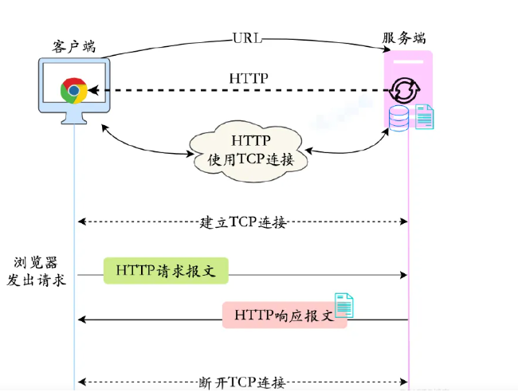
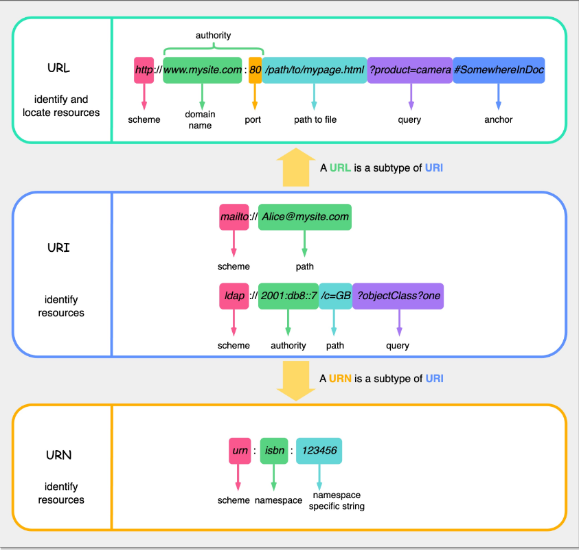
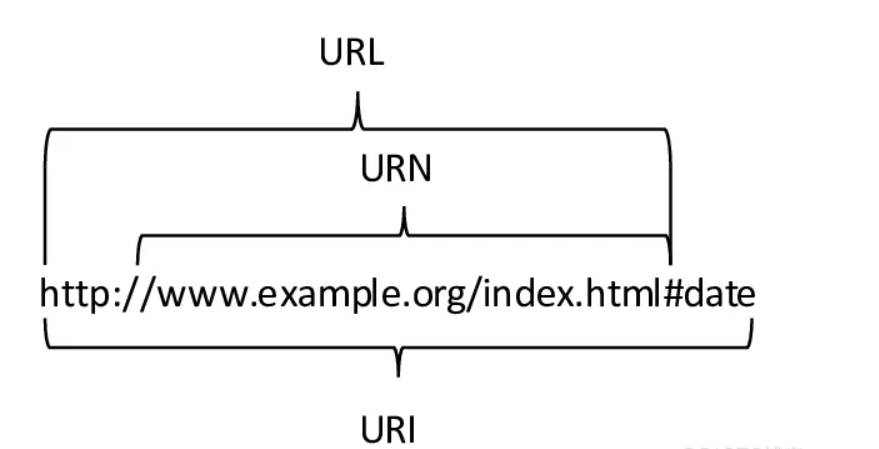
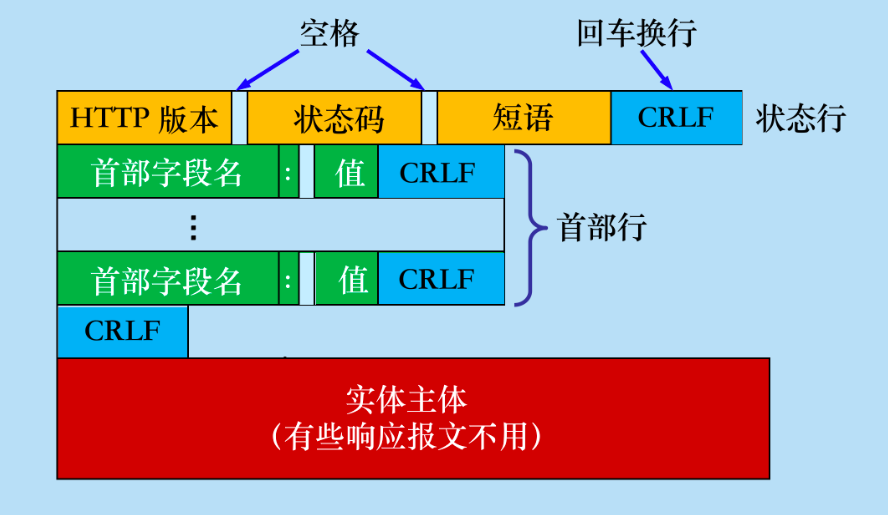
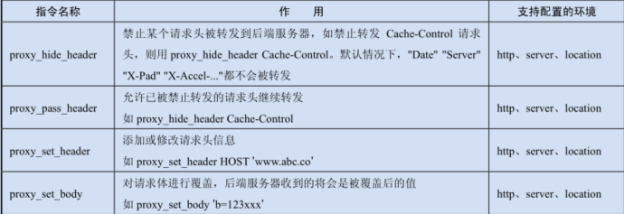
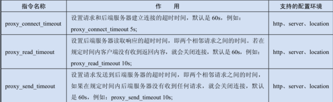

# 基础篇

## 一 入门知识

### 1.1 概述

###### Nginx是什么

Nginx是一个用C语言写的高性能、高并发的==HTTP服务器==

###### Nginx的作用

* 反向代理
* 负载均衡
* 配置SSL证书
* 防盗链
* 解决跨域问题
* 缓存
* 限流
* 动静资源分离

###### 负载均衡

* 硬件
  * F5

* 软件

  * LVS

  * Nginx

  * HAProxy

###### 安装注意事项

* 源码安装依赖

```shell
# --with-依赖名称=/依赖路径
--with-opensll=/software/openssl
```

* 添加模块

```shell
# 静态
--add-module=path

# 动态

```


###### 指令分类

1. 简单指令

由名称和参数组成，以空格分隔，以分号结尾

2. 指令快

由名称和大括号{}内的附加指令组成，不以分号结尾

###### 指令注意事项

* `当某个变量同时出现在多个指令块中时，最终会以在最小指令块中的赋值为准`
* 

###### 多个server匹配优先级

1. 精确的名字
2. 以*开头的最长通配符名称，如*.testnginx.com
3. 以*结尾的最长通配符名称，如 testnginx.*
4. 按照文件顺序，第1个匹配到的正则表达式
5. 如果没有匹配到对应的 server_name，则会访问 default_server

###### location匹配规则

| 配置格式         | 作用                                                 |
| ---------------- | ---------------------------------------------------- |
| location = /uri  | = 表示精确匹配                                       |
| location ^~ /uri | ^~ 匹配以某个 URL前缀开头的请求，不支持正则表达式    |
| location ~       | ~ 区分大小写的匹配，属于正则表达式                   |
| location ~*      | ~* 不区分大小写的匹配，属于正则表达式                |
| location /uri    | 表示前缀匹配，不带修饰符，但是优先级没有正则表达式高 |
| location /       | 通用匹配，默认找不到其他匹配时，会进行通用匹配       |
| location @       | 命名空间，不提供常规的请求匹配                       |

> 1. 通用匹配“/”的优先级最低，如果找不到其他配置，就会进行通用匹配；“@”表示命名空间的位置，通常在重定向时进行匹配，且不会改变 URL的原始请求
> 2. 打开 Debug 模式并观察日志，会看到每个请求的执行过程，包括匹配到对应location的操作
> 3. location 块也支持嵌套配置

###### 只能在location块中执行

* internal：表示该 location 块只支持 Nginx 内部的请求访问，如支持 rewrite、error_page等重定向，但不能通过外部的 HTTP直接访问
* limit_except：限定该 location块可以执行的 HTTP方法
* alias：定义指定位置的替换

```nginx
# 如果匹配到/a/test.json的请求，在进入location块后会将请求变成/c/x/a/test.json
location /a/ {
	alias /c/x/a/;
}
```

###### include的使用

指定主配置文件包含的其他扩展配置文件,扩展文件的内容也要符合Nginx的格式规范,可以出现在全局参数、location 块、server块等任何一个位置

```nginx
include /usr/local/nginx/conf/vhost/*.conf;
```


```nginx
user www www; #定义运行 Nginx 的用户和用户组
worker_processes 2; #Nginx 进程数
worker_cpu_affinity auto; #配置 Nginx 进程的 CPU 亲缘性
error_log /var/log/error_log info; #定义全局错误日志的类型，默认是 error
worker_rlimit_nofile 65535; #一个 worker 进程最多能够打开的文件数量
pid /var/run/nginx.pid; #进程文件
worker_priority -10; #在 Linux 系统下资源使用的优先级
worker_shutdown_timeout 30; #若在 30s 内 Nginx 无法“平滑”退出，则强行关闭进程
events {
	#单个进程的最大连接数（整个 Nginx 的最大连接数=单个进程的最大连接数连接数×进程数）
	worker_connections 10000;
	#epoll 用在 Linux 2.6 以上版本的内核高性能的网络 I/O 上
	#如果是在 FreeBSD 上，则用 kqueue 模型
	use epoll;
}
http {
	include conf/mime.types; #文件扩展名与文件类型映射表
	default_type application/octet-stream; #默认文件类型
	log_format main
		'$remote_addr - $remote_user [$time_local]'
		'"$request" $status $bytes_sent'
		' "$http_referer" "$http_user_agent" '
		' "$http_cookie" '; #定义日志格式
	client_header_buffer_size 1k; #设置用户请求头所使用的 buffer 的大小
	large_client_header_buffers 4 4k; #当默认的缓冲区大小不够用时就会使用此参数
	server_names_hash_bucket_size 128; #设置 server_names 散列表的桶的大小，
	#在域名比较多的情况下，需要调整这个值
	client_header_buffer_size 32k; #对上传文件大小的限制
	gzip on; #开启 gzip
	gzip _comp_level 6; #设置压缩等级
	gzip _min_length 1100; #设置允许压缩的页面最小字节数
	gzip _buffers 4 8k; #设置系统需要获取多大的缓存用于存储 gzip
	#的压缩结果数据流。4 8k 代表按照原始数
	#据的大小，即以 8KB 为单位的 4 倍申请内存
	gzip _types text/plain text/css; #匹配 MIME 类型进行压缩
	output_buffers 2 32k; #设置用于从磁盘读取响应的缓冲区的数量和
	#大小。2 32k 代表按照原始数据的大小
	#即以 32KB 为单位的 2 倍申请内存空间


	sendfile on; #启用 sendfile()函数
	tcp_nopush on; #为了防止网络阻塞，需要开启 sendfile
	tcp_nodelay on; #为了防止网络阻塞，需要开启 sendfile
	keepalive_timeout 90s; #长连接超时时间，单位是秒
	upstream backend { #upstream 块，weight 代表权重
	} #upstream 块，weight 代表权重
	server 192.168.1.12:8081 weight=3; #权重越高，则请求的比例越高
	server 192.168.1.13:8081 weight=2;
	server {
		listen 80; #HTTP 监听端口
		server_name your.example.com; #域名
		access_log /var/log/nginx.access_log main; #访问日志记录
		charset koi8-r; #默认编码
		location / {
			proxy_pass http://backend;
			proxy_redirect off;
			proxy_set_header Host $host;
			proxy_set_header X-Real-Ip $remote_addr;
			#后端服务器通过 X-Forwarded-For 获取用户的真实 IP 地址
			proxy_set_header X-Forwarded-For $proxy_add_x_forwarded_for;
		}
		error_page 404 /404.html; #对后端服务器抛出的错误 404 进行页面重定向
		location /404.html {
			root /spool/www;
		}
		#匹配以 jpg、jpeg、gif 结尾的 URL，直接去系统文件读取
		location ~* \.(jpg|jpeg|gif)$ {
			root /spool/www;
			expires 30d; #浏览器保留缓存的时间，如有 CDN，则 CDN 也会进行缓存
		}
	}
}
```


###### 常见配置实战技巧

* user

默认是 nobody，但如果使用 nobody，会导致没有权限执行写硬盘等操作。所以一般会选择低于 root 级别的用户，如 www，并在 Linux 系统下禁止用户通过 SSH（Secure Shell，远程连接工具）登录服务器，以提高安全性。

* worker_processes

  代表 worker的进程数，一般情况下建议和服务器的 CPU（Central Processing Unit，中央处理器）核数相同；也可以配置 worker_processes auto（用于 Nginx 1.2.5版本之后），它会自动根据 CPU 核数启动进程

  但在实际应用中，可能除 Nginx 外服务器还会同时运行其他多个服务，所以需要考虑服务器资源在不同服务上的分配，避免因进程启动过多导致过多的上下文切换

* worker_cpu_affinity auto

这是在 Nginx 1.9.10 版本中添加的功能，表示可以根据服务器的 CPU 核数自动设置 CPU亲缘性，以提升 Nginx 的性能。

* error_log & access_log

关于日志记录的配置。如果将 error_log 配置为 error 级别，可以减少不必要的日志记录；如果是测试环境可以设置为 info 级别。配置日志记录需要考虑硬盘的独立性，不要使用 Linux的根分区，以避免出现大量的 I/O 影响 Linux 服务器的吞吐能力；要单独挂载到一个磁盘上，使用独立的 I/O。另外，需要注意硬盘的使用寿命，关注 message 的日志，定期检查硬盘（Nginx 在记录日志时是异步处理的，因此不会因为硬盘问题导致请求异常，但会影响日志的记录）。

* worker_priority

配置 Nginx 在 Linux 服务器上使用资源的优先级，作为反向代理服务，Nginx 应该拥有极高的优先级，因此建议配置为-10。

* gzip_comp_level

配置压缩等级，等级最高为 9，等级越高压缩后的文件越小，但是消耗的 CPU 资源，也会越多。经测试，文件压缩等级为 7 和等级为 9 时，在文件大小上只有细微的差别，一般用5~7 的等级就可以了。

* upstream块

配置后端服务器，可以结合 proxy_next_upstream 等指令进行大量的优化。具体内容将会在以后的章节中进一步讲解。

* error_page

对错误进行重定向，在捕获后端服务器错误的状态码后，将请求重定向到其他位置，如友好提示页面。关于 error_page强大的功能，将在后面的章节进行单独说明。

* location & root

通过 root 路径可以读取静态文件，在 Nginx 1.7.11 版本之前，当 Nginx 读取硬盘文件时，都是进行阻塞型操作；后来引入了线程池，为读取硬盘文件提供了非阻塞型的操作，极大地提升了硬盘 I/O的读/写速度，也提升了 proxy_cache的缓存能力。Nginx 的常见配置在使用中有着不同的变化，熟悉 Nginx 的官方 Wiki是发挥其巨大作用的前提

###### $request_time 和$upstream_response_time的区别

  $upstream_response_time 指的是在 Nginx 启用了 upstream 的情况下，从 Nginx 与后端建立连接开始到接收完数据然后关闭连接为止的时间。$request_time 指从接收到用户请求到发送完响应数据的时间，包括接收请求数据的时间、程序响应的时间和输出响应数据的时间

###### $uri和$request_uri的区别

* $uri 记录的是执行一系列内部重定向操作后最终传递到后端服务器的 URL（不包含参数$args的值）
* $request_uri 记录的是当前请求的原始 URL（包含参数），如果没有执行内部重定向操作，$request_uri 去掉参数后的值和$uri 的值是一样的。在线上环境中排查问题时，如果在后端服务中看到的请求和在 Nginx 中存放的$request_uri无法匹配，可以考虑去 $uri里面进行查找

###### proxy代理实例

```nginx
location /test/v1/ {
	# 替换 URL 的代理方式： /test/v1/ 会被替换为/abc/
	# 如 /test/v1/xxx?a=1 到达后端就会变为 /abc/xxx?a=1
	proxy_pass http://127.0.0.1:81/abc/;
}

location /aaa/ {
	# 替换 URL 的代理方式，和上面的/test/v1/功能一样，只是替换成了"/"
	# 刚开始使用代理时 常常会和下面 /abc 的代理混淆
	proxy_pass http://127.0.0.1:81/;
}

location /abc {
	# 什么都不会改变，直接传递原始的 URL
	proxy_pass http://127.0.0.1:81;
}
```

###### server指令参数说明

| 参数         | 作用                                                         |
| ------------ | ------------------------------------------------------------ |
| weight       | 设置请求分发到后端服务器的权重，即每台后端服务器能够响应的请求数量的比例。如果设置相同的比例，意味着每台后端服务器能够响应的请求数量是一样的，默认值是 1。如在前面的配置示例中，假如有30 个请求进入服务器，那么第 1 台会进入 20 个请求，第 2 台会进入 10 个请求 |
| max_fails    | 请求最大失败次数，在指定时间内请求失败的最大次数，默认是 1。如果设置为 0，代表禁用这个设置 |
| fail_timeout | 在指定时间内请求失败的次数，超过这个次数则认为服务器不可用。如在前面的配置示例中fail_timeout =10s，即如果 10s 内请求失败次数超过 max_fails 的值，则在接下来的 10s 内，此 server 不再接收任何请求，10s后重新恢复为可用，并重新计算失败次数 |
| down         | 标记服务不可用                                               |
| backup       | 当 upstream 中所有的后端服务器都被设置为不可用时（如全都超过了请求最大失败次数），upstream 会对backup 的服务器进行分流 |


### 1.2 线程模型


#### HTTP



###### URL URI URN的关系







* URI（Uniform Resource Identifier）是一个用于标识某一资源的字符串，它是一个抽象的术语，分为两个具体的子集URL和URN。URI提供了一种在互联网上唯一标识资源的方法
* URL：定位资源的路径 URL（Uniform Resource Locator）是URI的一种，它不仅标识了资源，还提供了如何定位该资源的方法。URL由多个部分组成，包括协议（http、https等）、主机名、端口号、路径。它是我们在浏览器地址栏中常见的形式，如："https://www.example.com/page"。URI 不提供定位所述资源的方法
* URN：命名资源的独特标识 URN（Uniform Resource Name）也是URI的一种，它是一种资源的独特命名方式，与资源的位置无关。URN的一个典型例子是ISBN（国际标准书号），通过URN可以唯一标识一本书，而不考虑这本书存储在哪里

###### HTTP请求报文组成


###### HTTP响应报文组成




#### 惊群效应


## 二 安装配置

### 2.1 Nginx

1. 依赖安装

```shell
yum install gcc-c++
yum install -y pcre pcre-devel
yum install -y zlib zlib-devel
yum install -y openssl openssl-devel
```

2. 编译安装

```shell
# configure指定安装位置
./configure --prefix=/java/software/nginx/ --with-http_stub_status_module --with-http_ssl_module --user=java

./configure \
--prefix=/usr/local/nginx \
--sbin-path=/usr/sbin/nginx \
--conf-path=/usr/local/nginx/conf/nginx.conf \
--error-log-path=/usr/local/nginx/log/error.log \
--http-log-path=/usr/local/nginx/log/access.log \
--pid-path=/usr/local/nginx/nginx.pid \
--lock-path=/usr/local/nginx/nginx.lock \
--http-client-body-temp-path=/usr/local/nginx/cache/client_temp \
--http-proxy-temp-path=/usr/local/nginx/cache/proxy_temp \
--http-fastcgi-temp-path=/usr/local/nginx/cache/fastcgi_temp \
--http-uwsgi-temp-path=/usr/local/nginx/cache/uwsgi_temp \
--http-scgi-temp-path=/usr/local/nginx/cache/scgi_temp \
--user=nginx \
--group=nginx \
--with-file-aio \
--with-threads \
--with-http_addition_module \
--with-http_auth_request_module \
--with-http_dav_module \
--with-http_flv_module \
--with-http_gunzip_module \
--with-http_gzip_static_module \
--with-http_mp4_module \
--with-http_random_index_module \
--with-http_realip_module \
--with-http_secure_link_module \
--with-http_slice_module \
--with-http_ssl_module \
--with-http_stub_status_module \
--with-http_sub_module \
--with-http_v2_module \
--with-mail \
--with-mail_ssl_module \
--with-stream \
--with-stream_realip_module \
--with-stream_ssl_module \
--with-stream_ssl_preread_module 

# 安装
make & make install
```

3. 环境变量

```shell
# 1.目录
cd /etc/profile.d/

# 2.shell脚本
vim java.sh

# Nginx环境
PATH=$PATH:/java/software/nginx/sbin
export PATH

# 3.刷新环境变量
source /etc/profile

# 4.测试
echo $PATH
nginx -v
```

4. systemd服务

1. 进入systemd目录

```shell
cd /usr/lib/systemd/system
```

2. nginx.service编写

```shell
[Unit]
Description=nginx servce

[Service]
Type=forking
ExecStart=/java/software/nginx/sbin/nginx  -c /java/software/nginx/conf/nginx.conf
ExecStop=/bin/kill -s QUIT $MAINPID
Restart=/java/software/nginx/sbin/nginx -s reload

[Install]
WantedBy=multi-user.target
```

3. 重启


### 2.2 Keepalive


### 2.3 LuaJIT


### 2.4 HAProxy


### 2.5 Openresty


### 2.6 LVS


## 三 基础功能

### 内置变量


### IP地址

###### 获取真实IP地址


###### 防止IP地址伪造


### 请求管理

###### 1 限制IP地址的访问

###### 2 auth身份验证

###### 3 利用LDAP服务加强安全

###### 4 satisfy二选一


### 动静分离

### 限流

### 重写或重定向


### 解决跨域

## 四 最佳实践


### 常见问题


### 生产配置


# 中级篇


## 一 配置详解

### 1.1 默认配置


### 1.2 配置大全

#### 全局

```nginx
# 指定nginx进程使用什么用户启动 
user worker worker;

# 用于指定工作进程的数量：一般情况下设置成CPU的核数，如果开启了ssl和gzip更应该设置成与逻辑CPU数量一样甚至为2倍，可以减少I/O操作。
# 查看CPU核数：grep ^processor /proc/cpuinfo | wc -l
worker_processes auto;

# 开启利用多核CPU
worker_cpu_affinity auto;

# 定义全局错误日志文件：日志输出级别有debug、info、notice、warn、error、crit可供选择，debug输出日志最为最详细，而crit输出日志最少。
error_log /usr/local/nginx/logs/error.log info;

# 指定进程pid文件
pid logs/nginx.pid;

# 指定一个nginx进程可以打开的最多文件描述符数目：在Linux系统中每个进程都有一个文件描述符表，当进程打开一个文件时系统会分配一个文件描述符给该文件，该文件描述符可以用来通过文件描述符表进行读写操作，简单的理解为可以建立连接的数量。
# 由于每一个socket都会打开一个文件描述符,所以服务器可以同时处理连接数量受到系统文件描述符数量的限制。文件描述符的数量是有限的，取决于系统配置（通常是1024个）和系统限制（ulimit设置），使用查看。
# 查看：ulimit -n 设置：ulimit -n 65535
worker_rlimit_nofile 65535;

# worker子进程异常终止后的core文件，用于记录分析
worker_rlimit_core 10M，working_directory /opt/nginx/tmp;

# 指 worker子进程的nice值，以调整运行nginx的优先级。通常设置为负值以优先调用nginx，Linux默认进程的优先级值是 120，值越小越优先；
# nice 设定范围为 -20 到 +19
worker_priority -10;

# worker子进程优雅退出时的超时时间
worker_shutdown_timeout 5s;

# worker子进程内部使用的计时器精度，调整时间间隔越大系统调用越少，有利于性能提升，反之系统调用越多，性能下降
worker_resolution 100ms;

# nginx的运行方式，前台还是后台：前台用户调试，后台用于生产
daemon off;
```

#### events

```nginx
 # 指定IO模型：select、poll、kqueue、epoll、rtsig和/dev/poll
    # select和poll都是标准的工作模式，kqueue和epoll是高效的工作模式，不同的是epoll用在Linux平台上，而kqueue用在BSD系统中
    use epoll;

    # 每一个worker进程能并发处理（发起）的最大连接数（包含与客户端或后端被代理服务器间等所有连接数）
    # 理论上nginx服务器的最大连接数为 worker_processes * worker_connections
    worker_connections 65535;
    
    # keepalive超时时间，默认是60s
    # 这个参数也不能设置过大，否则会导致许多无效的http连接占据着nginx的连接数，终nginx崩溃！    
    keepalive_timeout 60;
    
    # 客户端请求头部的缓冲区大小，设置为分页大小或分页整数倍数。    
    # 获取分页大小：getconf PAGESIZE   
    client_header_buffer_size 4k;
    
    # 为打开文件指定缓存，默认是没有启用的：max指定缓存数量，建议和打开文件数一致；inactive是指经过多长时间文件没被请求后删除缓存  
    open_file_cache max=65535 inactive=60s;   

    # 这个是指多长时间检查一次缓存的有效信息。    
    open_file_cache_valid 60s;
    
    # open_file_cache指令中的inactive参数时间内文件的最少使用次数，低于这个数字将被移除
    open_file_cache_min_uses 1;
  
    # 是否缓存文件打开错误
    # 关闭意味着每次发生文件打开错误时，Nginx都会重新尝试打开文件，这可能会导致性能下降
    open_file_cache_errors on; 
    
    # accept_mutex是Nginx的负载均衡锁，accept_mutex这把锁可以让多个worker进程轮流地、序列化地与新的客户端建立TCP连接。
　　# 当某一个worker进程建立的连接数量达到worker_connections配置的最大连接数的7/8时，会大大地减小该worker进程试图建立新TCP连接的机会，以此实现所有worker进程之上处理的客户端请求数尽量接近。
　　# accept锁默认是打开的，如果关闭它，那么建立TCP连接的耗时会更短，但worker进程之间的负载会非常不均衡，因此不建议关闭它。
　　# 设置网路连接序列化，防止惊群现象发生，默认为on(惊群现象：一个网路连接到来，多个睡眠的进程被同事叫醒，但只有一个进程能获得链接，这样会影响系统性能。)
　　accept_mutex on;
    
    # 当请求到达master进程，会给其中一个worker子进程发送请求，如果该子进程在设置的时间内未响应（响应超时），则 master进程会再给其它子进程发送请求，只有当accept_mutex设置为on的时候才有意义
    accept_mutex_delay 200ms;

　　# accept锁可能需要这个lock文件：如果accept锁关闭lock_file配置完全不生效；如果打开了accept锁并且由于编译程序、操作系统架构等因素导致Nginx不支持原子锁，这时才会用文件锁实现accept锁，这样lock_file指定的lock文件才会生效。
　　lock_file logs/nginx.lock;

　　# 设置一个进程是否同时接受多个网络连接，默认为off
   # 当multi_accept被设置为"on"时，Nginx允许同时接受多个新连接，多个worker进程可以同时接受新连接，提高并发处理能力；当multi_accept被设置为"off"时，Nginx只会顺序地接受新连接，一个worker进程只能处理一个新连接，降低了并发能力
   # 在低并发或资源有限的情况下，多个worker进程同时接受连接可能导致系统资源的消耗
　　multi_accept on;
```

#### http

```nginx
 # 文件扩展名与文件类型映射表    
    include mime.types;
    
    # 默认文件类型 
    default_type application/octet-stream;
    
    # 默认编码    
    charset utf-8;
    
    # 服务器名字的hash表大小    
    #保存服务器名字的hash表是由指令server_names_hash_max_size 和 server_names_hash_bucket_size所控制的。参数hash bucket size总是等于hash表的大 小，并且是一路处理器缓存大小的倍数。在减少了在内存中的存取次数后，使在处理器中加速查找 hash表键值成为可能。如果hash bucket size等于一路处理器缓存的大小，那么在查找键的时 候，最坏的情况下在内存中查找的次数为2。第一次是确定存储单元的地址，第二次是在存储单元中查 找键 值。因此，如果Nginx给出需要增大hash max size 或 hash bucket size的提示，那么 首要的是增大前一个参数的大小.    
    server_names_hash_bucket_size 128;
    
    #客户端请求头部的缓冲区大小。这个可以根据你的系统分页大小来设置，一般一个请求的头部 大小不会超过1k，不过由于一般系统分页都要大于1k，所以这里设置为分页大小。分页大小可以用命 令getconf PAGESIZE取得。    
    client_header_buffer_size 32k;
    
    #客户请求头缓冲大小。nginx默认会用client_header_buffer_size这个buffer来读取 header值，如果header过大，它会使用large_client_header_buffers来读取。
    large_client_header_buffers 4 64k;
    
    #设定通过nginx上传文件的大小    
    client_max_body_size 8m;
    
    #开启高效文件传输模式，sendfile指令指定nginx是否调用sendfile函数来输出文件，对于 普通应用设为 on，如果用来进行下载等应用磁盘IO重负载应用，可设置为off，以平衡磁盘与网络 I/O处理速度，降低系统的负载。注意：如果图片显示不正常把这个改成off。    
    #sendfile指令指定 nginx 是否调用sendfile 函数（zero copy 方式）来输出文件，对 于普通应用，必须设为on。如果用来进行下载等应用磁盘IO重负载应用，可设置为off，以平衡磁盘 与网络IO处理速度，降低系统uptime。    
    sendfile on;
    
    #开启目录列表访问，合适下载服务器，默认关闭。    
    autoindex on;

    #此选项允许或禁止使用socke的TCP_CORK的选项，此选项仅在使用sendfile的时候使用,告 诉nginx在一个数据包里发送所有头文件，而不一个接一个的发送。就是说数据包不会马上传送出 去，等到数据包最大时，一次性的传输出去，这样有助于解决网络堵塞    
    tcp_nopush on;
 
    #告诉nginx不要缓存数据，而是一段一段的发送--当需要及时发送数据时，就应该给应用设置 这个属性，这样发送一小块数据信息时就不能立即得到返回值    
    tcp_nodelay on;
    
    #长连接超时时间，单位是秒    
    keepalive_timeout 120;
    
    #FastCGI相关参数是为了改善网站的性能：减少资源占用，提高访问速度。下面参数看字面意 思都能理解。    
    #这个指令为FastCGI缓存指定一个路径，目录结构等级，关键字区域存储时间和非活动删除时 间    
    fastcgi_cache_path /usr/local/nginx/fastcgi_cache levels=1:2 keys_zone=TEST:10m inactive=5m;    
    #指定连接到后端FastCGI的超时时间    
    fastcgi_connect_timeout 300;    
    #向FastCGI传送请求的超时时间，这个值是指已经完成两次握手后向FastCGI传送请求的超时时间
    fastcgi_send_timeout 300;    
    #接收FastCGI应答的超时时间，这个值是指已经完成两次握手后接收FastCGI应答的超时时间
    fastcgi_read_timeout 300;    
    #指定读取FastCGI应答第一部分 需要用多大的缓冲区,这里可以设置为fastcgi_buffers指 令指定的缓冲区大小，上面的指令指定它将使用1个 16k的缓冲区去读取应答的第一部分，即应答 头，其实这个应答头一般情况下都很小（不会超过1k），但是你如果在fastcgi_buffers指令中指 定了缓冲区的大小，那么它也会分配一个fastcgi_buffers指定的缓冲区大小去缓存
    fastcgi_buffer_size 64k;    
    #指定本地需要用多少和多大的缓冲区来 缓冲FastCGI的应答，如上所示，如果一个php脚本所 产生的页面大小为256k，则会为其分配16个16k的缓冲区来缓存，如果大于256k，增大 于256k的部 分会缓存到fastcgi_temp指定的路径中， 当然这对服务器负载来说是不明智的方案，因为内存中处 理数据速度要快于硬盘，通常这个值 的设置应该选择一个你的站点中的php脚本所产生的页面大小的 中间值，比如你的站点大部分脚本所产生的页面大小为 256k就可以把这个值设置为16 16k，或者4 64k 或者64 4k，但很显然，后两种并不是好的设置方法，因为如果产生的页面只有32k，如果用4 64k它会分配1个64k的缓冲区去缓存，而如果使用64 4k它会分配8个4k的缓冲区去缓存，而如果使 用16 16k则它会分配2个16k去缓存页面，这样看起来似乎更加合理•
    fastcgi_buffers 4 64k;    
    #这个指令我也不知道是做什么用，只知道默认值是fastcgi_buffers的两倍    
    fastcgi_busy_buffers_size 128k;    
    #在写入fastcgi_temp_path时将用多大的数据块，默认值是fastcgi_buffers的两倍    
    fastcgi_temp_file_write_size 128k;    
    #开启FastCGI缓存并且为其制定一个名称。个人感觉开启缓存非常有用，可以有效降低CPU负 载，并且防止502错误。但是这个缓存会引起很多问题，因为它缓存的是动态页面。具体使用还需根据 自己的需求 
    fastcgi_cache TEST    
    #为指定的应答代码指定缓存时间，如上例中将200，302应答缓存一小时，301应答缓存1天， 其他为1分钟
    fastcgi_cache_valid 200 302 1h;
    fastcgi_cache_valid 301 1d;
    fastcgi_cache_valid any 1m; 
    
    #缓存在fastcgi_cache_path指令inactive参数值时间内的最少使用次数，如上例，如果在 5分钟内某文件1次也没有被使用，那么这个文件将被移除
    fastcgi_cache_min_uses 1;
    
    #gzip模块设置    
    #开启压缩
    gzip  on;       
    # 设置允许压缩的页面最小字节数，页面字节数从header头得content-length中进行获取。 默认值是0，不管页面多大都压缩。建议设置成大于2k的字节数，小于2k可能会越压越大。  
 	gzip_min_length 2k;      
    # 设置系统获取几个单位的缓存用于存储gzip的压缩结果数据流。 例如 4 4k 代表以4k为单 位，按照原始数据大小以4k为单位的4倍申请内存。 4 8k 代表以8k为单位，按照原始数据大小以8k 为单位的4倍申请内存。      
    # 如果没有设置，默认值是申请跟原始数据相同大小的内存空间去存储gzip压缩结果。      
    gzip_buffers 4 16k;      
#压缩级别，1-10，数字越大压缩的越好，也越占用CPU时间
    gzip_comp_level 5;      
    # 默认值: gzip_types text/html (默认不对js/css文件进行压缩)      
    # 压缩类型，匹配MIME类型进行压缩      
    # 不能用通配符 text/*      
    # (无论是否指定)text/html默认已经压缩       
    # 设置哪压缩种文本文件可参考 conf/mime.types      
    gzip_types text/plain application/xjavascript text/css application/xml;     
    # 值为1.0和1.1 代表是否压缩http协议1.0，选择1.0则1.0和1.1都可以压缩      
    gzip_http_version 1.0       
    # IE6及以下禁止压缩
    gzip_disable "MSIE [1-6]\.";       
    # 默认值：off      
    # Nginx作为反向代理的时候启用，开启或者关闭后端服务器返回的结果，匹配的前提是后端服 务器必须要返回包含"Via"的 header头。      
    # off - 关闭所有的代理结果数据的压缩      
    # expired - 启用压缩，如果header头中包含 "Expires" 头信息      
    # no-cache - 启用压缩，如果header头中包含 "Cache-Control:no-cache" 头信息     
    # no-store - 启用压缩，如果header头中包含 "Cache-Control:no-store" 头信息     
    # private - 启用压缩，如果header头中包含 "Cache-Control:private" 头信息      
    # no_last_modified - 启用压缩,如果header头中不包含 "Last-Modified" 头信息     
    # no_etag - 启用压缩 ,如果header头中不包含 "ETag" 头信息      
    # auth - 启用压缩 , 如果header头中包含 "Authorization" 头信息      
    # any - 无条件启用压缩
    gzip_proxied expired no-cache no-store private auth;      
    # 给CDN和代理服务器使用，针对相同url，可以根据头信息返回压缩和非压缩副本      
    gzip_vary on; 
    
    
    
    #开启限制IP连接数的时候需要使用    
    #limit_zone crawler $binary_remote_addr 10m;
    
    #负载均衡配置
    upstream www.xx.com {             
		#upstream的负载均衡，weight是权重，可以根据机器配置定义权重。weigth参数表示 权值，权值越高被分配到的几率越大。
        server 192.168.80.121:80 weight=3;
        server 192.168.80.122:80 weight=2;
        server 192.168.80.123:80 weight=3;
        
        #nginx的upstream目前支持4种方式的分配
        #1、轮询（默认）
        #每个请求按时间顺序逐一分配到不同的后端服务器，如果后端服务器down掉，能自动剔除。
        #2、weight
        #指定轮询几率，weight和访问比率成正比，用于后端服务器性能不均的情况。
        #例如：
        #upstream bakend {        
        #    server 192.168.0.14 weight=10;
        #    server 192.168.0.15 weight=10;
        #}        
        #2、ip_hash
        #每个请求按访问ip的hash结果分配，这样每个访客固定访问一个后端服务器，可以解决 session的问题。        
        #例如：        
        #upstream bakend {        
        #    ip_hash;        
        #    server 192.168.0.14:88;        
        #    server 192.168.0.15:80;        
        #}        
        #3、fair（第三方）        
        #按后端服务器的响应时间来分配请求，响应时间短的优先分配。        
        #upstream backend {        
        #    server server1;        
        #    server server2;        
        #    fair;        
        #}        
        #4、url_hash（第三方）        
        #按访问url的hash结果来分配请求，使每个url定向到同一个后端服务器，后端服务器为 缓存时比较有效。        
        #例：在upstream中加入hash语句，server语句中不能写入weight等其他的参数， hash_method是使用的hash算法        
        #upstream backend {        
        #    server squid1:3128;        
        #    server squid2:3128;        
        #    hash $request_uri;        
        #    hash_method crc32;        
        #}

        #tips:        
        #upstream bakend{
        #定义负载均衡设备的Ip及设备状态}{        
        #    ip_hash;        
        #    server 127.0.0.1:9090 down;        
        #    server 127.0.0.1:8080 weight=2;        
        #    server 127.0.0.1:6060;        
        #    server 127.0.0.1:7070 backup;        
        #}        
        #在需要使用负载均衡的server中增加 proxy_pass http://bakend/;
        
        #每个设备的状态设置为:        
        #1.down表示单前的server暂时不参与负载        
        #2.weight为weight越大，负载的权重就越大。        
        #3.max_fails：允许请求失败的次数默认为1.当超过最大次数时，返回 proxy_next_upstream模块定义的错误        
        #4.fail_timeout:max_fails次失败后，暂停的时间。        
        #5.backup： 其它所有的非backup机器down或者忙的时候，请求backup机器。所以这 台机器压力会最轻。
        #nginx支持同时设置多组的负载均衡，用来给不用的server来使用。        
        #client_body_in_file_only设置为On 可以讲client post过来的数据记录到文件 中用来做debug        
        #client_body_temp_path设置记录文件的目录 可以设置最多3层目录        
        #location对URL进行匹配.可以进行重定向或者进行新的代理 负载均衡
```

#### server

```nginx
#监听端口
        listen 80;
        
        #域名可以有多个，用空格隔开
        server_name www.xx.com xx.com;
        index index.html index.htm index.php; 
        root /data/www/xx;
        
        #对******进行负载均衡
        location ~ .*.(php|php5)?$
        {
            fastcgi_pass 127.0.0.1:9000;
            fastcgi_index index.php; 
            include fastcgi.conf;
        }                 
        #图片缓存时间设置
        location ~ .*.(gif|jpg|jpeg|png|bmp|swf)$
        {
            expires 10d;
        }                 
		#JS和CSS缓存时间设置
        location ~ .*.(js|css)?$
        {
            expires 1h;
        }                 
        #日志格式设定        
        #$remote_addr与$http_x_forwarded_for用以记录客户端的ip地址；        
        #$remote_user：用来记录客户端用户名称；        
        #$time_local： 用来记录访问时间与时区；        
        #$request： 用来记录请求的url与http协议；        
        #$status： 用来记录请求状态；成功是200，        
        #$body_bytes_sent ：记录发送给客户端文件主体内容大小；        
        #$http_referer：用来记录从那个页面链接访问过来的；        
        #$http_user_agent：记录客户浏览器的相关信息；        
        #通常web服务器放在反向代理的后面，这样就不能获取到客户的IP地址了，通过$remote_add拿到的IP地址是反向代理服务器的iP地址。        
        #反向代理服务器在转发请求的http头信息中，可以增加x_forwarded_for信息，用以记 录原有客户端的IP地址和原来客户端的请求的服务器地址。
        log_format access '$remote_addr - $remote_user [$time_local] "$request" '
        '$status $body_bytes_sent "$http_referer" '
        '"$http_user_agent" $http_x_forwarded_for';                 
        #定义本虚拟主机的访问日志
        access_log  /usr/local/nginx/logs/host.access.log  main;
        access_log  /usr/local/nginx/logs/host.access.404.log  log404;                 
        #对 "/" 启用反向代理
        location / {
            proxy_pass http://127.0.0.1:88;
            proxy_redirect off;
            proxy_set_header X-Real-IP $remote_addr;                         
            #后端的Web服务器可以通过X-Forwarded-For获取用户真实IP
            proxy_set_header X-Forwarded-For $proxy_add_x_forwarded_for;
            
            #以下是一些反向代理的配置，可选。
            proxy_set_header Host $host;
            
            #允许客户端请求的最大单文件字节数
            client_max_body_size 10m;
            
            #缓冲区代理缓冲用户端请求的最大字节数，            
            #如果把它设置为比较大的数值，例如256k，那么，无论使用firefox还是IE浏览 器，来提交任意小于256k的图片，都很正常。如果注释该指令，使用默认的 client_body_buffer_size设置，也就是操作系统页面大小的两倍，8k或者16k，问题就出现了。            
            #无论使用firefox4.0还是IE8.0，提交一个比较大，200k左右的图片，都返回 500 Internal Server Error错误
            client_body_buffer_size 128k;
            
#表示使nginx阻止HTTP应答代码为400或者更高的应答。
            proxy_intercept_errors on;
            
            #后端服务器连接的超时时间_发起握手等候响应超时时间            
            #nginx跟后端服务器连接超时时间(代理连接超时)
            proxy_connect_timeout 90;
            
            #后端服务器数据回传时间(代理发送超时)            
            #后端服务器数据回传时间_就是在规定时间之内后端服务器必须传完所有的数据
            proxy_send_timeout 90;
            
            #连接成功后，后端服务器响应时间(代理接收超时)            
            #连接成功后_等候后端服务器响应时间_其实已经进入后端的排队之中等候处理（也 可以说是后端服务器处理请求的时间）
            proxy_read_timeout 90;
            
            #设置代理服务器（nginx）保存用户头信息的缓冲区大小            
            #设置从被代理服务器读取的第一部分应答的缓冲区大小，通常情况下这部分应答中包 含一个小的应答头，默认情况下这个值的大小为指令proxy_buffers中指定的一个缓冲区的大小，不 过可以将其设置为更小
            proxy_buffer_size 4k;
            
            #proxy_buffers缓冲区，网页平均在32k以下的设置            
            #设置用于读取应答（来自被代理服务器）的缓冲区数目和大小，默认情况也为分页大 小，根据操作系统的不同可能是4k或者8k
            proxy_buffers 4 32k;
            
            #高负荷下缓冲大小（proxy_buffers*2）
            proxy_busy_buffers_size 64k;
            
            #设置在写入proxy_temp_path时数据的大小，预防一个工作进程在传递文件时阻塞太长 
            #设定缓存文件夹大小，大于这个值，将从upstream服务器传
            proxy_temp_file_write_size 64k;
        }                          
        #设定查看Nginx状态的地址
        location /NginxStatus {
            stub_status on;
            access_log on;
            auth_basic "NginxStatus";
            auth_basic_user_file confpasswd;            
			#htpasswd文件的内容可以用apache提供的htpasswd工具来产生。
```

#### location


```nginx
#本地动静分离反向代理配置        
        #所有jsp的页面均交由tomcat或resin处理
        location ~ .(jsp|jspx|do)?$ {
            proxy_set_header Host $host;
            proxy_set_header X-Real-IP $remote_addr;
            proxy_set_header X-Forwarded-For $proxy_add_x_forwarded_for;
            proxy_pass http://127.0.0.1:8080; 
        }                 
        #所有静态文件由nginx直接读取不经过tomcat或resin
        location ~ .*. (htm|html|gif|jpg|jpeg|png|bmp|swf|ioc|rar|zip|txt|flv|mid|doc|ppt|        pdf|xls|mp3|wma)$
        {
            expires 15d;
        }
        location ~ .*.(js|css)?$
        {
            expires 1h;
        }

```

#### 客户端

| 指令                          | 说明                                                         |
| ----------------------------- | ------------------------------------------------------------ |
| client_body_buffer_size       | 设置读取客户端请求体的缓冲区大小。如果请求体的大小大于缓冲区的大小，则整个或一部分请求体会被写入临时文件。在默认情况下，会为32位系统、x86-64系统设置8KB的缓冲区，其他64位系统为 16KB的缓冲区 |
| client_body_temp_path         | 定义存储客户端请求体的临时文件目录，最多可以定义3个子集目录  |
| client_body_timeout           | 定义读取客户端请求体的超时时间，即两个连续的读操作之间的时间间隔。如果超时HTTP会抛出 408错误 |
| client_header_buffer_size     | 设置客户端请求头的缓冲区大小，默认为 1KB                     |
| client_max_body_size          | 设置客户端请求的最大主体的大小，默认为 1MB                   |
| client_header_timeout         | 设置客户端请求头的超时时间                                   |
| etag                          | 如果设置为 on，表示静态资源自动生成ETag响应头                |
| large_client_header_buffers   | 设置大型客户端请求头的缓冲区大小                             |
| keepalive_timeout             | 设置连接超时时间。服务器将在超过超时时间后关闭 HTTP 连接     |
| send_timeout                  | 指定客户端的响应超时时间                                     |
| server_names_hash_bucket_size | 设置 server_names（Nginx 中配置的全部域名）散列表的桶的大小，默认值取决于处理器缓存行的大小 |
| server_names_hash_max_size    | 设置 server_names 散列表的最大值                             |
| server_tokens                 | 启用或禁用在错误页面和服务器响应头字段中标识的 Nginx 版本    |
| tcp_nodelay                   | 启用或禁用 TCP_NODELAY选项。只有当连接保持活动时，才会被启用 |
| tcp_nopush                    | 仅当 sendfile时使用，能够将响应头和正文的开始部分一起发送    |


## 二 模块详解

### 2.1 核心模块

### 2.2 第三方模块


## 三 负载均衡

### 概述

iphash

* 效率高,但容易造成流量倾斜
* ip集中
* 后端服务器宕机,session不可用
* 中小型项目,快速空扩容

request_uri

* 不支持cookie的情况下,将jsessionid拼接在请求路径上
* 服务器资源存在倾斜

### 3.1 HTTP

### 3.2 HTTPS

### 3.3 TCP UDP

## 四 缓存管理

### 多级缓存

* 静态资源缓存
* 浏览器缓存
  * 内存缓存
  * 硬盘缓存
* CDN缓存
  * 
* 正向代理缓存
  * 
* 反向代理缓存
* Nginx内存缓存
* 外置内存缓存
* 上游服务器应用缓存

## 五 LUA脚本

### LUA语法


### LUA模块


### 数据库交互


## 六 动态Uptream


扩容

* 单机垂直拓容:硬件资源增加
* 水平拓展:集群化
* 细粒度拆分:分布式
  * 数据分区
  * 上游服务SOA化(原生支撑水平/垂直扩容)
  * 入口细分
    * 浏览器
    * 移动端原生APP(物联网)
    * H5内嵌式应用
* 数据异构化

### Keepalive


## 七 性能调优


* 参数调优
* gzip压缩
* Brotli压缩
* Concat 


###### 减少后端服务器的网络开销

  有很多请求的内容只和 URL 有关，即后端服务器不需要读取请求体和请求头，只根据URL 的信息即可生成所需的数据。在这种情况下，可以使用如下两个指令，并将其配置为off，禁止传输请求体和请求头

proxy_pass_request_body：确定是否向后端服务器发送 HTTP 请求体，支持配置的环境有 http、server、location

proxy_pass_request_headers：确定是否向后端服务器发送 HTTP 请求头，支持的配置的环境有 http、server、location。

通过配置以上两个指令，后端服务接收到的流量将会变小

###### 控制请求头和请求体



在设置 proxy_set_header 后，下一层级会继承这个请求头的内容。但如果下一层级也配置了 proxy_set_header 指令，那么当请求到达下一层级时，==在上一层级配置的请求头将会被全部清除==

###### 控制请求和后端服务器的交互时间



如果使用默认的设置，即 60s，请求可能需要等待很久才会做出下一步反应，而客户端往往不会等待那么久，所以需要合理设置交互时间，并且最好能在超时后做一些合理的措施


###### 故障转移

* proxy_next_upstream

定义转发条件，当请求返回 Nginx时，如果 HTTP状态满足 proxy_next_upstream设置的条件，就会触发 Nginx 将请求重新转发到下一台后端服务器，并累加出现此状态的服务器的失败次数（当超过 max_fails 和 fail_timeout 的值时就会设置此服务器为不可用）。如果设置
为 off，则表示关闭此功能。

* proxy_next_upstream_tries

定义尝试请求的次数，达到次数上限后就停止转发，并将请求内容返回客户端

* proxy_next_upstream_timeout

限制尝试请求的超时时间，如果第一次请求失败，下一次请求就会被此参数值控制。若设置为 0，则表示无超时时间，但尝试的请求仍会受到 proxy_read_timeout、proxy_send_timeout、proxy_connect_timeout的影响

> 通过这些配置，可以在后端服务器的某些节点出现请求异常时，快速做出故障切换的操作，从而屏蔽这些异常的请求。但是这存在一种隐患，即如果 proxy_next_ upstream_tries设置的值比较大，且 proxy_next_upstream 也设置了很多状态，当发生大面积异常时，重试不断累加，可能会导致请求反复向多个服务器发送，这样会给后端服务器带来更大的压力


### 资源静态化 

* SSI
* Rsync
* inotify


### GEOIP  


trace  


## 八 Nginx管理


### 日志


### 可视化


### Nginx监控


# 高级篇


## 一 高可用集群

### Nginx+Keepalived


### HAProxy+Keepalived+Nginx


### LVS+Keepalived+Nginx


## 二 其他版本

### Openresty

### Tengine


## 三 源码学习


 


